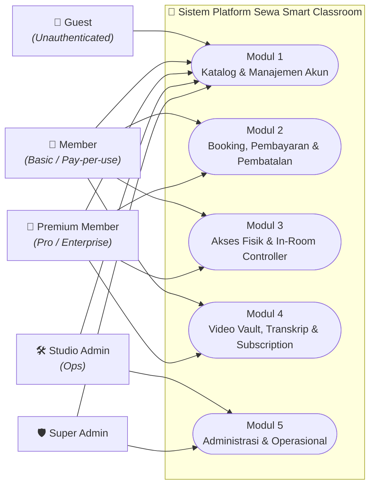
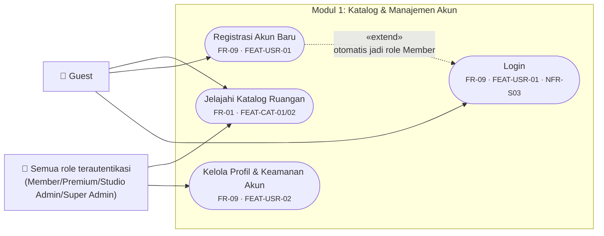
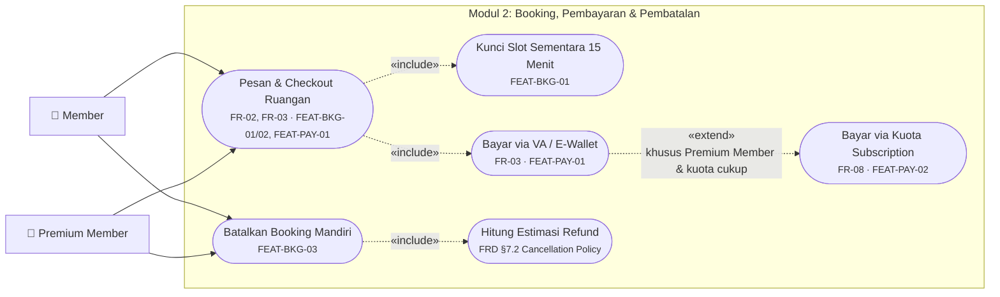
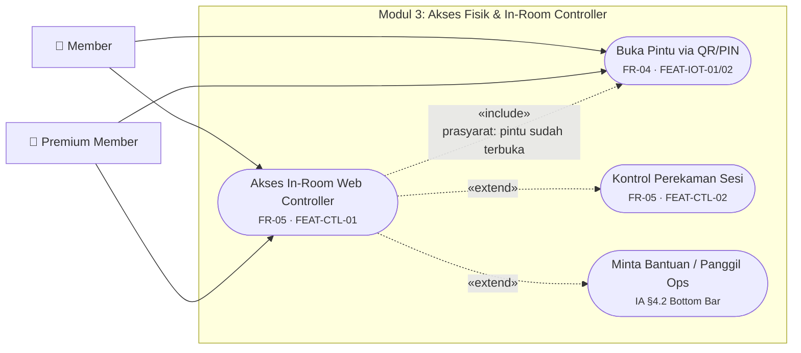
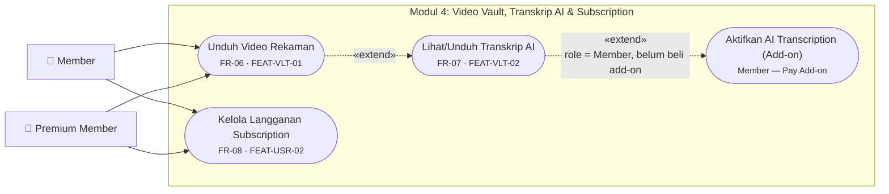
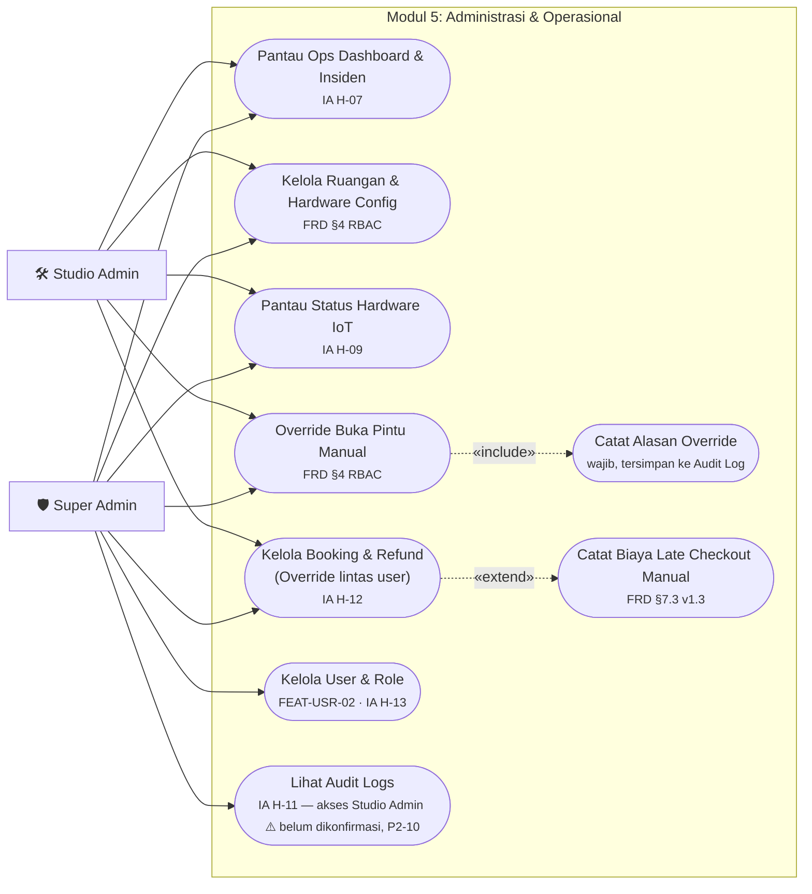

# Use Case Diagram: Platform Sewa Smart Classroom
**Tipe Dokumen:** Dokumentasi visual turunan (bukan dokumen sumber — lihat `docs/X_ProgressSummary.md` §7 untuk indeks ID lintas dokumen)
**Disusun Berdasarkan:** `02_ProductRequirementDocument.md` §4 (Functional Requirements), `03_FunctionalRequirementDocument.md` §2 (Feature Breakdown) & §4 (RBAC Matrix), `04_InformationArchitecture.md` §4 & §7 (Screen Hierarchy & Permission Notes)
**Tanggal:** 9 Agustus 2026
**Tujuan:** Memvisualisasikan interaksi antara 5 aktor (role RBAC) dengan seluruh fungsi sistem dalam bentuk diagram use case, sebagai referensi cepat sebelum masuk ke desain database/sistem (Tahap 4 — Google Antigravity).

> **Catatan notasi:** Mermaid tidak memiliki tipe diagram UML Use Case native, sehingga diagram di bawah disusun memakai `flowchart` dengan konvensi: **node persegi** = aktor, **node oval/stadium di dalam kotak sistem** = use case, **garis solid** = asosiasi aktor↔use case, **garis putus-putus `«include»`** = use case pendukung yang *wajib* dijalankan, **garis putus-putus `«extend»`** = perilaku kondisional/opsional. Setiap use case diberi label ID FR/FEAT agar tetap tertelusuri ke dokumen sumber — dokumen ini **tidak menggantikan** RBAC matrix penuh di `03_FunctionalRequirementDocument.md` §4.

---

## 1. Ringkasan Aktor

| Aktor | Deskripsi | Relasi Tier (PD §8) | Sumber |
| :--- | :--- | :--- | :--- |
| **Guest** | Pengunjung belum login/registrasi. Hanya bisa menjelajah katalog. | — | FRD §4 baris 1 |
| **Member** | Pengguna terautentikasi, pay-per-use atau tier **Basic**. | Basic | FRD §4 catatan pemetaan role |
| **Premium Member** | Pengguna dengan langganan tier **Pro**/**Enterprise** — mendapat kuota jam & transkrip AI *Included*. | Pro / Enterprise | FRD §4 catatan pemetaan role |
| **Studio Admin (Ops)** | Petugas operasional lokasi — kelola ruangan/hardware & override akses/pembatalan. | — | FRD §4 baris 7-8 |
| **Super Admin** | Akses penuh, termasuk manajemen role pengguna. | — | FRD §4 (Full Access di seluruh baris) |

> **Hierarki kemampuan (bukan diagram generalisasi UML formal, mengikuti pola nilai tabel RBAC FRD §4):** kemampuan **Premium Member ⊇ Member** (selisih: transkrip AI *Included* vs *Pay Add-on*, kuota subscription); kemampuan **Super Admin ⊇ Studio Admin** (selisih: *Full Access* vs *Read/Write*/*Execute*, plus Kelola User & Role yang eksklusif Super Admin).

---

## 2. Diagram Use Case Keseluruhan (Overview)

Diagram ini memetakan aktor ke 5 modul fungsional. Detail use case per modul ada di Bagian 3.

> **Catatan cakupan lintas-modul untuk Admin:** Sesuai FRD §4, Studio Admin & Super Admin sebenarnya juga memiliki akses **all-scope** (bukan hanya milik sendiri) ke sebagian use case Modul 2-4 — *Create Booking*, *Cancel All (override)*, *Read All Video Vault*, *Read All Transcription*. Kemampuan *override* ini direpresentasikan sebagai use case tersendiri di **Modul 5** (UC-22 Kelola Booking & Refund) mengikuti pemisahan yang sudah dibuat IA (screen 3.7 self-service vs 5.6 admin override) — bukan duplikasi use case Member/Premium, agar diagram tidak bias seolah admin "memesan ruangan untuk dirinya sendiri". *Read All Video Vault* dan *Read All Transcription* untuk Admin belum punya screen khusus di IA — dicatat sebagai observasi, bukan use case baru yang mengada-ada.

---

## 3. Diagram Use Case per Modul

### 3.1 Modul 1: Katalog & Manajemen Akun

*Aktor: Guest, Member, Premium Member, Studio Admin, Super Admin (semua role — fondasi seluruh modul lain)*

| Use Case | Aktor | Ref. FR/FEAT | Ref. Screen (IA) |
| :--- | :--- | :--- | :--- |
| Jelajahi Katalog Ruangan | Semua role | FR-01, FEAT-CAT-01/02 | 1.2 (H-01) |
| Registrasi Akun Baru | Guest | FR-09, FEAT-USR-01 | 1.4 |
| Login | Guest | FR-09, FEAT-USR-01, NFR-S03 | 1.4 |
| Kelola Profil & Keamanan Akun | Member/Premium/Studio Admin/Super Admin | FR-09, FEAT-USR-02 | 3.6 (H-06) |

---

### 3.2 Modul 2: Booking, Pembayaran & Pembatalan

*Aktor: Member, Premium Member (self-service). Override lintas-user oleh Admin lihat Modul 5, UC-22.*

| Use Case | Aktor | Ref. FR/FEAT | Ref. Screen (IA) |
| :--- | :--- | :--- | :--- |
| Pesan & Checkout Ruangan | Member, Premium Member | FR-02, FR-03, FEAT-BKG-01/02, FEAT-PAY-01 | 2.1-2.4 (H-03) |
| Bayar via Kuota Subscription | Premium Member (kondisional) | FR-08, FEAT-PAY-02 | H-03 poin 3 |
| Batalkan Booking Mandiri | Member, Premium Member (booking milik sendiri) | FEAT-BKG-03 | 3.2, 3.7 |

---

### 3.3 Modul 3: Akses Fisik & In-Room Controller

*Aktor: Member, Premium Member (slot milik sendiri). Akses all-slot oleh Admin — lihat catatan §2.*

| Use Case | Aktor | Ref. FR/FEAT | Ref. Screen (IA) |
| :--- | :--- | :--- | :--- |
| Buka Pintu via QR/PIN | Member, Premium Member (slot sendiri) | FR-04, FEAT-IOT-01/02 | 3.3, Task Flow A |
| Akses In-Room Web Controller | Member, Premium Member (slot sendiri) | FR-05, FEAT-CTL-01 | 4.1-4.2 (H-02) |
| Kontrol Perekaman Sesi | Member, Premium Member | FR-05, FEAT-CTL-02 | 4.2 (H-02), Task Flow B |

---

### 3.4 Modul 4: Video Vault, Transkrip AI & Subscription

*Aktor: Member, Premium Member. Akses all-user oleh Admin — lihat catatan §2.*

| Use Case | Aktor | Ref. FR/FEAT | Ref. Screen (IA) |
| :--- | :--- | :--- | :--- |
| Unduh Video Rekaman | Member (own), Premium Member (own) | FR-06, FEAT-VLT-01 | 3.4 (H-04) |
| Lihat/Unduh Transkrip AI | Member = *Pay Add-on*, Premium = *Included* | FR-07, FEAT-VLT-02 | H-04 poin 3 |
| Kelola Langganan Subscription | Member (mulai berlangganan), Premium Member (kelola/upgrade/downgrade/batalkan) | FR-08, FEAT-USR-02 | 3.5 (H-05) |

---

### 3.5 Modul 5: Administrasi & Operasional

*Aktor: Studio Admin (Ops), Super Admin*

| Use Case | Aktor | Ref. FR/FEAT | Ref. Screen (IA) |
| :--- | :--- | :--- | :--- |
| Pantau Ops Dashboard & Insiden | Studio Admin, Super Admin | — | 5.1 (H-07) |
| Kelola Ruangan & Hardware Config | Studio Admin (Read/Write), Super Admin (Full) | FRD §4 | 5.2 (H-08) |
| Pantau Status Hardware IoT | Studio Admin, Super Admin | — | 5.3 (H-09) |
| Override Buka Pintu Manual | Studio Admin (Execute), Super Admin (Full) | FRD §4 | 5.4 (H-10) |
| Kelola Booking & Refund (Override) | Studio Admin (Execute), Super Admin (Full) | FRD §4 | 5.6 (H-12) |
| Kelola User & Role | **Super Admin saja** | FEAT-USR-02 | 5.7 (H-13) |
| Lihat Audit Logs | Super Admin (pasti); Studio Admin (⚠️ asumsi kerja, belum RBAC resmi — P2-10) | — | 5.5 (H-11) |

---

## 4. Legenda Notasi

| Elemen | Arti |
| :--- | :--- |
| Node persegi `[Teks]` | Aktor (role RBAC) |
| Node oval/stadium `([Teks])` di dalam kotak sistem | Use case (fungsi sistem) |
| Garis solid `A --> UC` | Asosiasi: aktor berinteraksi langsung dengan use case |
| Garis putus-putus `«include»` | Use case pendukung yang **selalu** dijalankan sebagai bagian dari use case utama (mis. checkout selalu mengunci slot) |
| Garis putus-putus `«extend»` | Perilaku **kondisional/opsional** yang hanya berjalan pada kondisi tertentu (mis. bayar via kuota hanya untuk Premium Member) |

---

## 5. Batasan Dokumen

Diagram ini adalah **representasi visual turunan**, bukan sumber kebenaran baru. Setiap use case merujuk balik ke ID resmi di `02_ProductRequirementDocument.md` (FR-xx), `03_FunctionalRequirementDocument.md` (FEAT-xx, RBAC §4), dan `04_InformationArchitecture.md` (screen H-xx). Jika ditemukan perbedaan, dokumen sumber tersebut yang menjadi acuan sah — bukan diagram ini. Use case untuk 8 screen yang belum diprototipekan (lihat `docs/X_ProgressSummary.md` §8) tetap dimuat di sini karena sudah punya definisi resmi di FRD/IA, meskipun UI-nya belum dibangun.
