# Dokumen Desain Skema Database: Platform Sewa Smart Classroom

**Versi:** 1.0  
**Tanggal:** 9 Agustus 2026  
**Penulis:** Database Architect / Lead Engineer  
**Status:** Draf Desain Skema Produksi  
**Dokumen Terkait:**
* `docs/01_ProductDiscovery.md` (Strategi Bisnis, Pricing & Kebijakan Refund) -> [01_ProductDiscovery.md](file:///usr/local/var/www/domains/applications/maxy.academy/vc-classroom/docs/01_ProductDiscovery.md)
* `docs/02_ProductRequirementDocument.md` (Scope & Fitur Bisnis) -> [02_ProductRequirementDocument.md](file:///usr/local/var/www/domains/applications/maxy.academy/vc-classroom/docs/02_ProductRequirementDocument.md)
* `docs/03_FunctionalRequirementDocument.md` (Workflow System, API, Validation & Business Logic) -> [03_FunctionalRequirementDocument.md](file:///usr/local/var/www/domains/applications/maxy.academy/vc-classroom/docs/03_FunctionalRequirementDocument.md)
* `docs/04_InformationArchitecture.md` (Hierarchy Screens, Content & Navigasi) -> [04_InformationArchitecture.md](file:///usr/local/var/www/domains/applications/maxy.academy/vc-classroom/docs/04_InformationArchitecture.md)
* `README/UseCaseDiagram.md` (Visualisasi Aksi Aktor) -> [UseCaseDiagram.md](file:///usr/local/var/www/domains/applications/maxy.academy/vc-classroom/README/UseCaseDiagram.md)

---

## 1. Pendahuluan & Strategi Penyimpanan Data

Berdasarkan analisis prototype antarmuka pengguna (`index.html`, `profile.html`, `in-room.html`, serta Admin Portal di `admin/rooms.html` & `admin/dashboard.html`) dan dokumen fungsional platform, sistem memerlukan dua lapis penyimpanan data utama:

1. **RDBMS (PostgreSQL 16+)**: Digunakan untuk menyimpan seluruh data relasional transaksional yang membutuhkan integritas tinggi (ACID), seperti data pengguna, booking, pembayaran, konfigurasi ruangan, riwayat akses IoT, dan audit log.
2. **Caching & In-Memory Store (Redis 7.x)**: Digunakan untuk mekanisme penguncian slot waktu sementara (*Concurrency Slot Locking* 15 menit), manajemen status koneksi detak jantung (*heartbeat*) perangkat IoT, serta cache token sesi sementara kelas.

---

## 2. Entity Relationship Diagram (ERD)

Diagram di bawah menggambarkan relasi antar entitas beserta tipe data, status primary key (PK), dan foreign key (FK).

```mermaid
erDiagram
    users {
        uuid id PK
        varchar email "UQ, NOT NULL"
        varchar password_hash "NOT NULL"
        varchar name "NOT NULL"
        varchar phone "NOT NULL"
        varchar institution "NULL"
        varchar role "NOT NULL"
        boolean two_factor_enabled "NOT NULL"
        timestamp created_at "NOT NULL"
        timestamp updated_at "NOT NULL"
        timestamp deleted_at "NULL"
    }

    subscription_plans {
        varchar id PK
        varchar name "NOT NULL"
        integer monthly_hours_quota "NOT NULL"
        integer storage_gb "NOT NULL"
        boolean includes_ai_transcription "NOT NULL"
        decimal monthly_price "NOT NULL"
        timestamp created_at "NOT NULL"
        timestamp updated_at "NOT NULL"
    }

    user_subscriptions {
        uuid id PK
        uuid user_id FK "NOT NULL"
        varchar plan_id FK "NOT NULL"
        varchar status "NOT NULL"
        decimal quota_hours_used "NOT NULL"
        decimal quota_hours_total "NOT NULL"
        date start_date "NOT NULL"
        date end_date "NOT NULL"
        boolean auto_renew "NOT NULL"
        varchar payment_method_id "NULL"
        timestamp created_at "NOT NULL"
        timestamp updated_at "NOT NULL"
    }

    subscription_refunds {
        uuid id PK
        uuid user_subscription_id FK "NOT NULL"
        varchar status "NOT NULL"
        decimal refund_amount "NOT NULL"
        text reason "NULL"
        text admin_notes "NULL"
        uuid processed_by FK "NULL"
        timestamp processed_at "NULL"
        timestamp created_at "NOT NULL"
    }

    rooms {
        varchar id PK
        varchar name "NOT NULL"
        varchar location "NOT NULL"
        varchar capacity_tier "NOT NULL"
        integer capacity_seats "NOT NULL"
        decimal price_per_hour "NOT NULL"
        varchar status "NOT NULL"
        varchar smart_lock_device_id "UQ, NULL"
        varchar wifi_ip_address "NULL"
        timestamp created_at "NOT NULL"
        timestamp updated_at "NOT NULL"
    }

    room_facilities {
        uuid id PK
        varchar room_id FK "NOT NULL"
        varchar facility_name "NOT NULL"
        timestamp created_at "NOT NULL"
    }

    bookings {
        varchar id PK
        uuid user_id FK "NOT NULL"
        varchar room_id FK "NOT NULL"
        date booking_date "NOT NULL"
        time start_time "NOT NULL"
        time end_time "NOT NULL"
        varchar status "NOT NULL"
        varchar payment_type "NOT NULL"
        decimal original_amount "NOT NULL"
        decimal add_ons_amount "NOT NULL"
        decimal discount_amount "NOT NULL"
        decimal total_amount "NOT NULL"
        boolean is_ai_transcription_addon "NOT NULL"
        timestamp created_at "NOT NULL"
        timestamp updated_at "NOT NULL"
    }

    payments {
        uuid id PK
        varchar booking_id FK "NULL"
        uuid user_subscription_id FK "NULL"
        varchar payment_method "NOT NULL"
        varchar status "NOT NULL"
        varchar transaction_id "NULL"
        decimal paid_amount "NOT NULL"
        varchar payment_url "NULL"
        timestamp expires_at "NOT NULL"
        timestamp paid_at "NULL"
        jsonb callback_raw "NULL"
        timestamp created_at "NOT NULL"
        timestamp updated_at "NOT NULL"
    }

    room_access_tokens {
        uuid id PK
        varchar booking_id FK "NOT NULL"
        varchar pin_code "NOT NULL"
        varchar qr_code_content "NOT NULL"
        timestamp access_start_time "NOT NULL"
        timestamp access_end_time "NOT NULL"
        boolean is_used "NOT NULL"
        timestamp created_at "NOT NULL"
    }

    recordings {
        uuid id PK
        varchar booking_id FK "NOT NULL"
        varchar session_id "NOT NULL"
        varchar status "NOT NULL"
        timestamp started_at "NULL"
        timestamp stopped_at "NULL"
        varchar raw_video_url "NULL"
        varchar processed_video_url "NULL"
        integer video_duration_seconds "NULL"
        timestamp created_at "NOT NULL"
        timestamp updated_at "NOT NULL"
    }

    ai_transcriptions {
        uuid id PK
        uuid recording_id FK "NOT NULL"
        varchar status "NOT NULL"
        varchar transcript_srt_url "NULL"
        varchar transcript_json_url "NULL"
        integer word_count "NULL"
        timestamp created_at "NOT NULL"
        timestamp updated_at "NOT NULL"
    }

    room_maintenance_logs {
        uuid id PK
        varchar room_id FK "NOT NULL"
        uuid operator_id FK "NOT NULL"
        varchar reason "NOT NULL"
        text notes "NULL"
        timestamp started_at "NOT NULL"
        timestamp ended_at "NULL"
        timestamp created_at "NOT NULL"
    }

    iot_device_status {
        uuid id PK
        varchar room_id FK "NOT NULL"
        varchar device_type "NOT NULL"
        varchar status "NOT NULL"
        timestamp last_heartbeat "NOT NULL"
        timestamp created_at "NOT NULL"
        timestamp updated_at "NOT NULL"
    }

    manual_unlock_logs {
        uuid id PK
        varchar room_id FK "NOT NULL"
        uuid operator_id FK "NOT NULL"
        varchar booking_id FK "NULL"
        text reason "NOT NULL"
        timestamp created_at "NOT NULL"
    }

    late_checkout_logs {
        uuid id PK
        varchar booking_id FK "NOT NULL"
        uuid operator_id FK "NOT NULL"
        timestamp actual_checkout_time "NOT NULL"
        integer overtime_minutes "NOT NULL"
        decimal penalty_amount "NOT NULL"
        text notes "NULL"
        timestamp created_at "NOT NULL"
    }

    audit_logs {
        uuid id PK
        uuid actor_id FK "NOT NULL"
        varchar actor_role "NOT NULL"
        varchar action "NOT NULL"
        varchar target_table "NOT NULL"
        varchar target_id "NOT NULL"
        jsonb changes_payload "NULL"
        text description "NOT NULL"
        timestamp created_at "NOT NULL"
    }

    users ||--o{ user_subscriptions : "owns"
    users ||--o{ bookings : "creates"
    users ||--o{ audit_logs : "triggers"
    users ||--o{ room_maintenance_logs : "performs"
    users ||--o{ manual_unlock_logs : "authorizes"
    users ||--o{ late_checkout_logs : "registers"
    users ||--o{ subscription_refunds : "processes"

    subscription_plans ||--o{ user_subscriptions : "defines"
    user_subscriptions ||--o{ subscription_refunds : "requests"
    user_subscriptions ||--o{ payments : "billed_by"

    rooms ||--o{ room_facilities : "has"
    rooms ||--o{ bookings : "reserved_in"
    rooms ||--o{ room_maintenance_logs : "logged_for"
    rooms ||--o{ iot_device_status : "monitors"
    rooms ||--o{ manual_unlock_logs : "manually_unlocked_for"

    bookings ||--o{ payments : "billed_by"
    bookings ||--o{ room_access_tokens : "accessed_by"
    bookings ||--o{ recordings : "creates_recordings"
    bookings ||--o{ late_checkout_logs : "penalized_by"

    recordings ||--o{ ai_transcriptions : "generates"
```



---

## 3. Kamus Data (Data Dictionary)

Berikut adalah struktur tabel fisik lengkap dengan tipe data PostgreSQL, batasan nilai (*constraints*), dan deskripsi kegunaannya.

### 3.1 Tabel `users`
Menyimpan kredensial autentikasi pengguna dan profil dasar. Field didasarkan pada form profil (`profile.html` / IA Screen H-06) dan aturan validasi E.164 (`docs/03_FunctionalRequirementDocument.md` §6).

| Nama Kolom | Tipe Data | Nullable | Default | Batasan & Aturan Bisnis / FK | Deskripsi |
| :--- | :--- | :---: | :---: | :--- | :--- |
| `id` | `UUID` | No | `gen_random_uuid()`| `PRIMARY KEY` | ID unik untuk setiap pengguna. |
| `email` | `VARCHAR(255)` | No | — | `UNIQUE`, format email valid | Email login utama (Read-only pasca verifikasi). |
| `password_hash` | `VARCHAR(255)` | No | — | — | Hash kata sandi terenkripsi (BCrypt / Argon2). |
| `name` | `VARCHAR(255)` | No | — | Min. 2 karakter | Nama lengkap pengguna (form input `inputNama`). |
| `phone` | `VARCHAR(20)` | No | — | format E.164 (`^(\+62\|62\|0)8[1-9][0-9]{7,10}$`)| Nomor HP valid Indonesia (input `inputPhone`). |
| `institution` | `VARCHAR(255)` | Yes | `NULL` | — | Institusi/organisasi (input `inputInstitusi`). |
| `role` | `VARCHAR(50)` | No | `'MEMBER'` | Check constraint: `role_enum` | Role RBAC (Member, Premium Member, Admin, Super). |
| `two_factor_enabled` | `BOOLEAN` | No | `FALSE` | — | Toggle autentikasi dua faktor (input `toggle2FA`). |
| `created_at` | `TIMESTAMPTZ` | No | `NOW()` | — | Tanggal pendaftaran. |
| `updated_at` | `TIMESTAMPTZ` | No | `NOW()` | — | Tanggal pembaruan profil terakhir. |
| `deleted_at` | `TIMESTAMPTZ` | Yes | `NULL` | — | Soft deletion flag untuk kepatuhan GDPR/User Delete. |

### 3.2 Tabel `subscription_plans`
Menyimpan paket katalog subscription yang disetujui tim bisnis (Finance - 8 Agustus 2026).

| Nama Kolom | Tipe Data | Nullable | Default | Batasan & Aturan Bisnis / FK | Deskripsi |
| :--- | :--- | :---: | :---: | :--- | :--- |
| `id` | `VARCHAR(50)` | No | — | `PRIMARY KEY` (Enum: `'BASIC'`, `'PRO'`, `'ENTERPRISE'`) | ID string paket langganan. |
| `name` | `VARCHAR(100)` | No | — | — | Nama komersial paket. |
| `monthly_hours_quota` | `INTEGER` | No | — | `>= -1` (Enterprise = -1 / 9999) | Kuota sewa ruangan per bulan (Basic: 10, Pro: 30). |
| `storage_gb` | `INTEGER` | No | — | `>= 0` (Pro: 500 GB) | Kuota penyimpanan video cloud (Vault). |
| `includes_ai_transcription` | `BOOLEAN` | No | `FALSE` | — | Status transkripsi otomatis (Basic: No, Pro/Ent: Yes). |
| `monthly_price` | `NUMERIC(12,2)`| No | — | `>= 0` (Basic: 1.2M, Pro: 4.9M, Ent: 11.9M) | Harga tagihan bulanan dalam IDR. |
| `created_at` | `TIMESTAMPTZ` | No | `NOW()` | — | Tanggal pembuatan konfigurasi plan. |
| `updated_at` | `TIMESTAMPTZ` | No | `NOW()` | — | Tanggal modifikasi konfigurasi plan. |

### 3.3 Tabel `user_subscriptions`
Menyimpan detail langganan aktif pengguna dan sisa kuota jam. Perubahan status role ke `Premium Member` terikat otomatis pada keaktifan entri di tabel ini (FEAT-USR-02).

| Nama Kolom | Tipe Data | Nullable | Default | Batasan & Aturan Bisnis / FK | Deskripsi |
| :--- | :--- | :---: | :---: | :--- | :--- |
| `id` | `UUID` | No | `gen_random_uuid()`| `PRIMARY KEY` | ID langganan aktif. |
| `user_id` | `UUID` | No | — | `FOREIGN KEY` -> `users.id` | Pemilik langganan. |
| `plan_id` | `VARCHAR(50)` | No | — | `FOREIGN KEY` -> `subscription_plans.id`| Konfigurasi plan yang diikuti. |
| `status` | `VARCHAR(50)` | No | `'PENDING'` | Check: `'ACTIVE'`,`'CANCELLED'`,`'EXPIRED'`,`'PENDING'` | Status kelayakan tagihan & kuota. |
| `quota_hours_used` | `NUMERIC(5,2)` | No | `0.00` | `>= 0.00` (kelipatan 0.5 jam) | Jumlah kuota jam yang sudah terpakai bulan ini. |
| `quota_hours_total` | `NUMERIC(5,2)`| No | — | Copied dari `subscription_plans` | Total kuota jam tersedia (mis. 10.00 / 30.00). |
| `start_date` | `DATE` | No | — | — | Awal siklus tagihan berjalan. |
| `end_date` | `DATE` | No | — | `> start_date` | Akhir siklus (tanggal renewal otomatis). |
| `auto_renew` | `BOOLEAN` | No | `TRUE` | — | Apakah langganan diperpanjang otomatis di `end_date`. |
| `payment_method_id` | `VARCHAR(255)`| Yes | `NULL` | — | Token pembayaran berulang tersimpan dari PG. |
| `created_at` | `TIMESTAMPTZ` | No | `NOW()` | — | Tanggal aktivasi awal. |
| `updated_at` | `TIMESTAMPTZ` | No | `NOW()` | — | Tanggal modifikasi record. |

### 3.4 Tabel `subscription_refunds`
Mencatat pelacakan refund atas pembatalan langganan bulanan berdasarkan masa kelayakan 30 hari pertama (Draft Kontekstual `01_ProductDiscovery.md` §8.2 & IA H-05).

| Nama Kolom | Tipe Data | Nullable | Default | Batasan & Aturan Bisnis / FK | Deskripsi |
| :--- | :--- | :---: | :---: | :--- | :--- |
| `id` | `UUID` | No | `gen_random_uuid()`| `PRIMARY KEY` | ID kasus refund. |
| `user_subscription_id` | `UUID` | No | — | `FOREIGN KEY` -> `user_subscriptions.id`| ID langganan yang dibatalkan. |
| `status` | `VARCHAR(50)` | No | `'PENDING'` | Check: `'PENDING'`, `'APPROVED'`, `'REJECTED'` | Status peninjauan refund. |
| `refund_amount` | `NUMERIC(12,2)`| No | — | `>= 0.00` | Nominal uang kembali (100% jika <30 hari, 0% jika >30 hari). |
| `reason` | `TEXT` | Yes | `NULL` | Max 500 karakter | Alasan pembatalan dari pengguna. |
| `admin_notes` | `TEXT` | Yes | `NULL` | — | Catatan/alasan persetujuan/penolakan dari Admin. |
| `processed_by` | `UUID` | Yes | `NULL` | `FOREIGN KEY` -> `users.id` (Admin/Finance) | Akun operator yang memproses status. |
| `processed_at` | `TIMESTAMPTZ` | Yes | `NULL` | — | Waktu keputusan diambil. |
| `created_at` | `TIMESTAMPTZ` | No | `NOW()` | — | Tanggal klaim diajukan. |

### 3.5 Tabel `rooms`
Menyimpan data fisik ruangan / studio smart classroom (form edit/tambah ruangan `admin/rooms.html` / IA Screen H-08).

| Nama Kolom | Tipe Data | Nullable | Default | Batasan & Aturan Bisnis / FK | Deskripsi |
| :--- | :--- | :---: | :---: | :--- | :--- |
| `id` | `VARCHAR(100)` | No | — | `PRIMARY KEY` (e.g. `'rm-jakarta-01'`) | Kode/Slug unik ruangan (tidak memakai UUID agar URL readable). |
| `name` | `VARCHAR(255)` | No | — | — | Nama ruangan (form `Tambah Ruangan`). |
| `location` | `VARCHAR(255)` | No | — | — | Keterangan gedung & lantai (e.g. `'Lantai 3, Gedung Utama'`). |
| `capacity_tier` | `VARCHAR(50)` | No | — | Check: `'SMALL'`, `'MEDIUM'`, `'LARGE'` | Kelompok kapasitas (filter sitemap IA & PRD §8.1.A). |
| `capacity_seats` | `INTEGER` | No | — | `> 0` | Jumlah kursi presisi (e.g. 15, 30, 50). |
| `price_per_hour` | `NUMERIC(12,2)`| No | — | Harga acuan: 150k (Small), 250k (Med), 350k (Large)| Tarif sewa per jam (dalam IDR). |
| `status` | `VARCHAR(50)` | No | `'AVAILABLE'`| Check: `'AVAILABLE'`, `'MAINTENANCE'` | Status operasional ruangan (Maintenance menyembunyikan ruangan dari katalog). |
| `smart_lock_device_id`| `VARCHAR(100)`| Yes | `NULL` | `UNIQUE` | ID perangkat IoT Smart Lock terdaftar (MQTT relay channel). |
| `wifi_ip_address` | `VARCHAR(45)` | Yes | `NULL` | IPv4 / IPv6 Subnet Format | IP/Subnet WiFi lokal kelas (FEAT-CTL-01 Geofence). |
| `created_at` | `TIMESTAMPTZ` | No | `NOW()` | — | Tanggal ruangan ditambahkan ke database. |
| `updated_at` | `TIMESTAMPTZ` | No | `NOW()` | — | Tanggal konfigurasi ruangan diperbarui. |

### 3.6 Tabel `room_facilities`
Menampung asosiasi fasilitas hardware terinstall pada masing-masing ruangan (dijadikan referensi multi-checkbox pada `admin/rooms.html` & pencarian katalog `index.html`).

| Nama Kolom | Tipe Data | Nullable | Default | Batasan & Aturan Bisnis / FK | Deskripsi |
| :--- | :--- | :---: | :---: | :--- | :--- |
| `id` | `UUID` | No | `gen_random_uuid()`| `PRIMARY KEY` | ID asosiasi fasilitas. |
| `room_id` | `VARCHAR(100)` | No | — | `FOREIGN KEY` -> `rooms.id` ON DELETE CASCADE | ID ruangan terkait. |
| `facility_name` | `VARCHAR(100)` | No | — | Check: `'SMART_BOARD'`,`'MULTI_CAM_AI'`,`'STUDIO_PODCASTING'`,`'AUDIO_ARRAY'` | Tag nama fasilitas hardware aktif. |
| `created_at` | `TIMESTAMPTZ` | No | `NOW()` | — | Timestamp data dibuat. |

### 3.7 Tabel `bookings`
Menyimpan transaksi sewa ruangan berdurasi jam. Kode booking dibuat terstruktur (`bkg-YYYYMMDD-XXXX`) sesuai API schema (`docs/03_FunctionalRequirementDocument.md` §5.1).

| Nama Kolom | Tipe Data | Nullable | Default | Batasan & Aturan Bisnis / FK | Deskripsi |
| :--- | :--- | :---: | :---: | :--- | :--- |
| `id` | `VARCHAR(100)` | No | — | `PRIMARY KEY` (e.g. `'bkg-20260820-0089'`) | Format string ID transaksi booking terstruktur. |
| `user_id` | `UUID` | No | — | `FOREIGN KEY` -> `users.id` | Pelanggan pemesan. |
| `room_id` | `VARCHAR(100)` | No | — | `FOREIGN KEY` -> `rooms.id` | Ruangan yang dipesan. |
| `booking_date` | `DATE` | No | — | `>= Current Date` | Tanggal reservasi. |
| `start_time` | `TIME` | No | — | Format HH:mm (07:00 - 22:00) | Jam mulai sesi kelas. |
| `end_time` | `TIME` | No | — | `> start_time`, minimal selisih 60 menit & kelipatan 30m | Jam berakhir sesi kelas (validasi silang). |
| `status` | `VARCHAR(50)` | No | `'PENDING_PAYMENT'`| Check: `'PENDING_PAYMENT'`, `'CONFIRMED'`, `'CANCELLED'`, `'IN_ROOM'`, `'COMPLETED'` | Status reservasi. |
| `payment_type` | `VARCHAR(50)` | No | — | Check: `'PAY_PER_USE'`, `'SUBSCRIPTION_QUOTA'` | Jenis cara pemotongan transaksi (VA/E-wallet vs Quota). |
| `original_amount` | `NUMERIC(12,2)`| No | — | Tarif ruangan × durasi jam | Biaya sewa dasar. |
| `add_ons_amount` | `NUMERIC(12,2)`| No | `0.00` | Sesuai nominal add-on terpilih | Biaya tambahan (misal: AI Transkripsi add-on). |
| `discount_amount` | `NUMERIC(12,2)`| No | `0.00` | — | Nominal potongan harga. |
| `total_amount` | `NUMERIC(12,2)`| No | — | `(original + add_ons) - discount` | Total biaya akhir yang ditagihkan/dibayar. |
| `is_ai_transcription_addon` | `BOOLEAN` | No | `FALSE` | — | Status apakah layanan transkripsi AI dibeli secara add-on. |
| `created_at` | `TIMESTAMPTZ` | No | `NOW()` | — | Tanggal pembuatan data (trigger Redis Slot Lock). |
| `updated_at` | `TIMESTAMPTZ` | No | `NOW()` | — | Tanggal status diperbarui. |

### 3.8 Tabel `payments`
Mencatat riwayat pembayaran yang diproses via Payment Gateway (Midtrans/Xendit) untuk sewa ruangan atau pembelian subscription.

| Nama Kolom | Tipe Data | Nullable | Default | Batasan & Aturan Bisnis / FK | Deskripsi |
| :--- | :--- | :---: | :---: | :--- | :--- |
| `id` | `UUID` | No | `gen_random_uuid()`| `PRIMARY KEY` | ID pembayaran sistem. |
| `booking_id` | `VARCHAR(100)` | Yes | `NULL` | `FOREIGN KEY` -> `bookings.id` ON DELETE SET NULL | Booking terkait (jika pembayaran sewa). |
| `user_subscription_id` | `UUID` | Yes | `NULL` | `FOREIGN KEY` -> `user_subscriptions.id` | Subscriptions terkait (jika pembayaran paket). |
| `payment_method` | `VARCHAR(100)` | No | — | Check: `'VA_BCA'`, `'VA_MANDIRI'`, `'VA_BNI'`, `'EWALLET_GOPAY'`, `'EWALLET_OVO'`, `'EWALLET_SHOPEEPAY'`, `'SUBSCRIPTION_QUOTA'` | Metode pembayaran yang dipilih. |
| `status` | `VARCHAR(50)` | No | `'PENDING'` | Check: `'PENDING'`, `'PAID'`, `'FAILED'`, `'REFUNDED'` | Status pemrosesan pembayaran. |
| `transaction_id` | `VARCHAR(255)` | Yes | `NULL` | — | Kode referensi transaksi eksternal dari PG. |
| `paid_amount` | `NUMERIC(12,2)`| No | — | `>= 0` | Nominal dana riil yang disetorkan. |
| `payment_url` | `VARCHAR(500)` | Yes | `NULL` | — | Tautan pengalihan ke PG / QR bayar. |
| `expires_at` | `TIMESTAMPTZ` | No | — | Waktu saat checkout + 15 menit | Batas waktu transfer sebelum hangus/expire. |
| `paid_at` | `TIMESTAMPTZ` | Yes | `NULL` | — | Tanggal webhook callback status lunas diterima. |
| `callback_raw` | `JSONB` | Yes | `NULL` | — | Menyimpan payload webhook mentah untuk histori debugging. |
| `created_at` | `TIMESTAMPTZ` | No | `NOW()` | — | Tanggal pembayaran diajukan. |
| `updated_at` | `TIMESTAMPTZ` | No | `NOW()` | — | Pembaruan status transaksi. |

### 3.9 Tabel `room_access_tokens`
Menyimpan token akses IoT digital (PIN & QR Code) dengan buffer toleransi waktu sewa (+/- 15 menit) sesuai `docs/03_FunctionalRequirementDocument.md` §7.1.

| Nama Kolom | Tipe Data | Nullable | Default | Batasan & Aturan Bisnis / FK | Deskripsi |
| :--- | :--- | :---: | :---: | :--- | :--- |
| `id` | `UUID` | No | `gen_random_uuid()`| `PRIMARY KEY` | ID token akses fisik. |
| `booking_id` | `VARCHAR(100)` | No | — | `FOREIGN KEY` -> `bookings.id` ON DELETE CASCADE | Hubungan reservasi. |
| `pin_code` | `VARCHAR(6)` | No | — | format regex: `^[0-9]{6}$` | PIN cadangan 6 digit numerik. |
| `qr_code_content` | `VARCHAR(255)` | No | — | HMAC-SHA256 encrypted | Isi data QR untuk dipindai oleh kamera lock. |
| `access_start_time` | `TIMESTAMPTZ` | No | — | Tanggal sewa & `start_time` minus 15 menit | Awal waktu pintu dapat dibuka (buffer prep). |
| `access_end_time` | `TIMESTAMPTZ` | No | — | Tanggal sewa & `end_time` plus 15 menit | Akhir waktu pintu dapat dibuka (buffer checkout). |
| `is_used` | `BOOLEAN` | No | `FALSE` | — | Penanda apakah token telah digunakan masuk pertama kali. |
| `created_at` | `TIMESTAMPTZ` | No | `NOW()` | — | Waktu token digenerasikan (sukses bayar). |

### 3.10 Tabel `recordings`
Menyimpan tautan video hasil rekaman lokal edge IoT studio kelas yang telah diunggah ke cloud S3 storage (FEAT-VLT-01).

| Nama Kolom | Tipe Data | Nullable | Default | Batasan & Aturan Bisnis / FK | Deskripsi |
| :--- | :--- | :---: | :---: | :--- | :--- |
| `id` | `UUID` | No | `gen_random_uuid()`| `PRIMARY KEY` | ID internal berkas rekaman. |
| `booking_id` | `VARCHAR(100)` | No | — | `FOREIGN KEY` -> `bookings.id` ON DELETE CASCADE | Booking asal. |
| `session_id` | `VARCHAR(100)` | No | — | — | ID sesi rekaman RTSP dari controller (`rec-sess-xxxx`). |
| `status` | `VARCHAR(50)` | No | `'PROCESSING'` | Check: `'RECORDING'`, `'PAUSED'`, `'STOPPED'`, `'PROCESSING'`, `'READY'`, `'FAILED'` | Status kesiapan video di cloud vault. |
| `started_at` | `TIMESTAMPTZ` | Yes | `NULL` | — | Waktu awal rekaman dinyalakan. |
| `stopped_at` | `TIMESTAMPTZ` | Yes | `NULL` | `> started_at` | Waktu akhir rekaman dimatikan. |
| `raw_video_url` | `VARCHAR(500)` | Yes | `NULL` | — | URL bucket S3 privat rekaman mentah (.ts / .mkv). |
| `processed_video_url`| `VARCHAR(500)`| Yes | `NULL` | — | URL CDN video yang siap diunduh pengguna (.mp4). |
| `video_duration_seconds`| `INTEGER`| Yes | `NULL` | `>= 0` | Durasi video terhitung. |
| `created_at` | `TIMESTAMPTZ` | No | `NOW()` | — | Log inisiasi rekaman dibuat. |
| `updated_at` | `TIMESTAMPTZ` | No | `NOW()` | — | Pembaruan status unggahan/konversi. |

### 3.11 Tabel `ai_transcriptions`
Menyimpan berkas teks hasil Speech-to-Text asynchronous yang diproses setelah video sukses terunggah (FEAT-VLT-02 / PRD FR-07).

| Nama Kolom | Tipe Data | Nullable | Default | Batasan & Aturan Bisnis / FK | Deskripsi |
| :--- | :--- | :---: | :---: | :--- | :--- |
| `id` | `UUID` | No | `gen_random_uuid()`| `PRIMARY KEY` | ID berkas transkrip. |
| `recording_id` | `UUID` | No | — | `FOREIGN KEY` -> `recordings.id` ON DELETE CASCADE | Berkas video asal audio. |
| `status` | `VARCHAR(50)` | No | `'PENDING'` | Check: `'PENDING'`, `'PROCESSING'`, `'READY'`, `'FAILED'` | Status progres Speech-to-Text. |
| `transcript_srt_url` | `VARCHAR(500)` | Yes | `NULL` | — | URL S3 file subtitle format `.srt`. |
| `transcript_json_url`| `VARCHAR(500)` | Yes | `NULL` | — | URL S3 file transkrip berstempel waktu format `.json`. |
| `word_count` | `INTEGER` | Yes | `NULL` | `>= 0` | Jumlah kata terdeteksi (opsional untuk analitik). |
| `created_at` | `TIMESTAMPTZ` | No | `NOW()` | — | Log inisiasi transkripsi. |
| `updated_at` | `TIMESTAMPTZ` | No | `NOW()` | — | Pembaruan status konversi AI. |

### 3.12 Tabel `room_maintenance_logs`
Mencatat alasan ruangan ditutup dari publik oleh operator untuk pemeliharaan hardware/IoT (`admin/rooms.html`).

| Nama Kolom | Tipe Data | Nullable | Default | Batasan & Aturan Bisnis / FK | Deskripsi |
| :--- | :--- | :---: | :---: | :--- | :--- |
| `id` | `UUID` | No | `gen_random_uuid()`| `PRIMARY KEY` | ID catatan maintenance. |
| `room_id` | `VARCHAR(100)` | No | — | `FOREIGN KEY` -> `rooms.id` ON DELETE CASCADE | Ruangan yang dikunci. |
| `operator_id` | `UUID` | No | — | `FOREIGN KEY` -> `users.id` (Ops/Admin) | Operator penanggung jawab. |
| `reason` | `VARCHAR(255)` | No | — | — | Judul / deskripsi singkat maintenance. |
| `notes` | `TEXT` | Yes | `NULL` | — | Detail perbaikan rutin (input `maintenanceNotes`). |
| `started_at` | `TIMESTAMPTZ` | No | `NOW()` | — | Waktu dimulai penutupan. |
| `ended_at` | `TIMESTAMPTZ` | Yes | `NULL` | `> started_at` | Waktu selesai perbaikan (ruangan dibuka kembali). |
| `created_at` | `TIMESTAMPTZ` | No | `NOW()` | — | Log dibuat. |

### 3.13 Tabel `iot_device_status`
Melacak status heartbeat terkini untuk seluruh perangkat sensor IoT terinstall di ruangan untuk pendeteksian dini error (dashboard Admin portal `admin/dashboard.html` / IA Screen H-09).

| Nama Kolom | Tipe Data | Nullable | Default | Batasan & Aturan Bisnis / FK | Deskripsi |
| :--- | :--- | :---: | :---: | :--- | :--- |
| `id` | `UUID` | No | `gen_random_uuid()`| `PRIMARY KEY` | ID status perangkat. |
| `room_id` | `VARCHAR(100)` | No | — | `FOREIGN KEY` -> `rooms.id` ON DELETE CASCADE | Lokasi ruangan hardware. |
| `device_type` | `VARCHAR(50)` | No | — | Check: `'SMART_LOCK'`, `'AI_CAMERA'`, `'AUDIO_ARRAY'` | Jenis hardware yang diawasi. |
| `status` | `VARCHAR(50)` | No | `'OFFLINE'` | Check: `'ONLINE'`, `'OFFLINE'` | Status konektivitas terakhir. |
| `last_heartbeat` | `TIMESTAMPTZ` | No | `NOW()` | — | Waktu ping detak jantung terakhir yang diterima server. |
| `created_at` | `TIMESTAMPTZ` | No | `NOW()` | — | Log inisiasi. |
| `updated_at` | `TIMESTAMPTZ` | No | `NOW()` | — | Timestamp pembaruan detak jantung terakhir. |

### 3.14 Tabel `manual_unlock_logs`
Menyimpan jejak audit wajib beserta alasan tertulis ketika petugas admin membukakan kunci pintu manual dari remote server (`admin/dashboard.html` / IA Screen H-10).

| Nama Kolom | Tipe Data | Nullable | Default | Batasan & Aturan Bisnis / FK | Deskripsi |
| :--- | :--- | :---: | :---: | :--- | :--- |
| `id` | `UUID` | No | `gen_random_uuid()`| `PRIMARY KEY` | ID log manual unlock. |
| `room_id` | `VARCHAR(100)` | No | — | `FOREIGN KEY` -> `rooms.id` ON DELETE CASCADE | Ruangan yang pintunya dibuka manual. |
| `operator_id` | `UUID` | No | — | `FOREIGN KEY` -> `users.id` (Ops/Admin) | Akun petugas yang mengeksekusi override. |
| `booking_id` | `VARCHAR(100)` | Yes | `NULL` | `FOREIGN KEY` -> `bookings.id` ON DELETE SET NULL | Hubungan booking aktif (jika ada). |
| `reason` | `TEXT` | No | — | Min 10 karakter | Alasan wajib mengapa pintu dibukakan (input `overrideReason`). |
| `created_at` | `TIMESTAMPTZ` | No | `NOW()` | — | Waktu eksekusi perintah unlock. |

### 3.15 Tabel `late_checkout_logs`
Mencatat denda keterlambatan pengosongan kelas yang dilaporkan manual oleh petugas operasional (v1.3 logic: `docs/03_FunctionalRequirementDocument.md` §7.3).

| Nama Kolom | Tipe Data | Nullable | Default | Batasan & Aturan Bisnis / FK | Deskripsi |
| :--- | :--- | :---: | :---: | :--- | :--- |
| `id` | `UUID` | No | `gen_random_uuid()`| `PRIMARY KEY` | ID catatan insiden checkout terlambat. |
| `booking_id` | `VARCHAR(100)` | No | — | `FOREIGN KEY` -> `bookings.id` ON DELETE CASCADE | Booking yang overtime. |
| `operator_id` | `UUID` | No | — | `FOREIGN KEY` -> `users.id` (Ops/Admin) | Petugas yang melaporkan insiden. |
| `actual_checkout_time`| `TIMESTAMPTZ` | No | — | `> bookings.end_time` | Waktu aktual pengguna baru keluar kelas. |
| `overtime_minutes` | `INTEGER` | No | — | `> 10` (Toleransi batas checkout 10 menit) | Jumlah menit keterlambatan. |
| `penalty_amount` | `NUMERIC(12,2)`| No | — | Dihitung `1.5x tarif per jam` secara proporsional | Nominal denda yang ditagihkan. |
| `notes` | `TEXT` | Yes | `NULL` | — | Detail/alasan keterlambatan checkout (input `lateCheckoutNotes`). |
| `created_at` | `TIMESTAMPTZ` | No | `NOW()` | — | Tanggal pembuatan laporan denda. |

### 3.16 Tabel `audit_logs`
Menampung log keamanan terpusat untuk aktivitas administratif penting di Portal Admin (IA Screen H-11 / Audit Logs).

| Nama Kolom | Tipe Data | Nullable | Default | Batasan & Aturan Bisnis / FK | Deskripsi |
| :--- | :--- | :---: | :---: | :--- | :--- |
| `id` | `UUID` | No | `gen_random_uuid()`| `PRIMARY KEY` | ID entri audit. |
| `actor_id` | `UUID` | No | — | `FOREIGN KEY` -> `users.id` ON DELETE RESTRICT | Operator penanggung jawab. |
| `actor_role` | `VARCHAR(50)` | No | — | — | Peran/role JWT aktor saat melakukan aksi (Member/Admin/Super). |
| `action` | `VARCHAR(100)` | No | — | — | Tipe aksi (e.g. `'MANUAL_UNLOCK'`, `'CHANGE_ROLE'`, `'REFUND_BOOKING'`). |
| `target_table` | `VARCHAR(100)` | No | — | — | Tabel database fisik yang diubah nilainya. |
| `target_id` | `VARCHAR(100)` | No | — | — | Primary key record yang terdampak. |
| `changes_payload` | `JSONB` | Yes | `NULL` | — | Detail perubahan field (sebelum & sesudah) dalam struktur JSON. |
| `description` | `TEXT` | No | — | — | Narasi penjelas aksi (e.g. "Mengubah role user X dari Member ke Admin"). |
| `created_at` | `TIMESTAMPTZ` | No | `NOW()` | — | Waktu pencatatan log (sumber waktu server). |

---

## 4. Enum & Custom Types

Untuk membatasi kebebasan pengisian nilai kolom bertipe status, sistem menggunakan PostgreSQL native Enum (atau CHECK Constraint pada string).

1. **`role_enum`**: `'MEMBER'`, `'PREMIUM_MEMBER'`, `'STUDIO_ADMIN'`, `'SUPER_ADMIN'`
2. **`subscription_status_enum`**: `'ACTIVE'`, `'CANCELLED'`, `'EXPIRED'`, `'PENDING'`
3. **`refund_status_enum`**: `'PENDING'`, `'APPROVED'`, `'REJECTED'`
4. **`room_capacity_enum`**: `'SMALL'`, `'MEDIUM'`, `'LARGE'`
5. **`room_status_enum`**: `'AVAILABLE'`, `'MAINTENANCE'`
6. **`facility_name_enum`**: `'SMART_BOARD'`, `'MULTI_CAM_AI'`, `'STUDIO_PODCASTING'`, `'AUDIO_ARRAY'`
7. **`booking_status_enum`**: `'PENDING_PAYMENT'`, `'CONFIRMED'`, `'CANCELLED'`, `'IN_ROOM'`, `'COMPLETED'`
8. **`payment_method_enum`**: `'VA_BCA'`, `'VA_MANDIRI'`, `'VA_BNI'`, `'EWALLET_GOPAY'`, `'EWALLET_OVO'`, `'EWALLET_SHOPEEPAY'`, `'SUBSCRIPTION_QUOTA'`
9. **`payment_status_enum`**: `'PENDING'`, `'PAID'`, `'FAILED'`, `'REFUNDED'`
10. **`recording_status_enum`**: `'RECORDING'`, `'PAUSED'`, `'STOPPED'`, `'PROCESSING'`, `'READY'`, `'FAILED'`
11. **`iot_device_type_enum`**: `'SMART_LOCK'`, `'AI_CAMERA'`, `'AUDIO_ARRAY'`

---

## 5. Implementasi Workflow pada Level Skema

Berikut adalah alur perubahan status record di database PostgreSQL selama siklus hidup transaksi berjalan.

### 5.1 Alur Checkout, Hold, & Pelunasan Booking
1. Ketika pengguna menekan **"Pilih Jadwal"** (FEAT-BKG-01 / Hold), sistem:
   * Menulis entri baru di tabel `bookings` dengan status `'PENDING_PAYMENT'`.
   * Menulis entri baru di tabel `payments` dengan status `'PENDING'` dan `expires_at` diset `NOW() + INTERVAL '15 minutes'`.
   * Mengambil distributed lock di Redis selama 15 menit agar tidak bisa ditimpa.
2. Jika waktu 15 menit habis tanpa pembayaran (**`PAYMENT_TIMEOUT`**):
   * Redis lock kedaluwarsa secara otomatis.
   * Webhook/Cron memperbarui status `payments.status` menjadi `'FAILED'`.
   * Memperbarui status `bookings.status` menjadi `'CANCELLED'`.
3. Jika pembayaran lunas (**Webhook Receiver** - FEAT-PAY-01):
   * Webhook menerima callback, mencari record pembayaran berdasarkan `booking_id`.
   * Memperbarui `payments.status` = `'PAID'`, `payments.paid_at` = `NOW()`, dan menyimpan payload mentah ke `payments.callback_raw`.
   * Memperbarui `bookings.status` = `'CONFIRMED'`.
   * Menghasilkan entri baru di tabel `room_access_tokens` lengkap dengan PIN 6 digit dan `qr_code_content` hasil enkripsi HMAC, di mana `access_start_time` diisi `bookings.start_time - 15 menit` dan `access_end_time` diisi `bookings.end_time + 15 menit`.

### 5.2 Alur Pemotongan Kuota Langganan (Subscription Quota)
Jika metode pembayaran terpilih adalah **`SUBSCRIPTION_QUOTA`** (Premium Member - FEAT-PAY-02):
1. Transaksi dibungkus dalam Database ACID Transaction Block (`BEGIN ... COMMIT`).
2. Program melakukan lock record baris langganan aktif:
   ```sql
   SELECT id, quota_hours_used, quota_hours_total 
   FROM user_subscriptions 
   WHERE user_id = :user_id AND status = 'ACTIVE' 
   FOR UPDATE;
   ```
3. Melakukan pengecekan sisa kuota:
   `sisa_kuota = quota_hours_total - quota_hours_used`
   Jika sewa membutuhkan `2.0` jam, dan `sisa_kuota < 2.0`, transaksi dibatalkan (`ROLLBACK`) dan memicu error `QUOTA_EXCEEDED` agar dialihkan ke pay-per-use.
4. Jika kuota mencukupi:
   * Menambahkan kuota terpakai: `quota_hours_used = quota_hours_used + 2.0`.
   * Membuat entri di tabel `bookings` dengan status `'CONFIRMED'` secara instan (karena tidak perlu menunggu status lunas Payment Gateway).
   * Membuat entri `'PAID'` di tabel `payments` dengan `payment_method` = `'SUBSCRIPTION_QUOTA'` dan `paid_amount` = `0`.
   * Membuat entri token di `room_access_tokens`.
   * Mengakhiri transaksi database (`COMMIT`).

### 5.3 Alur Buka Pintu Smart Lock IoT & In-Room Control
1. Pengguna memindai QR / mengetikkan PIN di pintu kelas fisik (Smart Lock).
2. Perangkat smart lock mengirimkan data payload ke MQTT broker pada topik `/classroom/door/access_req`.
3. Backend membaca payload, mencari token akses aktif di PostgreSQL:
   ```sql
   SELECT rat.booking_id, b.room_id, b.status
   FROM room_access_tokens rat
   JOIN bookings b ON rat.booking_id = b.id
   WHERE (rat.pin_code = :input_pin OR rat.qr_code_content = :input_qr)
     AND NOW() BETWEEN rat.access_start_time AND rat.access_end_time
     AND b.status = 'CONFIRMED';
   ```
4. Jika ditemukan record valid:
   * Mengirim pesan persetujuan ke MQTT topik `/classroom/door/unlock`.
   * Memperbarui status booking `bookings.status` dari `'CONFIRMED'` menjadi `'IN_ROOM'`.
   * Menandai token akses `room_access_tokens.is_used` = `TRUE`.
5. Jika pengguna menekan tombol **"Start Recording"** di In-Room Controller (FEAT-CTL-02):
   * Membuat entri baru di tabel `recordings` dengan status `'RECORDING'` dan `started_at` = `NOW()`.

### 5.4 Alur Pasca Kelas: Upload Video & Transkripsi AI
1. Ketika sesi berakhir / pengguna menekan **"Selesaikan Sesi Lebih Awal"** (Exit):
   * Memperbarui `bookings.status` menjadi `'COMPLETED'`.
   * Memperbarui status video `recordings.status` menjadi `'STOPPED'` dan `stopped_at` = `NOW()`.
2. Pipeline edge studio lokal mengunggah video ke S3 bucket. Begitu sukses terunggah (FEAT-VLT-01):
   * Memperbarui `recordings.status` = `'READY'`, `recordings.raw_video_url` dan `processed_video_url` diisi dengan path S3.
   * Menghitung dan menyimpan `recordings.video_duration_seconds`.
3. Worker memicu tugas Speech-to-Text secara asynchronous (FEAT-VLT-02):
   * Membuat entri baru di tabel `ai_transcriptions` dengan status `'PENDING'`.
   * Begitu selesai dikonversi oleh mesin AI: memperbarui status `ai_transcriptions.status` = `'READY'` serta menulis tautan bucket berkas teks hasil transkrip ke `transcript_srt_url` dan `transcript_json_url`.
   * Jika konversi gagal pasca-retry 3x: memperbarui status `ai_transcriptions.status` = `'FAILED'` (memicu notifikasi error `TRANSCRIPTION_FAILED` di Admin panel).

---

## 6. Strategi Pengindeksan & Optimasi Kinerja

Untuk memastikan query database tetap responsif saat traffic padat (terutama query pencarian katalog, pencocokan jadwal, dan pengecekan token akses IoT), indeks fisik berikut wajib diimplementasikan di PostgreSQL:

### 6.1 Indeks Pencarian Katalog Ruangan (Catalog Discovery)
Mendukung query filter cepat berdasarkan lokasi, kapasitas, status, dan harga (`index.html` / IA Screen H-01).
```sql
-- Indeks komposit untuk filter ruangan aktif berdasarkan lokasi dan kapasitas
CREATE INDEX idx_rooms_lookup 
ON rooms (status, capacity_tier, price_per_hour);

-- Indeks pada relasi fasilitas ruangan untuk pencarian filter hardware spesifik
CREATE INDEX idx_room_facilities_room_id 
ON room_facilities (room_id, facility_name);
```

### 6.2 Indeks Keterisian Jadwal (Slot Conflict Guard)
Mendukung pengecekan tabrakan slot waktu pemesanan saat booking hold diajukan (`POST /bookings/hold`).
```sql
-- Indeks komposit mendeteksi tabrakan slot pada tanggal & jam tertentu untuk ruangan tertentu
CREATE INDEX idx_bookings_schedule_guard 
ON bookings (room_id, booking_date, start_time, end_time) 
WHERE status IN ('PENDING_PAYMENT', 'CONFIRMED', 'IN_ROOM');
```

### 6.3 Indeks Autentikasi IoT Smart Lock (Access Door Check)
Mendukung proses pencarian token PIN/QR Code super cepat oleh MQTT Broker (<200ms) saat user berdiri di depan pintu fisik.
```sql
-- Indeks pencarian token akses unik dengan range waktu validitas
CREATE UNIQUE INDEX idx_access_tokens_lookup 
ON room_access_tokens (pin_code) 
INCLUDE (booking_id, access_start_time, access_end_time);

CREATE UNIQUE INDEX idx_access_tokens_qr 
ON room_access_tokens (qr_code_content) 
INCLUDE (booking_id, access_start_time, access_end_time);
```

### 6.4 Indeks Riwayat Transaksi & Audit Logs
Mendukung pagination cepat pada halaman dashboard pengguna (Video Vault / History) dan tabel filter log admin.
```sql
-- Indeks pencarian riwayat booking milik pengguna
CREATE INDEX idx_bookings_user_history 
ON bookings (user_id, created_at DESC);

-- Indeks pencarian Video Vault pengguna
CREATE INDEX idx_recordings_lookup 
ON recordings (booking_id, status);

-- Indeks filter audit logs untuk admin (IA Screen H-11)
CREATE INDEX idx_audit_logs_filter 
ON audit_logs (target_table, action, created_at DESC);
```

---

## 7. Desain Struktur Caching & Key-Value Redis

Redis digunakan untuk operasi berkecepatan tinggi yang tidak membutuhkan penyimpanan jangka panjang. Berikut adalah taksonomi key-value terstruktur untuk VC Classroom:

### 7.1 Distributed Locking (Slot Waktu Sementara - 15 Menit)
Mencegah terjadinya *double-booking* slot jam operasional ketika dua user menekan tombol checkout di detik yang sama (FEAT-BKG-01).

* **Format Key**: `lock:room:{room_id}:{booking_date}:{start_time}-{end_time}`
* **Format Value**: `{user_id}`
* **Masa Kedaluwarsa (TTL)**: `900` detik (15 Menit)
* **Logika Operasi**:
  * Mengunci slot menggunakan perintah atomic `SETNX`:
    ```redis
    SET lock:room:rm-jakarta-01:2026-08-20:09:00-11:00 "usr-uuid-12345" EX 900 NX
    ```
  * Jika perintah mengembalikan nilai `1`, kunci sukses dipegang pengguna dan proses simpan pending booking di DB dapat diteruskan. Jika return `0`, slot sudah dipesan orang lain (memicu error `SLOT_ALREADY_LOCKED`).

### 7.2 Cache Status Perangkat IoT (Heartbeat Monitor)
Menghindari beban query berlebih ke PostgreSQL setiap kali perangkat mengirimkan ping heartbeat secara berkala (mis. tiap 10 detik).

* **Format Key**: `iot:heartbeat:{room_id}:{device_type}`
* **Format Value**: `{"status": "ONLINE", "last_ping": "2026-08-09T14:15:30Z"}`
* **Masa Kedaluwarsa (TTL)**: `30` detik (jika hardware absen mengirim ping >30 detik, status otomatis dianggap offline).
* **Sync Logika**: Worker cron berkala (mis. 1 menit sekali) membaca keys ini dan memperbarui status di tabel `iot_device_status` PostgreSQL jika terjadi transisi status (`ONLINE` <-> `OFFLINE`), guna mencatat histori insiden.

### 7.3 Cache Token Sesi Dashboard In-Room Controller
Memvalidasi akses dashboard lokal kelas (`in-room.html` / Screen H-02) yang terikat dengan IP subnet lokal kelas.

* **Format Key**: `session:in-room:{room_id}`
* **Format Value**: `{"booking_id": "bkg-20260820-0089", "ip_address": "192.168.1.15"}`
* **Masa Kedaluwarsa (TTL)**: Dinamis, disesuaikan sisa durasi booking sesi berjalan + 15 menit toleransi.

---

## 8. Keamanan Data & Kebijakan Penghapusan (Soft Delete)

Sesuai dengan regulasi kepatuhan privasi (GDPR / UU PDP):
1. **Penghapusan Akun Pengguna (Soft Delete)**:
   * Kolom `deleted_at` di tabel `users` akan diisi timestamp saat pengguna menghapus akunnya.
   * Seluruh query publik harus mengabaikan record dengan `deleted_at IS NOT NULL`.
   * Setelah 30 hari (masa tunggu pembatalan akun), worker otomatis akan melakukan pengaburan data (*data masking* / anonimisasi) pada kolom sensitif seperti `email` (diubah menjadi `deleted_user_id@anonymized.com`), `name` (`"Deleted User"`), dan `phone` (`"0"`), namun tetap mempertahankan integritas data transaksional di tabel `bookings` dan `payments` demi kepentingan audit laporan keuangan perusahaan.
2. **Kerahasiaan Media (Video Vault)**:
   * Tautan di kolom `raw_video_url` dan `processed_video_url` pada tabel `recordings` menunjuk ke bucket S3 yang diproteksi secara privat.
   * Aplikasi mengakses file menggunakan mekanisme **S3 Presigned URL** dengan masa kedaluwarsa URL maksimal 1 jam, guna mencegah kebocoran data rekaman kelas ke publik yang tidak berhak.
