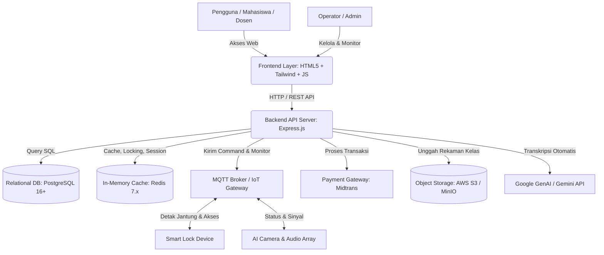
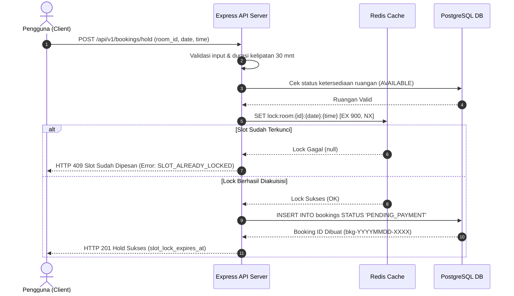
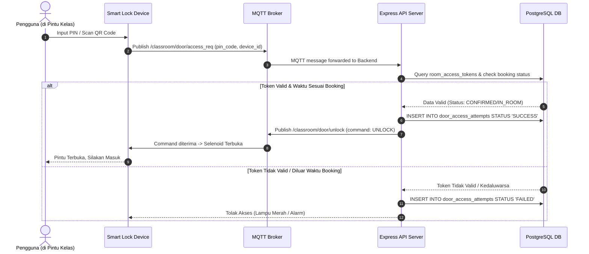

# Dokumen Desain Sistem (System Design): Platform Sewa Smart Classroom

**Versi:** 1.0  
**Tanggal:** 9 Agustus 2026  
**Penulis:** System Architect / Lead Engineer  
**Status:** Draf Arsitektur Sistem Produksi  
**Dokumen Terkait:**
* [2-UseCaseDiagram.md](2-UseCaseDiagram.md) (Aksi Aktor & Flow Bisnis)
* [2-UITesting.md](2-UITesting.md) (Validasi Antarmuka Pengguna)
* [3-DBSchema.md](3-DBSchema.md) (Desain Skema Database & Redis)
* [3-DBQuery.md](3-DBQuery.md) (Optimasi Kueri SQL)
* [4-APIDesign.md](4-APIDesign.md) (Kontrak REST & MQTT)
* [4-APIBackend.md](4-APIBackend.md) (Realisasi Implementasi API)

---

## 1. Arsitektur Sistem Umum (High-Level Architecture)

Platform Sewa Smart Classroom dirancang menggunakan arsitektur modern berbasis layanan terdistribusi mikro-modular (monolitik modular di sisi backend) untuk memastikan keandalan transaksional dan sinkronisasi real-time dengan perangkat IoT di kelas fisik.

### 1.1 Diagram Kontainer Sistem

Diagram di bawah menggambarkan interaksi komponen utama pada sistem:

---

## 2. Rincian Lapisan Arsitektur (Layer Breakdown)

### 2.1 Lapisan Presentasi (Frontend Layer)
Lapisan presentasi menggunakan arsitektur Multi-Page Application (MPA) berbasis file statis HTML yang digabungkan secara dinamis menggunakan modul JavaScript modern dan dibundel dengan **Vite**.

* **Teknologi Utama**:
  * **HTML5 & Vanilla JavaScript**: Mengendalikan logika UI secara langsung tanpa overhead framework yang berat, memicu HTTP fetch requests langsung ke backend API.
  * **Tailwind CSS (v4)**: Memastikan tampilan responsif, modern, dan konsisten (menggunakan curated theme palette untuk brand & surface).
  * **Lucide Icons**: Pustaka ikon vektor untuk komponen visual yang kaya.
* **Halaman Utama**:
  * [index.html](index.html): Halaman Pencarian & Katalog Kelas (Discovery).
  * [in-room.html](in-room.html): Dasbor Kontroler di dalam ruang kelas (untuk kontrol perangkat, status IoT, & recording).
  * [profile.html](profile.html): Manajemen profil pengguna, daftar transaksi dompet (wallet), riwayat langganan, dan unduhan file rekaman (Video Vault).
  * [admin/dashboard.html](admin/dashboard.html): Dashboard pemantauan statistik operasional, pendapatan, status detak jantung perangkat, audit log, dan persetujuan pengembalian dana (refund).
  * [admin/rooms.html](admin/rooms.html): Manajemen inventori ruangan, status maintenance, dan integrasi kunci pintu manual.

### 2.2 Lapisan Aplikasi (Backend Layer)
Lapisan backend dibangun menggunakan **Node.js** dengan framework **Express.js** untuk melayani seluruh API endpoint `/api/v1` secara stateless dan aman menggunakan otentikasi berbasis JWT (JSON Web Token).

* **Komponen Struktur Kode**:
  * **Config**: Koneksi database terpusat untuk PostgreSQL pool ([db.js](server/config/db.js)) dan klien Redis ([redis.js](server/config/redis.js)).
  * **Middleware**: Validasi otentikasi ([auth.js](server/middleware/auth.js)) dan standarisasi penanganan error ([errorHandler.js](server/middleware/errorHandler.js)).
  * **Routes**: Pengorganisasian endpoint modular ([auth.routes.js](server/routes/auth.routes.js), [bookings.routes.js](server/routes/bookings.routes.js), [rooms.routes.js](server/routes/rooms.routes.js), [studio.routes.js](server/routes/studio.routes.js)).
  * **Utils**: Fungsi bantuan audit log keamanan, enkripsi JWT, standar respon, slug generator, dan validasi input.

### 2.3 Lapisan Data & Penyimpanan (Data & Storage Layer)

Sistem menggunakan strategi penyimpanan data hibrida untuk menjaga integritas data transaksional sekaligus melayani operasi konkurensi tinggi secara real-time.

#### A. Database Relasional: PostgreSQL 16+
Digunakan untuk menyimpan seluruh data relasional yang memerlukan kepatuhan penuh ACID (Atomicity, Consistency, Isolation, Durability). 
* Terdiri dari **19 tabel utama** (lihat detail skema lengkap di [3-DBSchema.md](README/3-DBSchema.md)).
* Menangani integritas data pengguna (`users`), transaksi keuangan (`wallet_transactions`, `payments`), data operasional kelas (`rooms`, `bookings`), riwayat IoT (`door_access_attempts`, `manual_unlock_logs`), data rekaman & AI (`recordings`, `ai_transcriptions`), serta audit log administratif (`audit_logs`).

#### B. Cache & In-Memory Store: Redis 7.x
Digunakan untuk mengoptimalkan kinerja dan menyediakan mekanisme kunci konkurensi (distributed lock):
1. **Concurrency Slot Locking (TTL 15 Menit)**: Mencegah tabrakan pemesanan slot jadwal kelas yang sama secara bersamaan menggunakan pola `SET NX` (`lock:room:{roomId}:{bookingDate}:{startTime}-{endTime}`).
2. **Device Heartbeat Monitor (TTL 30 Detik)**: Menyimpan status detak jantung perangkat IoT fisik secara real-time dari MQTT broker sebelum diperbarui secara berkala ke database Postgres (`iot:heartbeat:{roomId}:{deviceType}`).
3. **In-Room Controller Session**: Cache token sesi aktif sementara untuk otentikasi dashboard kelas fisik (`session:in-room:{roomId}`).

#### C. Object Storage (AWS S3 / MinIO)
Digunakan sebagai repositori penyimpanan file biner berukuran besar (Video Vault), seperti file rekaman video mentah kelas (*raw video*), rekaman hasil olah kompresi (*processed video*), serta transkrip kelas (format `.srt` dan `.json`).

---

## 3. Alur Kerja & Mekanisme Kunci (Core Mechanism Flows)

### 3.1 Pencegahan Pemesanan Ganda (Concurrency Slot Locking)

Untuk menjamin tidak ada dua pengguna yang dapat membayar slot waktu yang sama di ruangan yang sama, backend menerapkan kunci terdistribusi menggunakan Redis sebelum membuat record reservasi di PostgreSQL.

* **Penanganan Kegagalan**: Jika penulisan ke PostgreSQL gagal setelah lock diperoleh, blok kode `try-catch` di backend akan langsung memanggil `redis.del(lockKey)` untuk segera melepas slot agar dapat dipesan oleh pengguna lain.

### 3.2 Alur Otentikasi & Akses Pintar IoT (Smart Lock)

Akses pintu fisik di kelas didasarkan pada token akses aktif (`pin_code` atau `qr_code_content`) yang hanya valid selama rentang waktu reservasi yang dikonfirmasi (`CONFIRMED` atau `IN_ROOM`).

---

## 4. Integrasi Kecerdasan Buatan (AI Integration - Gemini SDK)

Sistem memanfaatkan pustaka SDK resmi `@google/genai` untuk memproses rekaman sesi perkuliahan/presentasi di dalam kelas menjadi transkrip teks berkualitas tinggi secara otomatis.

1. **Trigger Aksi**: Ketika kelas berakhir atau pengguna menekan tombol "Stop Recording" di dasbor [in-room.html](in-room.html), backend memperbarui status rekaman menjadi `PROCESSING`.
2. **Prapemrosesan Audio**: Audio diekstrak dari file video rekaman kelas yang tersimpan di Object Storage.
3. **Pengolahan Gemini API**: Backend mengirimkan file audio/video tersebut ke Google Gemini model menggunakan sistem prompt yang dioptimalkan untuk transkripsi akademis dan profesional (mengacu pada modul prompt di [docs/GEMINI_SYSTEM_PROMPT.md](docs/GEMINI_SYSTEM_PROMPT.md)).
4. **Penyimpanan Hasil**: Output transkrip berupa file format SubRip (`.srt`) dan metadata JSON (`.json`) disimpan kembali ke Object Storage dan tautannya direkam di tabel `ai_transcriptions`.
5. **Akses Pengguna**: Pengguna dapat mengunduh transkrip dan video langsung dari tab Video Vault di halaman profil mereka.

---

## 5. Keamanan, RBAC, dan Audit Kepatuhan (Security & Audit Compliance)

Keandalan operasional dan aspek audit administratif menjadi prioritas dalam arsitektur sistem ini untuk mencegah penyalahgunaan hak akses fisik maupun finansial.

### 5.1 Role-Based Access Control (RBAC)
Sistem membagi pengguna ke dalam tiga role utama dengan tingkat hak akses yang ketat:
* **`USER`**: Mahasiswa atau dosen yang menyewa ruangan. Hanya berhak memesan ruangan, melakukan pembayaran saldo dompet, membuka pintu kelas miliknya sendiri pada jam booking, serta mengakses rekaman & transkrip kelasnya.
* **`OPERATOR`**: Staf operasional lapangan. Bertanggung jawab memantau ketersediaan kelas, mencatat penyelesaian pemeliharaan ruangan (`room_maintenance_logs`), mencatat overtime keterlambatan checkout (`late_checkout_logs`), dan memantau status heartbeat koneksi IoT.
* **`ADMIN`**: Pengelola tingkat tinggi. Memiliki hak penuh untuk membatalkan pesanan pengguna lain (*override cancellation*), mengubah saldo wallet pengguna, memproses pengembalian dana (*refund*), melakukan pembukaan pintu secara darurat (*emergency door override*), dan melihat seluruh audit log sistem.

### 5.2 Sistem Audit Log Administratif
Setiap tindakan kritis (seperti perubahan role, penambahan saldo wallet manual, pembatalan pesanan oleh admin, dan pembukaan pintu manual) wajib melewati middleware pencatatan audit ([audit.js](server/utils/audit.js)).
* Middleware ini secara otomatis menangkap data pelaku (`actor_id`, `actor_role`), tindakan (`action`), tabel target, data perubahan (`changes_payload`), dan deskripsi aktivitas.
* Seluruh log disimpan dalam tabel `audit_logs` dan tidak dapat diubah (*immutable*), yang kemudian ditampilkan pada dasbor admin untuk mematuhi standar kepatuhan operasional.
