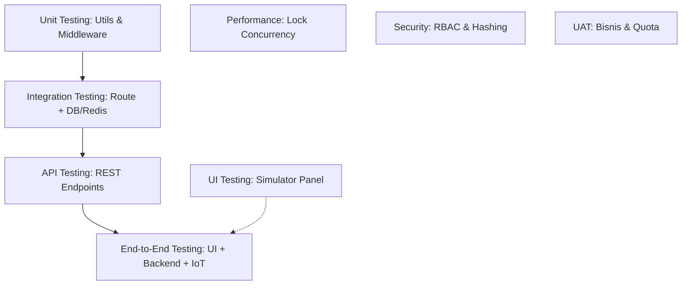

# Dokumen Strategi & Rencana Pengujian (Testing Strategy): Platform Sewa Smart Classroom

**Versi:** 1.0  
**Tanggal:** 9 Agustus 2026  
**Status:** Draf Strategi Pengujian Produksi  
**Dokumen Terkait:**
* [2-UITesting.md](2-UITesting.md) (Panduan Operasional Uji Coba Prototipe)
* [5-SYSDesign.md](5-SYSDesign.md) (Desain Sistem & Arsitektur)
* [6-TechnologyStack.md](6-TechnologyStack.md) (Spesifikasi Tech Stack)
* [X_ProgressSummary.md](../docs/X_ProgressSummary.md) (Backlog & Progres Proyek)

---

## 1. Strategi Pengujian Sistem (Testing Framework)

Pengujian pada platform **VC-Classroom** diatur secara modular untuk memverifikasi logika bisnis, integritas data konkurensi tinggi, sinkronisasi perangkat IoT, serta keandalan antarmuka pengguna (UI).

---

## 2. Cakupan & Implementasi Metodologi Pengujian

### 2.1 Unit Testing (Pengujian Unit)
* **Fokus**: Pengujian fungsi-fungsi utilitas murni (*pure functions*) dan middleware dalam isolasi tanpa ketergantungan database eksternal.
* **Cakupan Pengujian**:
  * **JWT Utility** ([jwt.js](server/utils/jwt.js)): Verifikasi keandalan tanda tangan (*signing*) dan verifikasi token JWT beserta keakuratan payload klaim role.
  * **Input Validator** ([validate.js](server/utils/validate.js)): Pengujian aturan format input (seperti validasi format nomor HP `+62` dan durasi sewa kelipatan 30 menit).
  * **Middleware Proteksi** ([auth.js](server/middleware/auth.js)): Pengujian unit unit terhadap fungsi `requireAuth` & `requireRole` menggunakan object `req`, `res`, dan `next` tiruan (*mocking*).

### 2.2 Integration Testing (Pengujian Integrasi)
* **Fokus**: Pengujian interaksi antara kode aplikasi dengan dependensi database lokal (PostgreSQL pool & Redis client).
* **Cakupan Pengujian**:
  * **PostgreSQL Connection Pool** ([db.js](server/config/db.js)): Verifikasi kelancaran query ke *database engine* PostgreSQL (Aiven) tanpa kegagalan pool.
  * **Redis Key & TTL Lifecycle** ([redis.js](server/config/redis.js)): Verifikasi penulisan data dan ketepatan masa kadaluwarsa (TTL) untuk distributed lock (900 detik) dan IoT heartbeat status (30 detik).

### 2.3 API Testing (Pengujian API)
* **Fokus**: Black-box & white-box testing pada REST API endpoint menggunakan koleksi **Postman API Collection** (sesuai spesifikasi [4-APIDesign.md](4-APIDesign.md)).
* **Cakupan Pengujian**:
  * Pengujian response payload, JSON schema, status code, dan header otentikasi.
  * Endpoint Kritis: `POST /api/v1/bookings/hold` (memastikan status 201 Created), `POST /api/v1/studio/record/action` (status control recording), dan rute portal administratif (`/api/v1/admin/*`).

### 2.4 UI Testing (Pengujian Antarmuka)
* **Fokus**: Pengujian fungsionalitas antarmuka visual prototipe HTML statis menggunakan panel simulator lokal.
* **Cakupan Pengujian**:
  * **Simulation Panel**: Memanfaatkan kontrol simulasi di pojok kanan bawah tiap prototipe (`index.html`, `in-room.html`, `profile.html`, `admin/dashboard.html`, `admin/rooms.html`) untuk menguji skenario penanganan kesalahan tanpa API server (seperti visual error `IOT_GATEWAY_OFFLINE`, `TOKEN_EXPIRED_OR_INVALID`, dan transisi filter kosong).
  * Detail langkah pengujian UI didokumentasikan lengkap di [2-UITesting.md](2-UITesting.md).

### 2.5 End to End (E2E) Testing (Pengujian Ujung ke Ujung)
* **Fokus**: Pengujian alur transaksi penuh pengguna (User Journey) dari interaksi UI, perubahan database, hingga sinyal IoT.
* **Skenario E2E Utama**:
  1. Pengguna login di `profile.html` -> Cari kelas di `index.html` -> Lakukan booking hold -> Bayar via top-up saldo wallet.
  2. Mendekati waktu sewa -> Pintu smart lock terbuka otomatis -> User masuk kelas -> Mulai/selesai rekaman via dashboard `in-room.html` -> Data rekaman tersimpan di database dan transkrip AI terbuat -> File unduhan dapat diakses kembali di `profile.html`.

### 2.6 Performance Testing (Pengujian Kinerja)
* **Fokus**: Menjamin kestabilan performa sistem saat diakses banyak pengguna bersamaan (High Concurrency).
* **Cakupan Pengujian**:
  * **Concurrency Lock Stress Testing**: Mensimulasikan ratusan request pemesanan hold beruntun di detik yang sama untuk menguji keandalan Redis `SET NX` mencegah pemesanan ganda (*double booking*).
  * **Response Latency Target**: Memastikan rute API non-IO berat memberikan response time kurang dari **100ms** (mis. `GET /rooms` dengan optimasi kueri terindeks dari [3-DBQuery.md](3-DBQuery.md)).

### 2.7 Security Testing (Pengujian Keamanan)
* **Fokus**: Perlindungan data sensitif, hak akses RBAC, dan audit kepatuhan.
* **Cakupan Pengujian**:
  * **RBAC Enforcement**: Memastikan rute administratif (`/api/v1/admin/*`) mutlak memblokir token dengan role `USER` dan memicu `403 Forbidden`.
  * **Cryptographic Checks**: Verifikasi keamanan penyimpanan password di database menggunakan hash `bcryptjs` satu arah.
  * **SQL Injection & XSS Prevention**: Memastikan query database mutlak menggunakan parameterisasi pool (`pg.query(text, params)`), bukan penggabungan string langsung (*string concatenation*).

### 2.8 UAT Testing (User Acceptance Testing)
* **Fokus**: Kesesuaian aplikasi dengan kriteria penerimaan bisnis yang dirumuskan di dokumen PRD & FRD.
* **Cakupan Pengujian**:
  * Verifikasi kuota langganan: Akun Enterprise memiliki nilai kuota `-1` (tak terbatas), sedangkan akun Lite/Pro berkurang otomatis pasca-booking.
  * Verifikasi hitungan biaya sewa: Memastikan rumus durasi booking dikali harga per jam dan harga add-on transkrip (Rp 50.000) terhitung tepat pada respon transaksi.

### 2.9 IoT Loop & Hardware Testing (Pengujian Integrasi Perangkat)
* **Fokus**: Pengujian komunikasi pub/sub MQTT antara smart lock fisik (atau simulator hardware) dengan MQTT Broker/Express API.
* **Cakupan Pengujian**:
  * Publikasi request pembukaan pintu dari hardware di topik `/classroom/door/access_req`.
  * Pengiriman perintah buka solenoid pintu dari backend di topik `/classroom/door/unlock` dengan parameter command `UNLOCK`.
  * Monitoring status kegagalan integrasi jika broker terputus (`IOT_GATEWAY_OFFLINE`).
