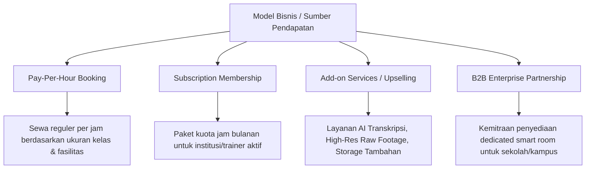
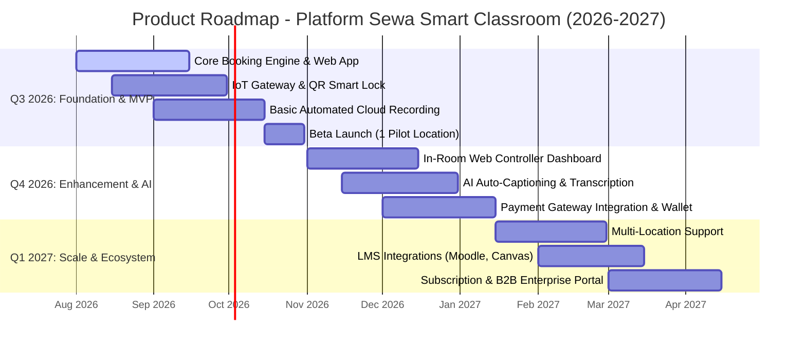
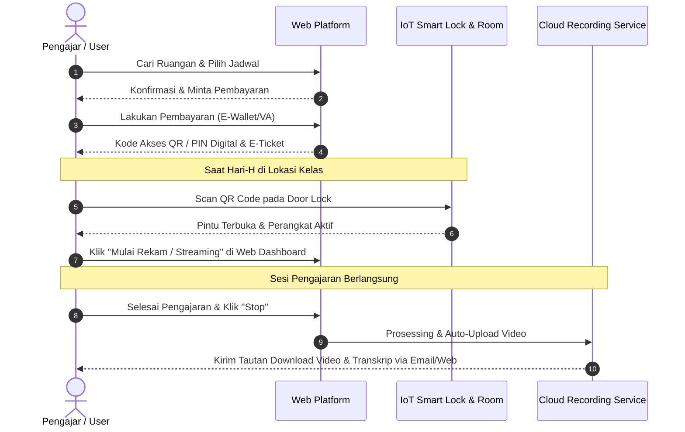

# Dokumen Perencanaan Produk: Platform Sewa Smart Classroom
**Peran / Penulis:** Senior Product Manager  
**Versi:** 1.0  
**Tanggal:** 8 Agustus 2026  
**Target Audiens:** Stakeholder Bisnis, UI/UX Designer, Software Engineer (Frontend/Backend), Quality Assurance (QA)  

---

## 1. Executive Summary & Ringkasan Eksekutif

Dokumen ini disusun sebagai acuan kerja utama (*Single Source of Truth*) dalam mengembangkan platform digital berbasis web untuk layanan **Penggunaan (Sewa) Smart Classroom**. Produk ini hadir untuk menjawab tantangan dan kebutuhan ekosistem pendidikan modern, akademisi, profesional trainer, serta kreator konten edukasi yang membutuhkan fasilitas ruang kelas pintar yang terintegrasi dengan teknologi perekaman otomatis, live streaming, dan alat interaktif secara mandiri (self-service).

---

## 2. Product Vision & Mission

### Product Vision
> *"Menjadi ekosistem smart classroom terdepan yang mendemokratisasi akses terhadap fasilitas pengajaran berbasis teknologi tinggi, enabling seamless blended learning, recording, and content creation for every educator and organization."*

### Product Mission
1. **Accessibility:** Menyediakan akses sewa ruang kelas pintar yang fleksibel, cepat, dan terjangkau secara ad-hoc maupun terjadwal.
2. **Automation:** Mengotomatiskan proses perekaman (*automated recording*), live streaming, dan pemrosesan materi pengajaran (*auto-captioning*, *cloud sync*).
3. **Simplicity:** Menyediakan antarmuka web yang intuitif untuk pemesanan ruang, kontrol perangkat iot di dalam kelas, hingga manajemen aset video digital.

---

## 3. Problem Statement, Solution & Value Proposition

### 3.1 Problem Statement
1. **Ketersediaan & Aksesibilitas Terbatas:** Lembaga pendidikan non-formal, pengajar independen, dan institusi kecil kesulitan mengakses ruang pengajaran modern berteknologi tinggi tanpa investasi kapital (CapEx) yang besar.
2. **Kompleksitas Otomasi Rekaman & Live Stream:** Proses rekaman micro-teaching, webinar, dan workshop sering kali memerlukan kru teknis manual (cameraman, audio engineer), menyebabkan biaya tinggi dan potensi *human error*.
3. **Kebutuhan Pembelajaran Insidental & Blended:** Meningkatnya permintaan akan kelas gabungan (luring & daring) secara mendadak/insidental tanpa dukungan infrastruktur audio-visual yang responsif dan andal.

### 3.2 Solusi Produk
Sebuah **Platform Web Sewa Smart Classroom On-Demand** yang terintegrasi dengan IoT & Sistem Otomasi Studio/Kelas:
* **Self-Service Booking & Door Access:** Pemesanan jadwal kelas secara real-time dengan integrasi akses masuk pintar (QR Code / PIN Digital).
* **Automated Smart Recording & Streaming:** Perekaman otomatis berbasis AI-tracking camera dan audio array yang langsung terunggah ke *Cloud Storage* pengguna.
* **One-Touch Classroom Controller:** Kontrol pencahayaan, mikrofon, kamera, dan interactive whiteboard langsung dari dashbord web di dalam kelas.

### 3.3 Value Proposition Canvas

| Dimensi | Elemen | Deskripsi Detail |
| :--- | :--- | :--- |
| **Value Proposition** | *Products & Services* | Web Booking Platform, Smart Room IoT Controller, Cloud Video Vault, Auto-Editing & Transkripsi AI |
| | *Gain Creators* | Akses instan tanpa kru teknis, hasil rekaman kualitas HD/4K langsung siap diunduh, fleksibilitas durasi sewa |
| | *Pain Relievers* | Menghilangkan biaya investasi alat mahal, menghilangkan risiko kegagalan rekaman, reservasi transparan tanpa birokrasi |
| **Customer Profile** | *Customer Jobs* | Mengajar kelas blended, merekam materi micro-teaching, menyelenggarakan webinar/workshop |
| | *Gains* | Efisiensi waktu, citra profesional di mata siswa/klien, efisiensi biaya operasional |
| | *Pains* | Biaya sewa studio mahal, setting peralatan memakan waktu lama, hasil audio/video buruk |

---

## 4. Target User Persona

### Persona 1: Dosen / Pengajar Independen (Dr. Aris, M.Pd.)
* **Demografi:** Usia 38 tahun, Pengajar & Konsultan Pendidikan.
* **Perilaku:** Rutin membuat materi *micro-teaching* dan kelas insidental untuk program sertifikasi.
* **Pain Points:** 
  * Tidak memiliki studio rekaman pribadi.
  * Membutuhkan waktu lama untuk mengedit video dan mengatur kamera.
* **Goals:** Mengunggah video pembelajaran berkualitas tinggi secara cepat tanpa repot urusan teknis studio.

### Persona 2: Corporate Trainer / Event Organizer (Siti Rahma)
* **Demografi:** Usia 29 tahun, People Development Lead di Startup.
* **Perilaku:** Menyelenggarakan workshop internal dan webinar interaktif bulanan untuk peserta *hybrid*.
* **Pain Points:** 
  * Ruang rapat kantor tidak memadai untuk interaksi *blended learning*.
  * Biaya sewa ballroom/studio komersial terlalu mahal untuk acara skala sedang (15-30 orang).
* **Goals:** Mendapatkan ruangan interaktif dengan fasilitas audio visual jernih dan akses mudah bagi peserta luring & daring.

### Persona 3: EdTech Content Creator (Bima Utama)
* **Demografi:** Usia 26 tahun, Pembuat Kursus Online Independen.
* **Perilaku:** Memproduksi modul kursus video secara berkelanjutan (batching).
* **Pain Points:** 
  * Peralatan studio mandiri terbatas.
  * Membutuhkan papan tulis interaktif (smart whiteboard) untuk penulisan rumus/diagram.
* **Goals:** Menyewa ruang pintar berdurasi jam-jaman dengan fitur smart board dan perekaman otomatis multi-angle.

---

## 5. Jobs to be Done (JTBD) Framework

```
[When...] Situasi & Konteks
  └── [I want to...] Kebutuhan & Tindakan
        └── [So that I can...] Hasil yang Diharapkan
```

1. **JTBD 1 (Pemesanan & Akses):**
   * *When* saya harus menyelenggarakan kelas blended insidental besok pagi,
   * *I want to* menemukan dan memesan smart classroom yang memiliki spesifikasi audio-visual lengkap secara instan melalui web,
   * *So that I can* memastikan kelas berjalan lancar tanpa terkendala persiapan teknis.

2. **JTBD 2 (Perekaman & Kontrol):**
   * *When* saya sedang mengajar di dalam smart classroom,
   * *I want to* mengontrol kamera tracking dan perekaman hanya dengan satu klik di dashboard web,
   * *So that I can* fokus 100% pada materi pengajaran tanpa terdistraksi oleh pengoperasian alat.

3. **JTBD 3 (Pasca Perekaman & Manajemen Aset):**
   * *When* sesi pembelajaran selesai,
   * *I want to* langsung menerima tautan unduhan video rekaman yang sudah terpotong rapi beserta transkripsinya,
   * *So that I can* membagikan materi tersebut kepada siswa/peserta workshop hari itu juga.

---

## 6. Competitor Analysis

| Fitur / Parameter | Platform Kami (Smart Classroom) | Studio Rekaman Lokal | Ruang Co-Working / R. Rapat | Platform LMS / Zoom Only |
| :--- | :--- | :--- | :--- | :--- |
| **Spesialisasi Edukasi** | Sangat Tinggi (Smart Board, AI Track Camera) | Rendah (Fokus pada Video General) | Rendah (Fokus pada Rapat) | Tinggi (Hanya Digital) |
| **Otomasi Rekaman** | Otomatis Cloud Sync & AI Editing | Manual (Dikerjakan Editor) | Tidak Ada | Terbatas (Cloud Recording) |
| **Kemudahan Pemesanan** | Self-Service Web Booking Instant | Manual (WhatsApp / Admin) | Web / App Booking | Instant |
| **Biaya / Efisiensi** | Pay-per-use (Terjangkau) | Mahal (Include Kru Studio) | Sedang (Tanpa Alat Edukasi) | Sangat Murah (Tanpa Ruang Fisik) |
| **Akses Fisik IoT** | Smart Lock (QR / PIN Instant) | Kunci Kunci Manual / Resepsionis | Card Access | N/A |

---

## 7. SWOT Analysis

### Strength (Kekuatan)
* Integrasi teknologi IoT fisik dan platform web yang efisien.
* Fitur *automated recording & tracking* menurunkan operational cost (tanpa kru).
* Sistem pemesanan mandiri 24/7 dengan konfirmasi dan akses QR instan.

### Weakness (Kelemahan)
* Kebergantungan tinggi pada koneksi internet dan infrastruktur fisik lokasi.
* Membutuhkan edukasi awal bagi pengguna yang belum terbiasa dengan fasilitas *smart room*.

### Opportunity (Peluang)
* Tingginya adopsi *blended learning* dan *micro-learning* pasca-pandemi.
* Pertumbuhan pesat industri *EdTech* dan kursus mandiri di Indonesia.
* Kemitraan strategis dengan universitas atau gedung komersial untuk penyediaan lokasi.

### Threat (Ancaman)
* Potensi kerusakan perangkat keras fisik oleh pengguna.
* Masuknya penyedia jasa studio konvensional yang mulai beralih ke otomatisasi.

---

## 8. Business Model & Monetization Strategy



### Rincian Strategi Monetisasi:
1. **Pay-Per-Use / On-Demand:** Biaya sewa berdasarkan jam (misal: Rp 150.000 - Rp 350.000 / jam tergantung tipe ruangan).
2. **Tiered Subscription (Pengajar & Lembaga):**
   * *Basic:* 10 jam/bulan + Standard Storage.
   * *Pro:* 30 jam/bulan + AI Transcription + Cloud Storage 500GB.
   * *Enterprise:* Unlimited access (prakiraan kuota) + Dedicated Support + Custom Integrasi LMS.
3. **Add-on Services:**
   * AI Transkripsi & Rangkuman Materi Otomatis.
   * Penyimpanan Cloud Jangka Panjang (Archive Vault).
   * Layanan Live Streaming Multi-platform simultaneously (YouTube, Zoom, Twitch).

---

## 9. Product Roadmap



---

## 10. Sistem Architecture & User Flow Diagram

### System User Flow



---

## 11. Panduan Implementasi untuk Tim Cross-Functional

### 11.1 Untuk UI/UX Designer
* **Mobile-First Responsiveness:** Halaman reservasi dan jadwal harus dioptimalkan untuk perangkat seluler.
* **In-Room Controller Interface:** Antarmuka *Dashboard In-Room* harus berukuran tombol besar (*touch-friendly*), ramah kontras, dan memiliki indikator visual status rekaman yang jelas (misal: warna merah berkedip saat *Live/Recording*).
* **Clear Feedback Loop:** Tampilkan status koneksi IoT secara real-time di layar.

### 11.2 Untuk Software Engineer (Frontend & Backend)
* **Backend:** 
  * Bangun arsitektur microservices atau modular monolith berbasis REST/GraphQL.
  * Sediakan Webhook untuk integrasi IoT Smart Lock (MQTT / HTTP REST).
  * Penanganan konkurensi jadwal pemesanan (*locking mechanism*) untuk mencegah *double-booking*.
* **Frontend:**
  * Gunakan framework modern (Next.js / React) untuk performa render cepat dan SEO-friendly pada halaman katalog studio.
  * Web Socket integration untuk menerima indikator status IoT dan progress upload video secara real-time.

### 11.3 Untuk Quality Assurance (QA)
* **Penyusunan Matrix Testing:**
  * **Functional Testing:** Verifikasi reservasi, pemotongan kuota sewa, dan integrasi Payment Gateway.
  * **IoT Integration Testing:** Uji skenario latensi pengiriman sinyal QR Code buka pintu & perintah rekam.
  * **Edge Cases Testing:** Apa yang terjadi jika koneksi internet di kelas terputus saat proses rekaman berlangsung? Pastikan ada fail-safe *local caching/backup storage*.

---