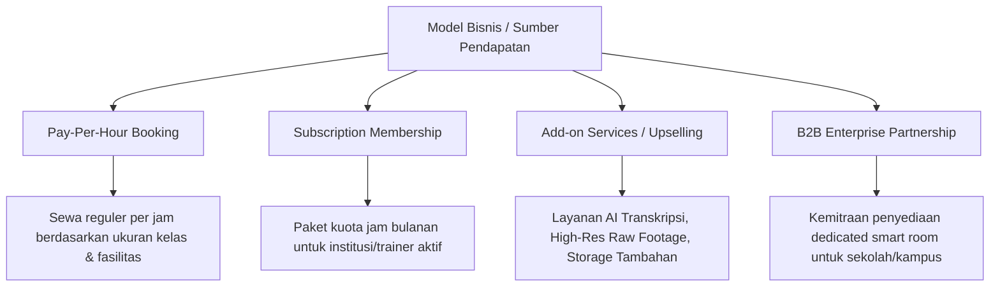
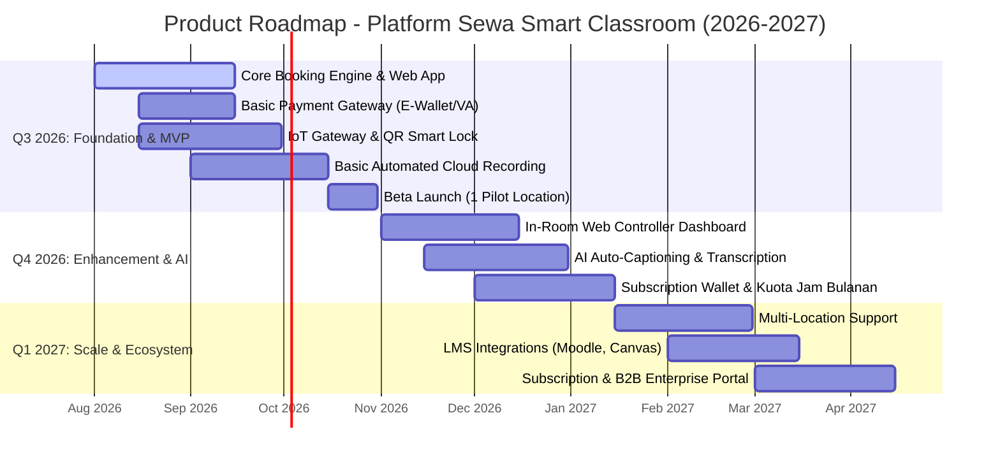
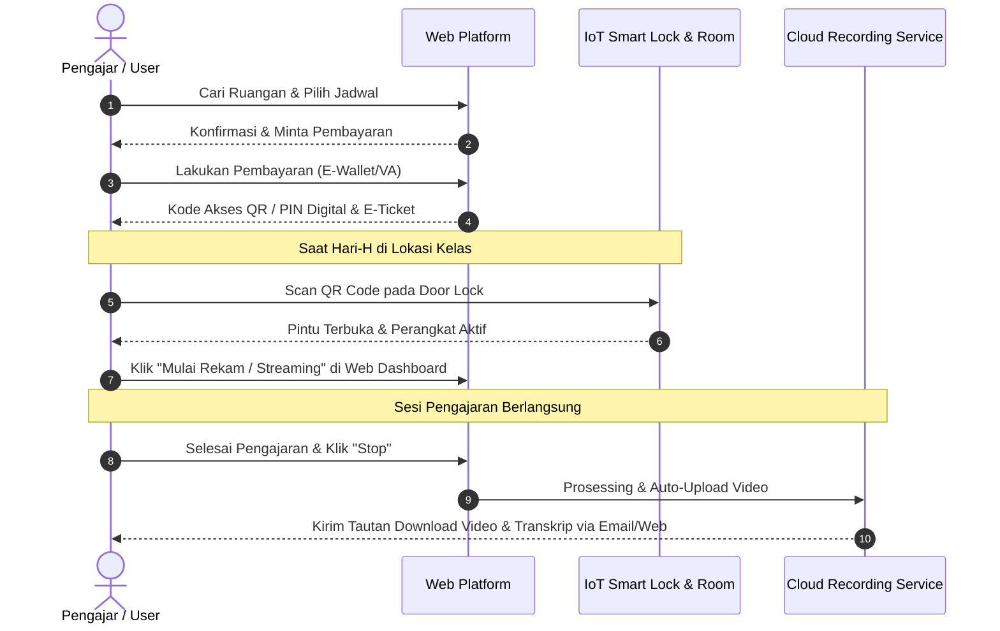

# Dokumen Perencanaan Produk: Platform Sewa Smart Classroom
**Peran / Penulis:** Senior Product Manager  
**Versi:** 1.3  
**Tanggal:** 8 Agustus 2026  
**Target Audiens:** Stakeholder Bisnis, UI/UX Designer, Software Engineer (Frontend/Backend), Quality Assurance (QA)  

### Riwayat Revisi

| Versi | Bagian | Sebelum | Sesudah |
| :--- | :--- | :--- | :--- |
| 1.0 | Dokumen (keseluruhan) | — | Draf awal dokumen product discovery. |
| 1.2 | Business Model & Monetization (8) | Harga hanya ditandai "indikatif" tanpa alat bantu penentuan; kebijakan refund subscription belum ada (hanya cancellation policy pay-per-use di FRD §7.2). | Ditambahkan §8.1 (Tabel Kerja Penentuan Harga, untuk diisi tim bisnis) dan §8.2 (Kebijakan Refund Subscription, draft kontekstual) — tindak lanjut P1-4 pada `docs/X_ProgressSummary.md`. |
| 1.3 | Business Model & Monetization (8, 8.1) | Tim bisnis sudah mengisi & menyetujui worksheet §8.1 dengan harga final, namun ringkasan utama di §8 (Rincian Strategi Monetisasi) masih menampilkan angka "misal: Rp150.000-350.000" bergaya indikatif — tidak sinkron dengan §8.1. | Angka final (Small Rp150rb, Medium Rp250rb, Large Rp350rb; Basic Rp1,2jt, Pro Rp4,9jt, Enterprise Rp11,9jt/bulan) dipindahkan ke §8; catatan "indikatif" dihapus untuk pricing; status §8.1 diperbarui jadi "selesai diisi & disetujui". Kebijakan refund subscription (§8.2) tetap draft kontekstual **secara sengaja**, tidak diubah. |
| 1.1 | Product Vision (2) | Hanya kutipan visi dalam Bahasa Inggris. | Ditambahkan terjemahan bebas dalam Bahasa Indonesia agar mudah dipahami semua pembaca. |
| 1.1 | Problem Statement (3.1) | Daftar 3 poin masalah tanpa ID dan tanpa keterangan pihak terdampak/dampak. | Diubah menjadi tabel dengan ID (P1-P3), kolom "Siapa Paling Terdampak" & "Dampak Jika Tidak Diatasi", ditambah catatan bahwa data masih kualitatif dan perlu riset pasar. |
| 1.1 | Solusi Produk (3.2) | 3 solusi dijabarkan tanpa keterkaitan eksplisit ke problem statement; terdapat typo "dashbord". | Setiap solusi ditandai relasi ke ID problem terkait (mis. "menjawab P1, P3"); typo "dashbord" diperbaiki menjadi "dashboard". |
| 1.1 | Value Proposition Canvas (3.3) | Gain Creators, Pain Relievers, Gains, dan Pains ditulis sebagai daftar lepas tanpa keterkaitan satu sama lain. | Dipecah menjadi dua tabel pemetaan 1:1: "Pain → Pain Reliever" dan "Gain → Gain Creator". |
| 1.1 | Target User Persona (4) | Tidak ada keterangan JTBD mana yang relevan untuk masing-masing persona. | Ditambahkan baris "Terkait JTBD" pada setiap dari 3 persona. |
| 1.1 | Jobs to be Done (5) | Hanya berisi 3 JTBD tanpa rangkuman keterkaitan ke persona/pain point/goal. | Ditambahkan subbagian 5.1: tabel pemetaan Persona → Pain Point Utama → Goal Utama → JTBD Terkait. |
| 1.1 | Competitor Analysis (6) | Tabel kompetitor memiliki typo "Kunci Kunci Manual"; tidak ada kesimpulan analisis. | Typo diperbaiki menjadi "Kunci Manual"; ditambahkan subbagian "Insight Kompetitif" berisi positioning terhadap tiap kompetitor dan celah pasar. |
| 1.1 | SWOT Analysis (7) | 4 kuadran (Strength, Weakness, Opportunity, Threat) berdiri sendiri tanpa rekomendasi tindak lanjut. | Ditambahkan subbagian "Implikasi Strategis" (S→O, S→T, W→O, W→T) yang menerjemahkan tiap kuadran menjadi arah strategi konkret. |
| 1.1 | Business Model & Monetization (8) | Strategi monetisasi (Pay-per-use, Subscription, Add-on) dijabarkan tanpa target persona & tanpa disclaimer harga. | Setiap tier subscription dikaitkan ke persona target; ditambahkan catatan bahwa harga masih indikatif dan kebijakan refund perlu dirumuskan. |
| 1.1 | Product Roadmap (9) | "Payment Gateway Integration" dijadwalkan Q4 2026 — tidak konsisten karena MVP/Beta Launch di Q3 2026 sudah membutuhkan pembayaran. | Integrasi payment dasar (E-Wallet/VA) dipindahkan ke Q3 2026 selaras dengan MVP; fitur wallet & kuota bulanan tetap di Q4 2026, ditambah catatan perbaikan di bawah diagram. |

---

## 1. Executive Summary & Ringkasan Eksekutif

Dokumen ini disusun sebagai acuan kerja utama (*Single Source of Truth*) dalam mengembangkan platform digital berbasis web untuk layanan **Penggunaan (Sewa) Smart Classroom**. Produk ini hadir untuk menjawab tantangan dan kebutuhan ekosistem pendidikan modern, akademisi, profesional trainer, serta kreator konten edukasi yang membutuhkan fasilitas ruang kelas pintar yang terintegrasi dengan teknologi perekaman otomatis, live streaming, dan alat interaktif secara mandiri (self-service).

---

## 2. Product Vision & Mission

### Product Vision
> *"Menjadi ekosistem smart classroom terdepan yang mendemokratisasi akses terhadap fasilitas pengajaran berbasis teknologi tinggi, enabling seamless blended learning, recording, and content creation for every educator and organization."*
>
> **Terjemahan bebas:** Menjadi ekosistem smart classroom nomor satu yang membuka akses teknologi pengajaran canggih bagi siapa saja, sehingga pembelajaran blended, perekaman, dan pembuatan konten dapat berjalan mulus tanpa hambatan teknis.

### Product Mission
1. **Accessibility:** Menyediakan akses sewa ruang kelas pintar yang fleksibel, cepat, dan terjangkau secara ad-hoc maupun terjadwal.
2. **Automation:** Mengotomatiskan proses perekaman (*automated recording*), live streaming, dan pemrosesan materi pengajaran (*auto-captioning*, *cloud sync*).
3. **Simplicity:** Menyediakan antarmuka web yang intuitif untuk pemesanan ruang, kontrol perangkat iot di dalam kelas, hingga manajemen aset video digital.

---

## 3. Problem Statement, Solution & Value Proposition

### 3.1 Problem Statement

| ID | Problem | Siapa Paling Terdampak | Dampak Jika Tidak Diatasi |
| :--- | :--- | :--- | :--- |
| **P1** | **Ketersediaan & Aksesibilitas Terbatas** — Lembaga pendidikan non-formal, pengajar independen, dan institusi kecil kesulitan mengakses ruang pengajaran modern berteknologi tinggi tanpa investasi kapital (CapEx) yang besar. | Pengajar independen, institusi kecil | Kualitas materi ajar tertinggal; sulit bersaing dengan penyedia kursus yang sudah memiliki studio sendiri. |
| **P2** | **Kompleksitas Otomasi Rekaman & Live Stream** — Proses rekaman micro-teaching, webinar, dan workshop sering kali memerlukan kru teknis manual (cameraman, audio engineer), menyebabkan biaya tinggi dan potensi *human error*. | Corporate trainer, content creator | Biaya produksi membengkak; jadwal produksi molor akibat ketergantungan pada kru manual. |
| **P3** | **Kebutuhan Pembelajaran Insidental & Blended** — Meningkatnya permintaan akan kelas gabungan (luring & daring) secara mendadak/insidental tanpa dukungan infrastruktur audio-visual yang responsif dan andal. | Semua persona, khususnya trainer korporat | Kualitas pengalaman peserta daring menurun; citra profesional penyelenggara terganggu. |

> **Catatan:** Ketiga problem di atas masih bersifat kualitatif berdasarkan observasi pasar. Disarankan dilengkapi data pendukung (survei/riset pasar) sebelum dijadikan justifikasi investasi.

### 3.2 Solusi Produk
Sebuah **Platform Web Sewa Smart Classroom On-Demand** yang terintegrasi dengan IoT & Sistem Otomasi Studio/Kelas — setiap solusi berikut dipetakan langsung ke problem yang dijawabnya (lihat ID pada 3.1):
* **Self-Service Booking & Door Access** *(menjawab P1, P3)*: Pemesanan jadwal kelas secara real-time dengan integrasi akses masuk pintar (QR Code / PIN Digital).
* **Automated Smart Recording & Streaming** *(menjawab P2)*: Perekaman otomatis berbasis AI-tracking camera dan audio array yang langsung terunggah ke *Cloud Storage* pengguna.
* **One-Touch Classroom Controller** *(menjawab P2, P3)*: Kontrol pencahayaan, mikrofon, kamera, dan interactive whiteboard langsung dari dashboard web di dalam kelas.

### 3.3 Value Proposition Canvas

| Dimensi | Elemen | Deskripsi Detail |
| :--- | :--- | :--- |
| **Value Proposition** | *Products & Services* | Web Booking Platform, Smart Room IoT Controller, Cloud Video Vault, Auto-Editing & Transkripsi AI |
| **Customer Profile** | *Customer Jobs* | Mengajar kelas blended, merekam materi micro-teaching, menyelenggarakan webinar/workshop |

Agar hubungan sebab-akibat antara masalah pengguna dan solusi produk mudah ditelusuri, setiap *Pain* dan *Gain* dipetakan 1:1 terhadap *Reliever*/*Creator*-nya:

**Pain → Pain Reliever**

| # | Customer Pain | Pain Reliever |
| :--- | :--- | :--- |
| 1 | Biaya sewa studio mahal | Model *pay-per-use*, tanpa investasi alat/kru mahal |
| 2 | Setting peralatan memakan waktu lama | Self-service booking & akses instan (QR/PIN) tanpa instalasi manual |
| 3 | Hasil audio/video buruk | AI-tracking camera & audio array kualitas HD/4K, menghilangkan risiko kegagalan rekaman |

**Gain → Gain Creator**

| # | Customer Gain | Gain Creator |
| :--- | :--- | :--- |
| 1 | Efisiensi waktu | Akses instan tanpa kru teknis, reservasi transparan tanpa birokrasi |
| 2 | Citra profesional di mata siswa/klien | Hasil rekaman kualitas HD/4K langsung siap diunduh |
| 3 | Efisiensi biaya operasional | Fleksibilitas durasi sewa (pay-per-hour), tanpa biaya tetap studio |

---

## 4. Target User Persona

### Persona 1: Dosen / Pengajar Independen (Dr. Aris, M.Pd.)
* **Demografi:** Usia 38 tahun, Pengajar & Konsultan Pendidikan.
* **Perilaku:** Rutin membuat materi *micro-teaching* dan kelas insidental untuk program sertifikasi.
* **Pain Points:** 
  * Tidak memiliki studio rekaman pribadi.
  * Membutuhkan waktu lama untuk mengedit video dan mengatur kamera.
* **Goals:** Mengunggah video pembelajaran berkualitas tinggi secara cepat tanpa repot urusan teknis studio.
* **Terkait JTBD:** JTBD 1 (Pemesanan & Akses), JTBD 3 (Pasca Perekaman & Manajemen Aset).

### Persona 2: Corporate Trainer / Event Organizer (Siti Rahma)
* **Demografi:** Usia 29 tahun, People Development Lead di Startup.
* **Perilaku:** Menyelenggarakan workshop internal dan webinar interaktif bulanan untuk peserta *hybrid*.
* **Pain Points:** 
  * Ruang rapat kantor tidak memadai untuk interaksi *blended learning*.
  * Biaya sewa ballroom/studio komersial terlalu mahal untuk acara skala sedang (15-30 orang).
* **Goals:** Mendapatkan ruangan interaktif dengan fasilitas audio visual jernih dan akses mudah bagi peserta luring & daring.
* **Terkait JTBD:** JTBD 1 (Pemesanan & Akses), JTBD 2 (Perekaman & Kontrol).

### Persona 3: EdTech Content Creator (Bima Utama)
* **Demografi:** Usia 26 tahun, Pembuat Kursus Online Independen.
* **Perilaku:** Memproduksi modul kursus video secara berkelanjutan (batching).
* **Pain Points:** 
  * Peralatan studio mandiri terbatas.
  * Membutuhkan papan tulis interaktif (smart whiteboard) untuk penulisan rumus/diagram.
* **Goals:** Menyewa ruang pintar berdurasi jam-jaman dengan fitur smart board dan perekaman otomatis multi-angle.
* **Terkait JTBD:** JTBD 2 (Perekaman & Kontrol), JTBD 3 (Pasca Perekaman & Manajemen Aset).

---

## 5. Jobs to be Done (JTBD) Framework

```
[When...] Situasi & Konteks
  └── [I want to...] Kebutuhan & Tindakan
        └── [So that I can...] Hasil yang Diharapkan
```

1. **JTBD 1 (Pemesanan & Akses):**
   * *When* saya harus menyelenggarakan kelas blended insidental besok pagi,
   * *I want to* menemukan dan memesan smart classroom yang memiliki spesifikasi audio-visual lengkap secara instan melalui web,
   * *So that I can* memastikan kelas berjalan lancar tanpa terkendala persiapan teknis.

2. **JTBD 2 (Perekaman & Kontrol):**
   * *When* saya sedang mengajar di dalam smart classroom,
   * *I want to* mengontrol kamera tracking dan perekaman hanya dengan satu klik di dashboard web,
   * *So that I can* fokus 100% pada materi pengajaran tanpa terdistraksi oleh pengoperasian alat.

3. **JTBD 3 (Pasca Perekaman & Manajemen Aset):**
   * *When* sesi pembelajaran selesai,
   * *I want to* langsung menerima tautan unduhan video rekaman yang sudah terpotong rapi beserta transkripsinya,
   * *So that I can* membagikan materi tersebut kepada siswa/peserta workshop hari itu juga.

### 5.1 Pemetaan Persona, Pain Point, Goal & JTBD

Tabel ini merangkas keterkaitan antara persona, pain point utama, goal utama, dan JTBD terkait agar tim pengembangan dapat menelusuri "mengapa" di balik setiap fitur yang dibangun.

| Persona | Pain Point Utama | Goal Utama | JTBD Terkait |
| :--- | :--- | :--- | :--- |
| Dr. Aris — Dosen/Pengajar Independen | Tidak punya studio pribadi; edit video memakan waktu lama | Upload video pembelajaran berkualitas tinggi secara cepat | JTBD 1, JTBD 3 |
| Siti Rahma — Corporate Trainer/EO | Ruang rapat kantor tidak memadai; sewa ballroom/studio komersial mahal | Ruangan interaktif dengan akses mudah bagi peserta hybrid | JTBD 1, JTBD 2 |
| Bima Utama — EdTech Content Creator | Peralatan studio mandiri terbatas; butuh smart whiteboard | Sewa ruang jam-jaman dengan smart board & rekaman otomatis multi-angle | JTBD 2, JTBD 3 |

---

## 6. Competitor Analysis

| Fitur / Parameter | Platform Kami (Smart Classroom) | Studio Rekaman Lokal | Ruang Co-Working / R. Rapat | Platform LMS / Zoom Only |
| :--- | :--- | :--- | :--- | :--- |
| **Spesialisasi Edukasi** | Sangat Tinggi (Smart Board, AI Track Camera) | Rendah (Fokus pada Video General) | Rendah (Fokus pada Rapat) | Tinggi (Hanya Digital) |
| **Otomasi Rekaman** | Otomatis Cloud Sync & AI Editing | Manual (Dikerjakan Editor) | Tidak Ada | Terbatas (Cloud Recording) |
| **Kemudahan Pemesanan** | Self-Service Web Booking Instant | Manual (WhatsApp / Admin) | Web / App Booking | Instant |
| **Biaya / Efisiensi** | Pay-per-use (Terjangkau) | Mahal (Include Kru Studio) | Sedang (Tanpa Alat Edukasi) | Sangat Murah (Tanpa Ruang Fisik) |
| **Akses Fisik IoT** | Smart Lock (QR / PIN Instant) | Kunci Manual / Resepsionis | Card Access | N/A |

### Insight Kompetitif
* **Vs. Studio Rekaman Lokal:** Keunggulan utama kami ada di harga (pay-per-use vs. paket mahal termasuk kru) dan kecepatan akses (self-service instant vs. booking manual via WhatsApp/admin).
* **Vs. Ruang Co-Working/Rapat:** Kami unggul di kelengkapan alat khusus edukasi (smart board, AI tracking camera) yang tidak dimiliki ruang rapat umum.
* **Vs. Platform LMS/Zoom Only:** Kami menang di sisi kualitas produksi fisik (ruang, kamera, audio) untuk kebutuhan tatap muka/hybrid, sementara Zoom/LMS unggul di biaya karena tanpa ruang fisik — sehingga kedua kategori ini melayani kebutuhan yang berbeda, bukan pengganti langsung satu sama lain.
* **Celah pasar yang dimanfaatkan:** Belum ada pemain yang menggabungkan *self-service booking*, *smart lock*, dan *automated recording* khusus untuk kebutuhan edukasi dalam satu platform.

---

## 7. SWOT Analysis

### Strength (Kekuatan)
* Integrasi teknologi IoT fisik dan platform web yang efisien.
* Fitur *automated recording & tracking* menurunkan operational cost (tanpa kru).
* Sistem pemesanan mandiri 24/7 dengan konfirmasi dan akses QR instan.

### Weakness (Kelemahan)
* Kebergantungan tinggi pada koneksi internet dan infrastruktur fisik lokasi.
* Membutuhkan edukasi awal bagi pengguna yang belum terbiasa dengan fasilitas *smart room*.

### Opportunity (Peluang)
* Tingginya adopsi *blended learning* dan *micro-learning* pasca-pandemi.
* Pertumbuhan pesat industri *EdTech* dan kursus mandiri di Indonesia.
* Kemitraan strategis dengan universitas atau gedung komersial untuk penyediaan lokasi.

### Threat (Ancaman)
* Potensi kerusakan perangkat keras fisik oleh pengguna.
* Masuknya penyedia jasa studio konvensional yang mulai beralih ke otomatisasi.

### Implikasi Strategis (Ringkasan SWOT)
* **Strength → Opportunity:** Manfaatkan otomasi rekaman (tanpa kru) untuk menangkap pertumbuhan pasar *blended learning* dengan struktur biaya yang lebih kompetitif dibanding kompetitor konvensional.
* **Strength → Threat:** Perkuat *automated recording & tracking* sebagai *moat* teknologi sebelum studio konvensional sempat beralih ke otomatisasi serupa.
* **Weakness → Opportunity:** Gunakan momentum kemitraan strategis (kampus/gedung komersial) untuk sekaligus menyediakan infrastruktur internet yang andal di setiap lokasi baru, mengurangi ketergantungan pada infrastruktur pihak ketiga.
* **Weakness → Threat:** Edukasi pengguna yang belum familiar dengan smart room perlu dipercepat (onboarding in-app) agar tidak kalah gesit dibanding kompetitor yang mulai bertransformasi digital.

---

## 8. Business Model & Monetization Strategy



### Rincian Strategi Monetisasi:
1. **Pay-Per-Use / On-Demand:** Harga final per jam berdasarkan tipe ruangan — **Small Rp150.000, Medium Rp250.000, Large Rp350.000** (disetujui Senior PM & Finance, 8 Agustus 2026; dasar perhitungan & perbandingan kompetitor di §8.1.A). Cocok untuk kebutuhan insidental Persona 1 (Dr. Aris) dan Persona 3 (Bima Utama) yang tidak selalu butuh sewa rutin.
2. **Tiered Subscription (Pengajar & Lembaga)** — harga final disetujui 8 Agustus 2026 (dasar perhitungan di §8.1.B):
   * *Basic:* 10 jam/bulan + Standard Storage — **Rp1.200.000/bulan** — target pengajar independen dengan jadwal rutin ringan.
   * *Pro:* 30 jam/bulan + AI Transcription + Cloud Storage 500GB — **Rp4.900.000/bulan** — target trainer korporat/kreator konten aktif (Persona 2 & 3).
   * *Enterprise:* Unlimited access (prakiraan kuota) + Dedicated Support + Custom Integrasi LMS — **Rp11.900.000/bulan** — target institusi/perusahaan (kelanjutan B2B Enterprise Partnership).
3. **Add-on Services:**
   * AI Transkripsi & Rangkuman Materi Otomatis.
   * Penyimpanan Cloud Jangka Panjang (Archive Vault).
   * Layanan Live Streaming Multi-platform simultaneously (YouTube, Zoom, Twitch).

> **Catatan:** Harga pay-per-use dan subscription di atas adalah **harga final** hasil validasi tim bisnis (rincian & dasar perhitungan lengkap di §8.1). Kebijakan pembatalan/refund untuk model pay-per-use *booking per sesi* sudah final strukturnya di `03_FunctionalRequirementDocument.md` §7.2 (100%/50%/0% berdasarkan jarak waktu ke sesi); kebijakan refund untuk *subscription* masih berstatus **draft kontekstual** di §8.2 — ini disengaja (bukan gap), karena teks & SLA finalnya baru akan dituntaskan saat halaman Kebijakan & Ketentuan (IA screen 1.6) dibangun.

### 8.1 Tabel Kerja Penentuan Harga (Worksheet)

> **Status: selesai diisi & disetujui** (Senior PM & Finance, 8 Agustus 2026). Hasil akhirnya sudah dipindahkan ke Bagian 8 (Rincian Strategi Monetisasi) di atas. Tabel di bawah ini dipertahankan sebagai jejak audit dasar perhitungan (perbandingan kompetitor, estimasi biaya operasional, margin) — bukan lagi worksheet kosong.

**A. Pay-Per-Use per Tipe Ruangan** (tier kapasitas mengikuti filter katalog di `03_FunctionalRequirementDocument.md` §2.1 & `04_InformationArchitecture.md` H-01)

| Tipe Ruangan | Kapasitas | Fasilitas Utama Termasuk | Harga Acuan Studio Rekaman Lokal | Harga Acuan Co-Working/R. Rapat | Estimasi Biaya Operasional/Jam | Margin Target (%) | Harga Final Diusulkan (Rp/Jam) | Disetujui Oleh & Tanggal |
| :--- | :--- | :--- | :--- | :--- | :--- | :--- | :--- | :--- |
| Small | 1-10 orang | Smart Board, 1x AI Camera | 250 - 350 ribu | 100 - 150 ribu | 50 ribu | 66% | 150 ribu | Senior PM & Finance, 8 Ags 2026 |
| Medium | 11-30 orang | Smart Board, Multi-Cam AI, Audio Array | 400 - 550 ribu | 180 - 250 ribu | 85 ribu | 66% | 250 ribu | Senior PM & Finance, 8 Ags 2026 |
| Large | 31-50 orang | Smart Board, Multi-Cam AI, Studio Podcasting, Audio Array | 600 - 900 ribu | 300 - 450 ribu | 120 ribu | 65% | 350 ribu | Senior PM & Finance, 8 Ags 2026 |

**B. Tiered Subscription**

| Tier | Kuota Jam/Bulan | Fasilitas Termasuk | Setara Harga jika Dibeli Pay-Per-Use | Target Diskon vs Pay-Per-Use (%) | Harga Bulanan Diusulkan (Rp) | Disetujui Oleh & Tanggal |
| :--- | :--- | :--- | :--- | :--- | :--- | :--- |
| Basic | 10 jam | Standard Storage | 1.5 juta (basis tarif Small @150k) | 20% | 1.2 juta | Senior PM & Finance, 8 Ags 2026 |
| Pro | 30 jam | AI Transcription + Cloud Storage 500GB | 7.5 juta (basis tarif Medium @250k) | 33% | 4.9 juta | Senior PM & Finance, 8 Ags 2026 |
| Enterprise | Unlimited (prakiraan kuota) | Dedicated Support + Custom Integrasi LMS | 20 juta (mix tarif Medium-Large) | 40% | 11.9 juta | Senior PM & Finance, 8 Ags 2026 |

### 8.2 Kebijakan Refund Subscription (Draft Kontekstual)

> **Status: draft kontekstual**, bukan teks final/legal. Tujuannya memberi titik mulai diskusi bagi tim bisnis. Teks resmi & implementasinya akan dimuat di halaman **Kebijakan & Ketentuan (Terms & Policy)** tersendiri — lihat `04_InformationArchitecture.md` §2 (screen 1.6, placeholder).

Berbeda dari *Cancellation Policy* pay-per-use per sesi (FRD §7.2), kebijakan ini khusus mengatur pembatalan **langganan (Subscription Membership)** yang bersifat siklus bulanan:

1. **Masa Jaminan Uang Kembali:** Pembatalan dalam 30 hari pertama sejak aktivasi subscription → refund 100% dari biaya siklus berjalan.
2. **Pembatalan Setelah 30 Hari Aktif:** Tidak ada refund untuk sisa periode siklus yang sudah dibayar; subscription tetap aktif hingga akhir siklus tersebut, lalu tidak diperpanjang otomatis.
3. **Alur Komunikasi:**
   * Pengguna mengajukan pembatalan melalui halaman Subscription (IA screen 3.5).
   * Sistem mengirim notifikasi email/in-app: permintaan diterima.
   * Tim Ops/Finance memproses & mengonfirmasi status (disetujui/ditolak beserta alasan) maksimal dalam **_(isi)_ hari kerja**.
   * Status akhir & nominal refund ditampilkan kembali di halaman Subscription pengguna.
4. **Kanal Eskalasi:** Sengketa/keberatan diarahkan ke halaman Bantuan (1.5 Help/FAQ) atau kontak dukungan resmi.

> **Catatan:** Angka "30 hari" dan durasi SLA proses refund adalah titik awal berdasarkan pola umum industri, **bukan keputusan final** — wajib divalidasi tim bisnis/legal sebelum dipublikasikan di halaman Kebijakan & Ketentuan.

---

## 9. Product Roadmap



> **Catatan perbaikan:** Pada draf sebelumnya, "Payment Gateway Integration" dijadwalkan di Q4 2026 — padahal alur booking di MVP (Beta Launch, Q3 2026) sudah mengharuskan pembayaran (lihat diagram user flow di Bagian 10). Roadmap ini telah disesuaikan: integrasi pembayaran dasar (E-Wallet/VA) dipindahkan ke Q3 2026 agar selaras dengan kebutuhan MVP, sementara fitur *wallet* & kuota jam bulanan untuk subscription tetap di Q4 2026.

---

## 10. Sistem Architecture & User Flow Diagram

### System User Flow



---

## 11. Panduan Implementasi untuk Tim Cross-Functional

### 11.1 Untuk UI/UX Designer
* **Mobile-First Responsiveness:** Halaman reservasi dan jadwal harus dioptimalkan untuk perangkat seluler.
* **In-Room Controller Interface:** Antarmuka *Dashboard In-Room* harus berukuran tombol besar (*touch-friendly*), ramah kontras, dan memiliki indikator visual status rekaman yang jelas (misal: warna merah berkedip saat *Live/Recording*).
* **Clear Feedback Loop:** Tampilkan status koneksi IoT secara real-time di layar.

### 11.2 Untuk Software Engineer (Frontend & Backend)
* **Backend:** 
  * Bangun arsitektur microservices atau modular monolith berbasis REST/GraphQL.
  * Sediakan Webhook untuk integrasi IoT Smart Lock (MQTT / HTTP REST).
  * Penanganan konkurensi jadwal pemesanan (*locking mechanism*) untuk mencegah *double-booking*.
* **Frontend:**
  * Gunakan framework modern (Next.js / React) untuk performa render cepat dan SEO-friendly pada halaman katalog studio.
  * Web Socket integration untuk menerima indikator status IoT dan progress upload video secara real-time.

### 11.3 Untuk Quality Assurance (QA)
* **Penyusunan Matrix Testing:**
  * **Functional Testing:** Verifikasi reservasi, pemotongan kuota sewa, dan integrasi Payment Gateway.
  * **IoT Integration Testing:** Uji skenario latensi pengiriman sinyal QR Code buka pintu & perintah rekam.
  * **Edge Cases Testing:** Apa yang terjadi jika koneksi internet di kelas terputus saat proses rekaman berlangsung? Pastikan ada fail-safe *local caching/backup storage*.

---