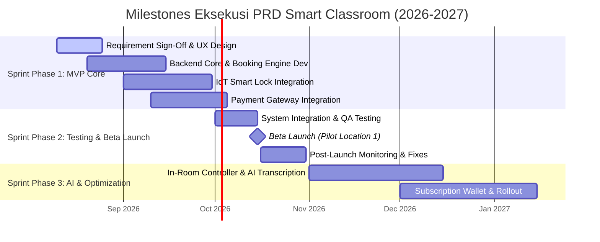

# Product Requirement Document (PRD): Platform Sewa Smart Classroom
**Versi:** 1.1  
**Tanggal:** 8 Agustus 2026  
**Penulis:** Senior Product Manager  
**Target Audiens:** Stakeholder Bisnis, UI/UX Designer, Software Engineer (Frontend/Backend), Quality Assurance (QA)  
**Dokumen Terkait:** `01_ProductDiscovery.md` (rujukan strategi bisnis, visi produk, dan analisis pasar — lihat Bagian 10 dokumen ini untuk pembagian kepemilikan topik antar dokumen)

### Riwayat Revisi

| Versi | Bagian | Sebelum | Sesudah |
| :--- | :--- | :--- | :--- |
| 1.0 | Dokumen (keseluruhan) | — | Draf awal Product Requirement Document. |
| 1.1 | Executive Summary (1) | Menjabarkan ulang visi & value proposition yang sudah ada di Product Discovery. | Dipersingkat dan ditambahkan rujukan eksplisit ke `01_ProductDiscovery.md` untuk konteks strategi, agar tidak ada duplikasi narasi antar dokumen. |
| 1.1 | Business Goals (2.2) | Target konversi subscription tidak dikaitkan ke tier harga mana pun. | Ditambahkan rujukan ke tier Subscription pada Business Model (PD §8) agar target bisnis & struktur harga tetap konsisten. |
| 1.1 | Scope & Out of Scope (3) | Tidak ada keterkaitan eksplisit ke fase roadmap. | Ditambahkan rujukan ke fase "Q3 2026: Foundation & MVP" pada Product Roadmap (PD §9). |
| 1.1 | Non-Functional Requirements (5) | Butir NFR tidak memiliki ID individual, hanya dikelompokkan per subbagian (5.1/5.2/5.3); terdapat typo "Kesediafasilitasan". | Ditambahkan ID unik per butir (NFR-P01 dst.) agar dapat dirujuk presisi dari Success Metrics dan dokumen turunan lain; ditambahkan NFR-P04 (Video Processing Time) yang sebelumnya tidak terdefinisi meski dirujuk Success Metrics; typo diperbaiki menjadi "Ketersediaan". |
| 1.1 | Success Metrics (6) | Kolom "Poin Kontribusi PRD" merujuk subbagian umum (mis. "NFR-5.1", "NFR-5.3") yang berisi beberapa butir sekaligus. | Diperbarui merujuk ID NFR spesifik (mis. "NFR-P03", "NFR-P04") hasil perbaikan Bagian 5. |
| 1.1 | Product Milestones & Release Plan (9) | Tanggal "IoT Smart Lock Integration" & "Payment Gateway Integration" tidak sinkron dengan Product Roadmap PD §9 (selisih hingga 2 minggu); task "AI Transcription" digabung dengan "In-Room Controller" padahal di PD keduanya terpisah. | Tanggal disamakan dengan PD §9 dan task dipisah agar strukturnya identik; ditambahkan catatan sinkronisasi. |
| 1.1 | Keterkaitan Antar Dokumen (10 - baru) | Belum ada panduan kepemilikan topik antar dokumen maupun antisipasi redundansi ke depan. | Ditambahkan bagian baru berisi tabel *source of truth* per topik serta rekomendasi anti-redundansi jangka pendek, menengah, dan panjang. |

---

## 1. Executive Summary

Dokumen Product Requirement Document (PRD) ini menjabarkan **spesifikasi teknis dan fungsional** dari Platform Web Sewa Smart Classroom On-Demand — mencakup *scope*, *functional/non-functional requirements*, *acceptance criteria*, dan rencana rilis.

PRD ini adalah turunan langsung dari `01_ProductDiscovery.md` (PD): PD menjawab **"mengapa"** produk ini dibangun (visi, masalah pengguna, model bisnis), sedangkan PRD ini menjawab **"apa"** yang harus dibangun dan **"bagaimana"** mengukur keberhasilannya secara teknis. Narasi strategi bisnis, visi produk, persona, dan analisis pasar sengaja tidak diulang di sini — rujuk PD untuk konteks tersebut agar kedua dokumen tidak saling tumpang tindih dan mudah dijaga konsistensinya (lihat Bagian 10).

PRD ini bertindak sebagai panduan eksekusi teknis bagi tim lintas fungsi guna memastikan produk dikembangkan sesuai batasan lingkup (*scope*), kualitas (*acceptance criteria*), dan target jadwal yang disepakati.

---

## 2. Product Goals & Business Goals

### 2.1 Product Goals
1. **Otomatisasi Akses & Operasional Studio:** Mengurangi ketergantungan pada staf fisik lokasi hingga 90% dengan mengintegrasikan sistem *Smart Lock* dan *In-Room IoT Controller*.
2. **Perekaman Pembelajaran Berakurasi Tinggi:** Menyediakan fitur *One-Touch Recording & Streaming* yang secara otomatis mengunggah video beresolusi HD/4K dan transkrip teks ke *Cloud Storage* pengguna dalam waktu < 15 menit pasca-sesi.
3. **Pengalaman Pengguna Tanpa Hambatan (Seamless UX):** Memungkinkan pengguna menyelesaikan seluruh alur (pencarian lokasi, reservasi, pembayaran, hingga penerimaan tiket digital) di platform web dalam waktu kurang dari 3 menit.

### 2.2 Business Goals
1. **Pencapaian Traction MVP (Q3 - Q4 2026):** Mencapai minimal 150 jam total durasi sewa per bulan pada lokasi pilot (*pilot location*) dalam 3 bulan pertama setelah Beta Launch.
2. **Efisiensi Beban Operasional (OpEx):** Menekan biaya operasional studio hingga 60% dibanding studio rekaman konvensional melalui otomasi IoT tanpa kru manual.
3. **Penyertaan Model Pendapatan Berulang (Recurring Revenue):** Mengonversi minimal 20% pengguna *pay-per-use* menjadi pelanggan *Subscription Membership* pada Q1 2027.

> **Rujukan:** Target konversi pada poin 3 mengacu pada struktur tier Basic/Pro/Enterprise yang didefinisikan di `01_ProductDiscovery.md` §8 (Business Model & Monetization Strategy). Perubahan harga/tier di PD wajib ditinjau ulang terhadap target ini agar business goal tidak menjadi tidak relevan.

---

## 3. Scope & Out of Scope

```
┌─────────────────────────────────────────────────────────────────────────────┐
│                          PROJECT SCOPE MATRIX                               │
├────────────────────────────────────────┬────────────────────────────────────┤
│               IN-SCOPE                 │          OUT-OF-SCOPE              │
├────────────────────────────────────────┼────────────────────────────────────┤
│ • Web Application (Responsive)         │ • Native Mobile Apps (iOS/Android) │
│ • Self-Service Booking & Payment       │ • Pengadaan/Manufaktur Hardware.   │
│ • Smart Lock Integration (MQTT/REST)   │ • Integrasi LMS Kustom Enterprise. │
│ • In-Room Web Controller Dashboard     │ • Fitur Marketplace Tutor/Guru.    │
│ • Cloud Auto-Upload & AI Transcription │ • Pembatalan Manual via Admin      │
└────────────────────────────────────────┴────────────────────────────────────┘
```

> **Rujukan:** Cakupan pada bagian ini merepresentasikan fase **"Q3 2026: Foundation & MVP"** pada Product Roadmap (`01_ProductDiscovery.md` §9). Jika fase roadmap berubah, Scope & Out of Scope ini wajib ditinjau ulang agar tidak terjadi drift antar dokumen.

### 3.1 Scope (Dalam Lingkup)
* **Web Application (Responsive):** Modul Katalog Ruangan, *Real-time Availability Calendar*, *Checkout*, dan *User Video Vault*.
* **Sistem Pembayaran Terintegrasi:** Payment Gateway untuk Virtual Account & E-Wallet (*pay-per-use*).
* **Integrasi IoT Smart Lock:** Generator QR Code / PIN Digital yang terhubung otomatis ke perangkat *Smart Lock* pintu kelas.
* **In-Room Web Controller Dashboard:** Antarmuka kontrol khusus di dalam kelas untuk memulai/menghentikan rekaman, memilih preset kamera/mikrofon, dan kontrol pencahayaan.
* **Automated Cloud Recording & Basic AI Transkripsi:** Sistem otomasi penyimpan video di cloud storage beserta hasil konversi audio-ke-teks.

### 3.2 Out of Scope (Luar Lingkup)
* **Aplikasi Seluler Native (iOS/Android):** Fungsionalitas penuh menggunakan Progressive Web App (PWA) / Web Responsive pada Fase 1.
* **Pengadaan & Garansi Perangkat Keras Fisik:** Infrastruktur kamera, smart lock, dan sensor fisik dikelola oleh tim infrastruktur/mitra properti terpisah.
* **Integrasi LMS Kustom (Canvas/Moodle Enterprise):** Ditunda hingga Q1 2027 (Masuk ke *Product Roadmap* Fase 3).
* **Marketplace Tutor / Edukator:** Platform fokus murni pada penyediaan sewa sarana dan prasarana (infrastruktur), bukan penyaluran jasa pengajar.

---

## 4. Functional Requirements (FR)

| ID Fitur | Modul/Fungsi | Deskripsi Kebutuhan Fungsional | Prioritas |
| :--- | :--- | :--- | :--- |
| **FR-01** | **Eksplorasi Ruang** | Sistem harus menampilkan katalog smart classroom yang dapat difilter berdasarkan lokasi, kapasitas, dan ketersediaan fasilitas (misal: Smart Board, Multi-Camera). | High (Must Have) |
| **FR-02** | **Engine Reservasi** | Sistem harus mengunci slot waktu secara sementara (*slot locking*) selama 15 menit saat pengguna berada dalam proses *checkout* untuk mencegah *double-booking*. | High (Must Have) |
| **FR-03** | **Gateway Pembayaran** | Sistem harus menerima pembayaran melalui E-Wallet dan Virtual Account, serta memproses webhooks konfirmasi pembayaran secara real-time. | High (Must Have) |
| **FR-04** | **Integrasi Smart Lock** | Sistem harus meregenerasi QR Code dan PIN Digital unik yang hanya aktif 15 menit sebelum hingga 15 menit setelah durasi sewa berakhir. | High (Must Have) |
| **FR-05** | **In-Room Controller** | Dashboard web khusus kelas yang mendeteksi jaringan/IP lokal kelas untuk memberikan akses kontrol satu-klik (*Start/Stop Record*, *Camera Angle Switch*). | High (Must Have) |
| **FR-06** | **Penyimpanan Cloud** | Video hasil rekaman harus terpotong secara otomatis begitu sesi berakhir dan langsung diunggah ke pustaka digital (*Video Vault*) akun pengguna. | High (Must Have) |
| **FR-07** | **AI Transkripsi** | Sistem harus memproses file audio rekaman menjadi dokumen transkripsi teks (.srt / .pdf) menggunakan AI Speech-to-Text. | Medium (Should Have) |
| **FR-08** | **Manajemen Kuota** | Sistem harus mendukung penggunaan kuota jam sewa bulanan bagi pengguna berstatus *Subscription Membership*. | Medium (Should Have) |

---

## 5. Non-Functional Requirements (NFR)

### 5.1 Performa & Skalabilitas (Performance & Scalability)
* **Response Time:** Loading halaman web katalog dan reservasi tidak boleh melebihi 2 detik pada jaringan 4G/WiFi standar (PageSpeed Score > 85).
* **Concurrency:** Sistem *booking engine* harus mampu menangani minimal 500 pengguna aktif yang melakukan pemesanan secara bersamaan tanpa mengalami *race condition*.
* **IoT Latency:** Latensi pengiriman perintah pembukaan pintu dari server ke *Smart Lock* tidak boleh lebih dari 3 detik.

### 5.2 Keamanan & Akses (Security & Compliance)
* **Akses Fisik Terbatas:** Token QR Code/PIN bersifat dinamis (*time-bound*) dan kadaluarsa secara otomatis setelah durasi sewa usai.
* **Data Encryption:** Seluruh enkripsi data lalu lintas menggunakan HTTPS/TLS 1.3 dan enkripsi file rekaman di *Cloud Storage* menggunakan AES-256.
* **Authentication:** Menggunakan standar OAuth 2.0 / JWT untuk otentikasi sesi akun pengguna.

### 5.3 Keandalan & Kesediafasilitasan (Reliability & Availability)
* **System Uptime:** Platform web dan API gateway harus memiliki *uptime* minimal 99.5% per bulan.
* **Local Caching (Fail-safe):** Apabila jaringan internet di lokasi kelas terputus saat proses pengajaran, rekaman harus tetap tersimpan pada *local storage device* di dalam kelas dan melakukan *auto-resync* ke Cloud saat koneksi pulih.

---

## 6. Success Metrics (KPI)

| Kategori | Nama Metrik | Target Nilai / Milestone | Poin Kontribusi PRD |
| :--- | :--- | :--- | :--- |
| **Operational** | **Success Access Rate** | > 99% sukses pembukaan pintu via QR/PIN tanpa bantuan manual | FR-04, NFR-5.1 |
| **User Experience** | **Booking Completion Rate** | > 75% pengguna yang memulai *checkout* berhasil menyelesaikan pembayaran | FR-02, FR-03 |
| **Product Quality** | **Video Auto-Sync Time** | < 15 menit durasi pemrosesan hingga video siap diunduh | FR-06, NFR-5.3 |
| **Business Impact** | **Classroom Utilization Rate**| Minimal 30% tingkat keterisian jam sewa ruangan per bulan | FR-01, FR-08 |

---

## 7. User Stories & Acceptance Criteria

### 7.1 User Story 1: Pemesanan & Pembayaran Ruangan
> **Sebagai** Pengajar / Corporate Trainer,  
> **Saya ingin** memilih jadwal smart classroom dan membayarnya secara langsung via web,  
> **Agar** saya mendapatkan kepastian tempat dan tiket akses digital secara instan.

**Acceptance Criteria (AC):**
* **AC-1.1:** Diberikan halaman katalog, ketika pengguna memilih lokasi dan durasi jam sewa, maka sistem menampilkan total harga secara transparan termasuk pajak.
* **AC-1.2:** Ketika pengguna menekan tombol "Bayar", sistem mengunci slot waktu (*slot lock*) selama 15 menit dan menampilkan metode pembayaran (VA/E-Wallet).
* **AC-1.3:** Ketika pembayaran terkonfirmasi, sistem mengirimkan email konfirmasi dan menerbitkan E-Ticket yang berisi QR Code/PIN di dashboard pengguna.

### 7.2 User Story 2: Masuk ke Ruangan via Smart Lock
> **Sebagai** Penyewa Ruangan,  
> **Saya ingin** memindai QR Code atau memasukkan PIN pada pintu kelas,  
> **Agar** saya dapat masuk ke dalam kelas tanpa harus menunggu kunci fisik dari pengelola.

**Acceptance Criteria (AC):**
* **AC-2.1:** Diberikan QR Code pada E-Ticket, ketika di-scan pada pemindai *Smart Lock* dalam rentang waktu sewa (termasuk toleransi 15 menit sebelum), maka pintu akan terbuka (*unlock*).
* **AC-2.2:** Jika QR Code di-scan di luar jam sewa yang sah, maka pemindai menolak akses dan menampilkan indikator merah serta pesan kesalahan pada layar pemindai.

### 7.3 User Story 3: Kontrol Perekaman di Dalam Kelas
> **Sebagai** Pengajar di dalam Smart Classroom,  
> **Saya ingin** menekan tombol "Mulai Rekam" pada dashboard web kelas,  
> **Agar** sistem studio merekam aktivitas mengajar saya secara otomatis.

**Acceptance Criteria (AC):**
* **AC-3.1:** Diberikan *In-Room Dashboard*, ketika pengguna menekan "Start Recording", sistem mengubah indikator layar menjadi merah berkedip ("REC") dan mengirim instruksi ke kamera AI-tracking.
* **AC-3.2:** Ketika pengguna menekan "Stop Recording", sistem menghentikan sesi perekaman dan menampilkan notifikasi: *"Video sedang diproses dan diunggah ke Cloud Storage Anda"*.

---

## 8. Risks & Assumptions

### 8.1 Risks (Risiko) & Mitigasi

| ID | Deskripsi Risiko | Tingkat Dampak | Strategi Mitigasi |
| :--- | :--- | :--- | :--- |
| **R-01** | Koneksi internet di lokasi kelas mengalami *down* saat sesi pengajaran berlangsung. | High | Sediakan perangkat penyimpanan lokal (*In-Room Edge Storage*) untuk menampung rekaman sementara sebelum sinkronisasi cloud. |
| **R-02** | *Smart Lock* tidak merespon akibat kendala daya/listrik mati di lokasi. | High | Pasang baterai *Uninterruptible Power Supply* (UPS) cadangan pada setiap *Smart Lock* dan sediakan kunci fisik manual darurat pada pengelola gedung. |
| **R-03** | Pembatalan sewa sepihak secara mendadak oleh pengguna yang menyebabkan kekosongan jadwal. | Medium | Terapkan aturan *Cancellation Policy* (refund 100% jika >24 jam, tidak ada refund jika <4 jam sebelum sesi). |

### 8.2 Assumptions (Asumsi Dasar)
* Perangkat keras IoT (*Smart Lock*, Kamera AI, Audio Array) yang terpasang di lokasi pilot mendukung protokol komunikasi standar (MQTT / HTTP REST API).
* Seluruh pengguna memiliki perangkat smartphone/laptop dengan browser modern yang terhubung ke jaringan untuk mengakses tiket dan kontrol kelas.

---

## 9. Product Milestones & Release Plan



---
