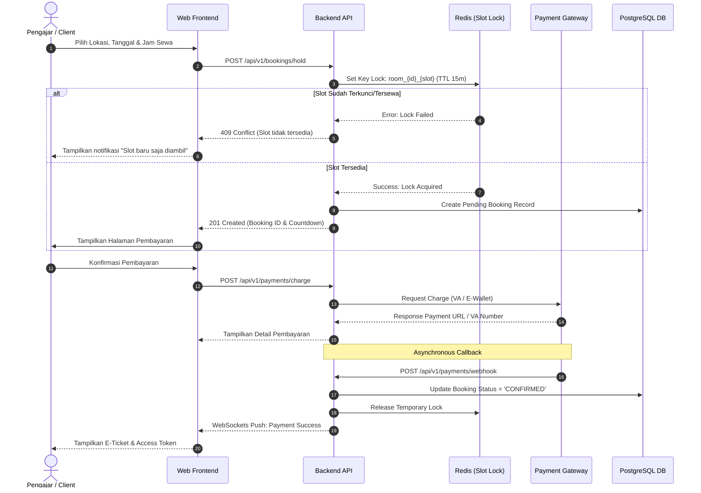
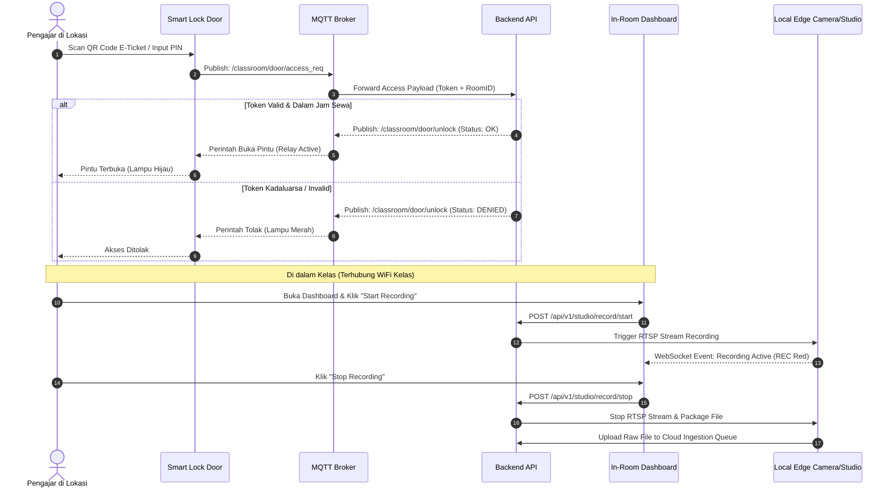

# Functional Requirement Document (FRD): Platform Sewa Smart Classroom
**Versi:** 1.0  
**Tanggal:** 8 Agustus 2026  
**Penulis:** Senior Product Manager  
**Target Audiens:** Lead Software Engineer (Frontend/Backend), IoT Integration Engineer, UI/UX Designer, QA Automation, System Architect  
**Dokumen Terkait:** `01_ProductDiscovery.md` (Strategi & Bisnis), `02_PRD.md` (Persyaratan Produk & Scope)  

---

## 1. Executive Summary & Batasan Dokumen

Dokumen Functional Requirement Document (FRD) ini menerjemahkan kebutuhan produk (*Product Requirements*) dari `02_PRD.md` menjadi **spesifikasi teknis, alur sistem, aturan bisnis, serta arsitektur API** yang siap diimplementasikan oleh tim *Engineering*.

### Mencegah Redundansi Lintas Dokumen:
* **Product Discovery (`01_ProductDiscovery.md`):** Mengatur *WHY* (Latar belakang, Visi, Market Analysis, Persona, SWOT, Pricing Model).
* **PRD (`02_PRD.md`):** Mengatur *WHAT* (Scope, Product Goals, Functional High-Level, User Stories & Acceptance Criteria, KPIs).
* **FRD (`03_FRD.md` - Dokumen Ini):** Mengatur *HOW* (Detail Fitur, End-to-End Workflow, Validasi Data, Logic Error Handling, API Endpoint Contracts, RBAC, & Business Logic Rules).

---

## 2. All Features & Detailed Feature Breakdown

Berikut adalah daftar seluruh fitur teknis beserta modul dan ID relasinya terhadap PRD:

```
┌─────────────────────────────────────────────────────────────────────────────┐
│                           FEATURE MODULE MATRIX                             │
├─────────────────────────┬──────────────────────────────┬────────────────────┤
│ MODUL                   │ ID FITUR TEKNIS              │ PRD TRACEABILITY   │
├─────────────────────────┼──────────────────────────────┼────────────────────┤
│ 1. Catalog & Discovery  │ FEAT-CAT-01, FEAT-CAT-02     │ FR-01              │
│ 2. Booking Engine       │ FEAT-BKG-01, FEAT-BKG-02     │ FR-02              │
│ 3. Payment Gateway      │ FEAT-PAY-01, FEAT-PAY-02     │ FR-03              │
│ 4. IoT & Smart Lock     │ FEAT-IOT-01, FEAT-IOT-02     │ FR-04              │
│ 5. In-Room Web Control  │ FEAT-CTL-01, FEAT-CTL-02     │ FR-05              │
│ 6. Cloud Video Vault    │ FEAT-VLT-01, FEAT-VLT-02     │ FR-06, FR-07       │
│ 7. User & Access Mgmt   │ FEAT-USR-01, FEAT-USR-02     │ FR-08              │
└─────────────────────────┴──────────────────────────────┴────────────────────┘
```

### 2.1 Modul 1: Katalog & Pencarian Ruangan (Catalog & Discovery)
* **FEAT-CAT-01 (Real-Time Availability Grid):** Display kalender interaktif per jam untuk melihat status keterisian ruangan (Tersedia, Terkunci, Tersewa, Maintenance).
* **FEAT-CAT-02 (Hardware Facility Filter):** Filter pencarian berdasarkan ketersediaan alat spesifik (Smart Board, AI Camera Tracking, Podcasting Setup, Kapasitas Kursi).

### 2.2 Modul 2: Booking Engine & Slot Locking
* **FEAT-BKG-01 (Concurrency Slot Locking):** Sistem penguncian sementara slot waktu (selama 15 menit) menggunakan Redis Distributed Lock untuk mencegah *double-booking*.
* **FEAT-BKG-02 (Booking Duration Rules):** Aturan kelipatan sewa (minimal 1 jam, increment per 30 menit).

### 2.3 Modul 3: Payment & Checkout Integration
* **FEAT-PAY-01 (Multi-Payment Webhook Receiver):** Handler asynchronous untuk pemrosesan status callback Virtual Account (BCA, Mandiri, BNI) & E-Wallet (GoPay, OVO, ShopeePay).
* **FEAT-PAY-02 (Subscription Quota Deduction Engine):** Engine pemotongan kuota jam otomatis bagi pengguna berstatus *Subscription Member*.

### 2.4 Modul 4: IoT Smart Lock & Access Control
* **FEAT-IOT-01 (Dynamic Access Token Generator):** Engine pembuat QR Code & PIN 6-digit terenkripsi (HMAC-SHA256) dengan masa aktif terikat jadwal sewa (*time-window* + 15 menit *buffer*).
* **FEAT-IOT-02 (MQTT Hardware Relay Control):** Broker komunikasi dua arah antara cloud server dengan papan kontrol pintu *Smart Lock* di lokasi fisik.

### 2.5 Modul 5: In-Room Web Controller Dashboard
* **FEAT-CTL-01 (Geofenced/IP-Bound Local Dashboard):** Dashboard kontrol yang hanya dapat diakses dari browser jika perangkat terhubung ke IP/Subnet WiFi lokal di dalam kelas.
* **FEAT-CTL-02 (Studio Hardware Signal Switch):** Antarmuka satu-klik untuk mengirim sinyal *Start/Stop Recording*, *Preset Camera Pan/Tilt*, dan *Microphone Mute/Unmute*.

### 2.6 Modul 6: Cloud Video Vault & AI Transcription
* **FEAT-VLT-01 (Automated Ingestion Pipeline):** Pipeline pengunggahan otomatis rekaman video dari local storage edge kelas ke S3-Compatible Cloud Storage begitu sesi berakhir.
* **FEAT-VLT-02 (Speech-to-Text Job Worker):** Antrean pemrosesan asynchronous (Celery/RabbitMQ) yang mengonversi audio rekaman menjadi transkrip bertanda waktu (.srt/.json).

---

## 3. End-to-End System Workflows

### 3.1 Workflow Pemesanan & Pembayaran Ruangan



### 3.2 Workflow Akses IoT & In-Room Recording Control



---

## 4. Role Management & Permission Matrix (RBAC)

Aplikasi menerapkan **Role-Based Access Control (RBAC)** secara terpusat melalui JWT Claim:

| Modul / Tindakan | Guest (Unauth) | Member (Pengajar) | Premium Member | Studio Admin (Ops) | Super Admin |
| :--- | :---: | :---: | :---: | :---: | :---: |
| **View Catalog & Availability** | Read | Read | Read | Read | Read |
| **Create Booking & Checkout** | ❌ | Create | Create | Create | Create |
| **Access In-Room Controller** | ❌ | Execute (Own Slot) | Execute (Own Slot) | Execute (All) | Execute (All) |
| **Download Video Vault** | ❌ | Read (Own) | Read (Own) | Read (All) | Read (All) |
| **View AI Transcription** | ❌ | Pay Add-on | Included | Read (All) | Read (All) |
| **Manage Room & Hardware Config**| ❌ | ❌ | ❌ | Read/Write | Full Access |
| **Manual Override Door Lock** | ❌ | ❌ | ❌ | Execute | Full Access |

---

## 5. API Requirements & Interface Contracts

Seluruh API menggunakan format **RESTful JSON** berbasis HTTPS dengan standar otentikasi `Bearer <JWT_TOKEN>`.

### 5.1 Endpoint: Booking Hold (Kunci Slot)
* **HTTP Method:** `POST`
* **URL Path:** `/api/v1/bookings/hold`
* **Request Headers:**
  ```http
  Authorization: Bearer <JWT_TOKEN>
  Content-Type: application/json
  ```
* **Request Body Payload:**
  ```json
  {
    "room_id": "rm-jakarta-01",
    "booking_date": "2026-08-20",
    "start_time": "09:00",
    "end_time": "11:00",
    "add_ons": ["ai_transcription"]
  }
  ```
* **Response Body Payload (201 Created):**
  ```json
  {
    "status": "success",
    "data": {
      "booking_id": "bkg-20260820-0089",
      "slot_lock_expires_at": "2026-08-08T09:27:12Z",
      "total_amount": 350000,
      "currency": "IDR",
      "status": "PENDING_PAYMENT"
    }
  }
  ```

### 5.2 Endpoint: In-Room Recording Trigger
* **HTTP Method:** `POST`
* **URL Path:** `/api/v1/studio/record/action`
* **Request Body Payload:**
  ```json
  {
    "booking_id": "bkg-20260820-0089",
    "room_id": "rm-jakarta-01",
    "action": "START", // Options: START, PAUSE, STOP
    "preset_profile": "LECTURE_AI_TRACKING"
  }
  ```
* **Response Body Payload (200 OK):**
  ```json
  {
    "status": "success",
    "data": {
      "session_id": "rec-sess-9912",
      "current_status": "RECORDING",
      "started_at": "2026-08-20T09:02:11Z",
      "storage_target": "s3://vault/bkg-20260820-0089/"
    }
  }
  ```

---

## 6. Data Validation Rules

Berikut adalah skema validasi masukan (*input validation*) yang wajib diterapkan di layer Backend API dan Frontend Form:

| Field Name | Type / Format | Mandatory? | Aturan & Constraint Validasi Data |
| :--- | :--- | :---: | :--- |
| `room_id` | String (UUID/Slug) | Ya | Harus merujuk pada `room_id` aktif di database. |
| `booking_date` | Date (`YYYY-MM-DD`)| Ya | Tidak boleh tanggal lampau (`>= Current Date`). Maksimal 30 hari ke depan. |
| `start_time` | Time (`HH:mm`) | Ya | Format 24 jam. Harus selaras dengan slot jam operasional gedung (07:00 - 22:00). |
| `duration_minutes` | Integer | Ya | Minimum 60 menit, kelipatan 30 menit (misal: 60, 90, 120, 150). |
| `user_phone` | String (E.164) | Ya | Harus nomor HP valid Indonesia (`^(\+62\|62\|0)8[1-9][0-9]{7,10}$`). |
| `pin_code` | Numeric String | Ya (IoT) | Tepat 6 digit angka (`^[0-9]{6}$`). |

---

## 7. Business Logic Rules

1. **Aturan Toleransi Akses Pintu (Access Window Buffer):**
   * QR Code / PIN Smart Lock mulai dapat digunakan **15 menit sebelum** jam sewa dimulai (untuk persiapan studio).
   * Akses pintu otomatis dicabut **15 menit setelah** jam sewa berakhir.
2. **Aturan Pembatalan & Refund (Cancellation Policy):**
   * Pembatalan `> 24 jam` sebelum sesi: Refund 100% (dikreditkan ke saldo wallet/kuota).
   * Pembatalan `4 - 24 jam` sebelum sesi: Refund 50%.
   * Pembatalan `< 4 jam` sebelum sesi: No Refund (0%).
3. **Aturan Overtime Kelas (Late Checkout Penalty):**
   * Jika sistem mendeteksi kehadiran di kelas melebihi 10 menit dari jadwal tanpa reservasi lanjutan, sistem *In-Room* memberikan peringatan suara/layar.
   * Keterlambatan mengosongkan ruangan > 15 menit dikenakan biaya keterlambatan otomatis sebesar `1.5x tarif per jam` yang ditagihkan ke akun pengguna.
4. **Aturan Penguncian Slot Beruntun (Preventing Abuse):**
   * Satu akun pengguna tidak diperbolehkan melakukan *Slot Locking* aktif lebih dari 3 ruangan secara bersamaan tanpa menyelesaikan pembayaran.

---

## 8. Error Handling & Fail-Safe Matrix

| Kode Error / Kondisi | HTTP Status | Pesan Error ke User / Log | Skenario Penanganan System Fail-Safe |
| :--- | :---: | :--- | :--- |
| **SLOT_ALREADY_LOCKED** | 409 Conflict | "Slot waktu yang Anda pilih baru saja dipesan oleh pengguna lain. Silakan pilih jam lain." | Re-fetch data ketersediaan kalender secara otomatis tanpa reload halaman. |
| **PAYMENT_TIMEOUT** | 408 Timeout | "Waktu pembayaran Anda telah habis. Slot telah dilepaskan." | Redis Key Expire callback otomatis melepaskan kunci slot agar dapat dipesan orang lain. |
| **IOT_GATEWAY_OFFLINE** | 503 Service Unavail | "Terjadi kendala koneksi perangkat di lokasi. Petugas lapangan telah dinotifikasi." | Trigger SMS/WhatsApp otomatis ke Tim Operational Field Officer untuk pembukaan pintu manual via master key/backup cellular lock. |
| **CLOUD_UPLOAD_FAILED** | 500 Int Server Err | "Video rekaman disimpan sementara di server lokal studio. Proses unggah akan diulang otomatis." | Local Edge Storage menyimpan file video (redundant copy) hingga koneksi Cloud S3 pulih dan retry mechanism sukses. |

---
