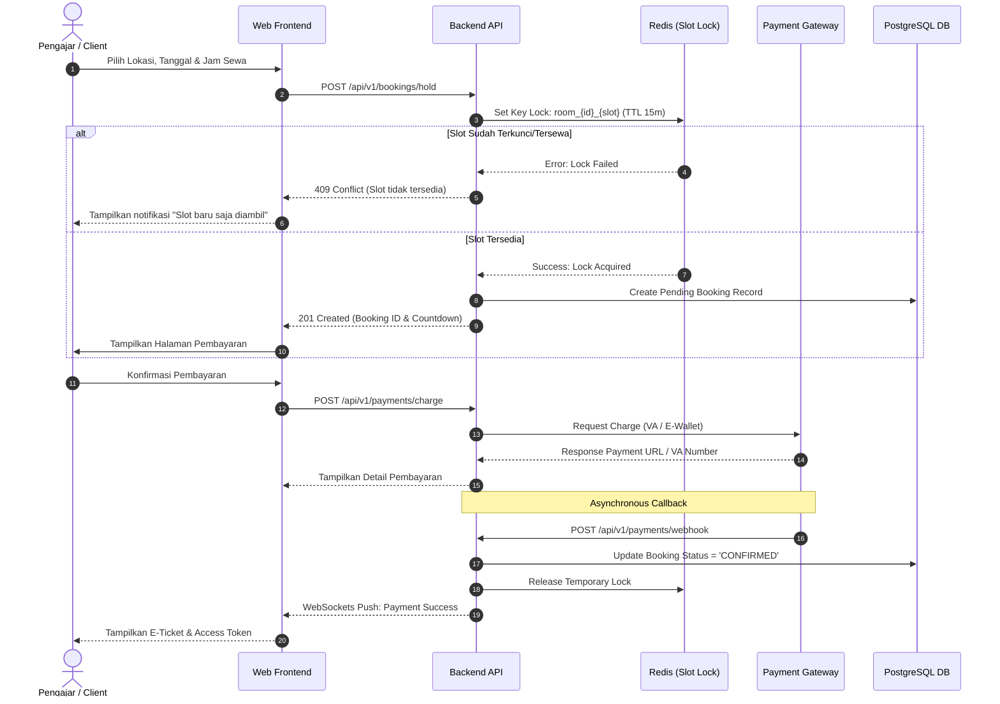
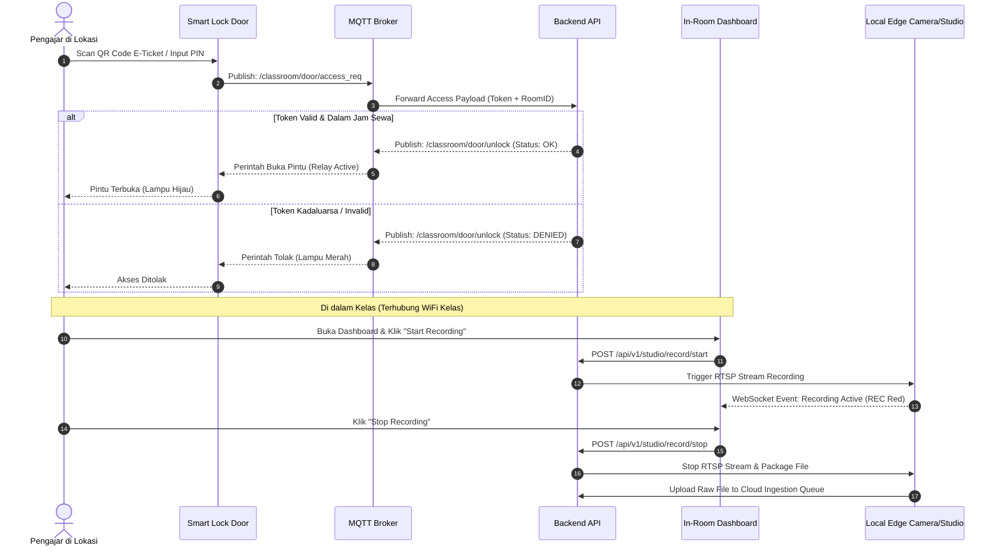
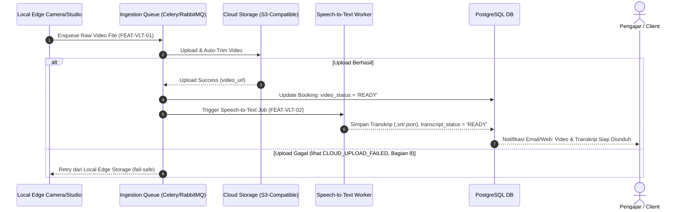
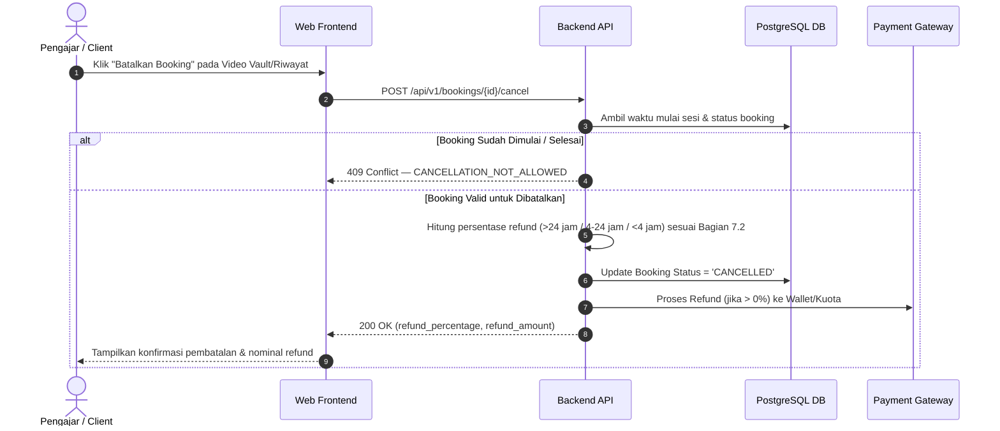

# Functional Requirement Document (FRD): Platform Sewa Smart Classroom
**Versi:** 1.1  
**Tanggal:** 8 Agustus 2026  
**Penulis:** Senior Product Manager  
**Target Audiens:** Lead Software Engineer (Frontend/Backend), IoT Integration Engineer, UI/UX Designer, QA Automation, System Architect  
**Dokumen Terkait:** `01_ProductDiscovery.md` (Strategi & Bisnis), `02_ProductRequirementDocument.md` (Persyaratan Produk & Scope)  

### Riwayat Revisi

| Versi | Bagian | Sebelum | Sesudah |
| :--- | :--- | :--- | :--- |
| 1.0 | Dokumen (keseluruhan) | — | Draf awal Functional Requirement Document. |
| 1.1 | Referensi Nama File (1, 6) | Merujuk `02_PRD.md` dan `03_FRD.md`, tidak sesuai nama file sebenarnya. | Diperbaiki menjadi `02_ProductRequirementDocument.md` dan `03_FunctionalRequirementDocument.md` agar tautan antar dokumen valid. |
| 1.1 | Feature Module Matrix (2) | FEAT-PAY-02 (Subscription Quota Deduction) salah ditelusuri ke FR-03 (Gateway Pembayaran); Modul 7 (User & Access Mgmt) juga ditelusuri ke FR-08 — bentrok dengan FEAT-PAY-02 yang seharusnya memilikinya. Fitur Pembatalan/Refund (Bagian 7.2) tidak punya ID fitur sama sekali. | FEAT-PAY-02 ditelusuri ke FR-08 (sesuai isi PRD: "Manajemen Kuota"); Modul 7 ditelusuri ke NFR-S03 karena PRD belum punya FR khusus untuk User & Access Management (dicatat sebagai gap untuk PRD berikutnya); ditambahkan FEAT-BKG-03 (Cancellation & Refund Engine). |
| 1.1 | Modul 7: User & Access Management (2.7 - baru) | Muncul di Feature Module Matrix namun tidak pernah dijelaskan detail fiturnya (FEAT-USR-01/02 tanpa deskripsi). | Ditambahkan subbagian 2.7 yang mendetailkan FEAT-USR-01 (Registrasi & Autentikasi) dan FEAT-USR-02 (Role & Profile Management). |
| 1.1 | Modul 2: Booking Engine (2.2) | Business Rule Pembatalan & Refund (Bagian 7.2) tidak punya fitur/API/workflow pendukung, dan bertentangan secara implisit dengan status "Pembatalan Manual via Admin" yang ditandai Out-of-Scope di PRD. | Ditambahkan FEAT-BKG-03 (Cancellation & Refund Engine) dengan klarifikasi bahwa pembatalan **self-service oleh pengguna** ada dalam lingkup; yang di luar lingkup hanya *override manual oleh admin*. |
| 1.1 | Workflow (3) | Tidak ada diagram alur untuk Cloud Upload & AI Transcription (FR-06/FR-07) maupun untuk Pembatalan Booking. | Ditambahkan Bagian 3.3 (Workflow Cloud Upload & AI Transcription) dan Bagian 3.4 (Workflow Pembatalan & Refund). |
| 1.1 | Role Management & Permission Matrix (4) | Nama role "Member" & "Premium Member" tidak dikaitkan ke tier Subscription (Basic/Pro/Enterprise) di PD §8; tidak ada baris permission untuk "Cancel Booking". | Ditambahkan catatan pemetaan role ke tier subscription; ditambahkan baris permission "Cancel Own Booking". |
| 1.1 | API Requirements (5) | Hanya 2 dari lebih 8 fitur yang memiliki kontrak API terdokumentasi; endpoint pembayaran (charge/webhook) hanya disebut di diagram alur tanpa kontrak resmi; tidak ada endpoint pembatalan. | Ditambahkan Bagian 5.3 (Payment Charge & Webhook), Bagian 5.4 (Cancel Booking), dan Bagian 5.5 (tabel ringkasan seluruh endpoint termasuk topik MQTT). |
| 1.1 | Data Validation Rules (6) | Tabel memvalidasi field `duration_minutes` yang **tidak ada** pada payload kontrak API riil (kontrak memakai `start_time`/`end_time`); field `end_time`, `add_ons`, dan `action` tidak divalidasi sama sekali. | Baris `duration_minutes` dihapus, digantikan validasi `end_time` + aturan lintas-field (durasi dihitung dari selisih `start_time`-`end_time`); ditambahkan baris `add_ons` dan `action`. |
| 1.1 | Business Logic Rules (7) | Rule 3 (Late Checkout Penalty) menyebut "sistem mendeteksi kehadiran di kelas" tanpa mekanisme/fitur pendeteksi yang terdefinisi. | Ditambahkan catatan dependency eksplisit bahwa mekanisme deteksi kehadiran belum terdefinisi dan perlu spesifikasi hardware IoT tambahan sebelum rule ini dapat diimplementasikan. |
| 1.1 | Error Handling & Fail-Safe Matrix (8) | Tidak mencakup error untuk token akses kadaluarsa/invalid (padahal ada di diagram alur 3.2), limit slot lock berlebih (Business Rule 4), kuota subscription habis (FR-08), maupun kegagalan transkripsi AI (FR-07). | Ditambahkan baris TOKEN_EXPIRED_OR_INVALID, MAX_CONCURRENT_LOCKS_EXCEEDED, QUOTA_EXCEEDED, dan TRANSCRIPTION_FAILED. |

---

## 1. Executive Summary & Batasan Dokumen

Dokumen Functional Requirement Document (FRD) ini menerjemahkan kebutuhan produk (*Product Requirements*) dari `02_ProductRequirementDocument.md` menjadi **spesifikasi teknis, alur sistem, aturan bisnis, serta arsitektur API** yang siap diimplementasikan oleh tim *Engineering*.

### Mencegah Redundansi Lintas Dokumen:
* **Product Discovery (`01_ProductDiscovery.md`):** Mengatur *WHY* (Latar belakang, Visi, Market Analysis, Persona, SWOT, Pricing Model).
* **PRD (`02_ProductRequirementDocument.md`):** Mengatur *WHAT* (Scope, Product Goals, Functional High-Level, User Stories & Acceptance Criteria, KPIs).
* **FRD (`03_FunctionalRequirementDocument.md` - Dokumen Ini):** Mengatur *HOW* (Detail Fitur, End-to-End Workflow, Validasi Data, Logic Error Handling, API Endpoint Contracts, RBAC, & Business Logic Rules).

> **Prinsip acuan:** Setiap ID (FR-xx, NFR-xx, AC-x.x) yang dirujuk di dokumen ini **harus sudah terdefinisi** di `02_ProductRequirementDocument.md`. Jika FRD membutuhkan fitur yang belum punya ID PRD (lihat Bagian 2.7), hal itu dicatat eksplisit sebagai gap yang perlu ditutup di revisi PRD berikutnya — bukan didiamkan atau diberi ID baru secara sepihak.

---

## 2. All Features & Detailed Feature Breakdown

Berikut adalah daftar seluruh fitur teknis beserta modul dan ID relasinya terhadap PRD:

```
┌─────────────────────────────────────────────────────────────────────────────┐
│                           FEATURE MODULE MATRIX                             │
├─────────────────────────┬──────────────────────────────┬────────────────────┤
│ MODUL                   │ ID FITUR TEKNIS              │ PRD TRACEABILITY   │
├─────────────────────────┼──────────────────────────────┼────────────────────┤
│ 1. Catalog & Discovery  │ FEAT-CAT-01, FEAT-CAT-02     │ FR-01              │
│ 2. Booking Engine       │ FEAT-BKG-01, FEAT-BKG-02,    │ FR-02 (+ 7.2)      │
│                         │ FEAT-BKG-03                  │                    │
│ 3. Payment Gateway      │ FEAT-PAY-01                  │ FR-03              │
│                         │ FEAT-PAY-02                  │ FR-08              │
│ 4. IoT & Smart Lock     │ FEAT-IOT-01, FEAT-IOT-02     │ FR-04              │
│ 5. In-Room Web Control  │ FEAT-CTL-01, FEAT-CTL-02     │ FR-05              │
│ 6. Cloud Video Vault    │ FEAT-VLT-01                  │ FR-06              │
│                         │ FEAT-VLT-02                  │ FR-07              │
│ 7. User & Access Mgmt   │ FEAT-USR-01, FEAT-USR-02     │ NFR-S03 (gap PRD*) │
└─────────────────────────┴──────────────────────────────┴────────────────────┘
* Belum ada FR khusus User & Access Management di PRD — lihat catatan Bagian 2.7.
```

> **Koreksi traceability:** Pada draf sebelumnya, FEAT-PAY-02 (Subscription Quota Deduction) salah ditelusuri ke FR-03, padahal secara isi ia menjalankan **FR-08 (Manajemen Kuota)** di PRD. Modul 7 (User & Access Mgmt) sebelumnya ikut memakai ID FR-08 yang sama — bentrok dengan FEAT-PAY-02. Karena PRD tidak memiliki FR eksplisit untuk User & Access Management, modul ini ditelusuri sementara ke **NFR-S03 (Authentication)**; direkomendasikan PRD ditambahkan FR baru (mis. FR-09) pada revisi berikutnya agar traceability lengkap.

### 2.1 Modul 1: Katalog & Pencarian Ruangan (Catalog & Discovery)
* **FEAT-CAT-01 (Real-Time Availability Grid):** Display kalender interaktif per jam untuk melihat status keterisian ruangan (Tersedia, Terkunci, Tersewa, Maintenance).
* **FEAT-CAT-02 (Hardware Facility Filter):** Filter pencarian berdasarkan ketersediaan alat spesifik (Smart Board, AI Camera Tracking, Podcasting Setup, Kapasitas Kursi).

### 2.2 Modul 2: Booking Engine & Slot Locking
* **FEAT-BKG-01 (Concurrency Slot Locking):** Sistem penguncian sementara slot waktu (selama 15 menit) menggunakan Redis Distributed Lock untuk mencegah *double-booking*.
* **FEAT-BKG-02 (Booking Duration Rules):** Aturan kelipatan sewa (minimal 1 jam, increment per 30 menit).
* **FEAT-BKG-03 (Cancellation & Refund Engine):** Fitur *self-service* bagi pengguna untuk membatalkan booking miliknya sendiri melalui web, memicu perhitungan refund otomatis sesuai *Cancellation Policy* (Bagian 7.2). **Catatan lingkup:** ini berbeda dengan "Pembatalan Manual via Admin" yang ditandai *Out of Scope* di `02_ProductRequirementDocument.md` §3.2 — yang di luar lingkup adalah kemampuan admin melakukan *override* pembatalan atas nama pengguna, bukan pembatalan mandiri oleh pengguna sendiri.

### 2.3 Modul 3: Payment & Checkout Integration
* **FEAT-PAY-01 (Multi-Payment Webhook Receiver):** Handler asynchronous untuk pemrosesan status callback Virtual Account (BCA, Mandiri, BNI) & E-Wallet (GoPay, OVO, ShopeePay).
* **FEAT-PAY-02 (Subscription Quota Deduction Engine):** Engine pemotongan kuota jam otomatis bagi pengguna berstatus *Subscription Member*.

### 2.4 Modul 4: IoT Smart Lock & Access Control
* **FEAT-IOT-01 (Dynamic Access Token Generator):** Engine pembuat QR Code & PIN 6-digit terenkripsi (HMAC-SHA256) dengan masa aktif terikat jadwal sewa (*time-window* + 15 menit *buffer*).
* **FEAT-IOT-02 (MQTT Hardware Relay Control):** Broker komunikasi dua arah antara cloud server dengan papan kontrol pintu *Smart Lock* di lokasi fisik.

### 2.5 Modul 5: In-Room Web Controller Dashboard
* **FEAT-CTL-01 (Geofenced/IP-Bound Local Dashboard):** Dashboard kontrol yang hanya dapat diakses dari browser jika perangkat terhubung ke IP/Subnet WiFi lokal di dalam kelas.
* **FEAT-CTL-02 (Studio Hardware Signal Switch):** Antarmuka satu-klik untuk mengirim sinyal *Start/Stop Recording*, *Preset Camera Pan/Tilt*, dan *Microphone Mute/Unmute*.

### 2.6 Modul 6: Cloud Video Vault & AI Transcription
* **FEAT-VLT-01 (Automated Ingestion Pipeline)** *(FR-06)*: Pipeline pengunggahan otomatis rekaman video dari local storage edge kelas ke S3-Compatible Cloud Storage begitu sesi berakhir.
* **FEAT-VLT-02 (Speech-to-Text Job Worker)** *(FR-07)*: Antrean pemrosesan asynchronous (Celery/RabbitMQ) yang mengonversi audio rekaman menjadi transkrip bertanda waktu (.srt/.json).

### 2.7 Modul 7: User & Access Management

> Modul ini tercantum di Feature Module Matrix namun belum pernah dijelaskan pada draf sebelumnya. Karena `02_ProductRequirementDocument.md` belum memiliki FR eksplisit untuk registrasi/akun pengguna, detail di bawah ini diturunkan dari kebutuhan implisit **NFR-S03 (Authentication)** dan dari aktor-aktor yang muncul di Role Management (Bagian 4).

* **FEAT-USR-01 (Registrasi & Autentikasi):** Registrasi akun via email/nomor HP, login menggunakan OAuth 2.0 / JWT (sesuai NFR-S03), termasuk alur *forgot password* dan verifikasi akun.
* **FEAT-USR-02 (Role & Profile Management):** Manajemen profil pengguna (nama, institusi, nomor HP untuk validasi `user_phone`) serta penetapan role (`Member`, `Premium Member`, `Studio Admin`, `Super Admin`) sesuai matriks RBAC pada Bagian 4. Perubahan status ke `Premium Member` terjadi otomatis saat pengguna berlangganan salah satu tier Subscription (Basic/Pro/Enterprise, lihat PD §8).

---

## 3. End-to-End System Workflows

### 3.1 Workflow Pemesanan & Pembayaran Ruangan



### 3.2 Workflow Akses IoT & In-Room Recording Control



### 3.3 Workflow Cloud Upload & AI Transcription (FR-06, FR-07)

> Alur ini sebelumnya tidak terdokumentasi meski FR-06 dan FR-07 adalah dua dari delapan Functional Requirement inti di PRD.



### 3.4 Workflow Pembatalan & Refund Booking (FEAT-BKG-03)

> Alur ini juga sebelumnya tidak terdokumentasi meski Business Rule 7.2 (Cancellation Policy) sudah mendefinisikan aturan refund-nya.



---

## 4. Role Management & Permission Matrix (RBAC)

Aplikasi menerapkan **Role-Based Access Control (RBAC)** secara terpusat melalui JWT Claim:

| Modul / Tindakan | Guest (Unauth) | Member (Pengajar) | Premium Member | Studio Admin (Ops) | Super Admin |
| :--- | :---: | :---: | :---: | :---: | :---: |
| **View Catalog & Availability** | Read | Read | Read | Read | Read |
| **Create Booking & Checkout** | ❌ | Create | Create | Create | Create |
| **Access In-Room Controller** | ❌ | Execute (Own Slot) | Execute (Own Slot) | Execute (All) | Execute (All) |
| **Cancel Own Booking** | ❌ | Execute (Own, self-service) | Execute (Own, self-service) | Execute (All, override) | Execute (All, override) |
| **Download Video Vault** | ❌ | Read (Own) | Read (Own) | Read (All) | Read (All) |
| **View AI Transcription** | ❌ | Pay Add-on | Included | Read (All) | Read (All) |
| **Manage Room & Hardware Config**| ❌ | ❌ | ❌ | Read/Write | Full Access |
| **Manual Override Door Lock** | ❌ | ❌ | ❌ | Execute | Full Access |

> **Catatan pemetaan role ↔ tier Subscription:** "Member" merepresentasikan pengguna *pay-per-use* atau tier **Basic**; "Premium Member" merepresentasikan pelanggan tier **Pro** atau **Enterprise** (lihat `01_ProductDiscovery.md` §8). "Studio Admin (Ops)" khusus mengelola izin *Manual Override* — inilah cakupan "Pembatalan via Admin" yang ditandai Out-of-Scope di PRD §3.2 pada Fase 1; pembatalan oleh Member/Premium Member atas booking miliknya sendiri tetap dalam lingkup (lihat FEAT-BKG-03).

---

## 5. API Requirements & Interface Contracts

Seluruh API menggunakan format **RESTful JSON** berbasis HTTPS dengan standar otentikasi `Bearer <JWT_TOKEN>`.

### 5.1 Endpoint: Booking Hold (Kunci Slot)
* **HTTP Method:** `POST`
* **URL Path:** `/api/v1/bookings/hold`
* **Request Headers:**
  ```http
  Authorization: Bearer <JWT_TOKEN>
  Content-Type: application/json
  ```
* **Request Body Payload:**
  ```json
  {
    "room_id": "rm-jakarta-01",
    "booking_date": "2026-08-20",
    "start_time": "09:00",
    "end_time": "11:00",
    "add_ons": ["ai_transcription"]
  }
  ```
* **Response Body Payload (201 Created):**
  ```json
  {
    "status": "success",
    "data": {
      "booking_id": "bkg-20260820-0089",
      "slot_lock_expires_at": "2026-08-08T09:27:12Z",
      "total_amount": 350000,
      "currency": "IDR",
      "status": "PENDING_PAYMENT"
    }
  }
  ```

### 5.2 Endpoint: In-Room Recording Trigger
* **HTTP Method:** `POST`
* **URL Path:** `/api/v1/studio/record/action`
* **Request Body Payload:**
  ```json
  {
    "booking_id": "bkg-20260820-0089",
    "room_id": "rm-jakarta-01",
    "action": "START", // Options: START, PAUSE, STOP
    "preset_profile": "LECTURE_AI_TRACKING"
  }
  ```
* **Response Body Payload (200 OK):**
  ```json
  {
    "status": "success",
    "data": {
      "session_id": "rec-sess-9912",
      "current_status": "RECORDING",
      "started_at": "2026-08-20T09:02:11Z",
      "storage_target": "s3://vault/bkg-20260820-0089/"
    }
  }
  ```

### 5.3 Endpoint: Payment Charge & Webhook

> Sebelumnya kedua endpoint ini hanya muncul di diagram alur (Bagian 3.1) tanpa kontrak resmi — ditambahkan di sini agar konsisten dengan endpoint lain.

* **HTTP Method:** `POST` — **URL Path:** `/api/v1/payments/charge`
  ```json
  // Request
  { "booking_id": "bkg-20260820-0089", "payment_method": "EWALLET_GOPAY" }
  ```
  ```json
  // Response (200 OK)
  { "status": "success", "data": { "payment_url": "https://pay.gw/xyz", "expires_at": "2026-08-08T09:27:12Z" } }
  ```
* **HTTP Method:** `POST` — **URL Path:** `/api/v1/payments/webhook` *(dipanggil oleh Payment Gateway, bukan Frontend)*
  ```json
  // Request (dari Payment Gateway)
  { "booking_id": "bkg-20260820-0089", "payment_status": "PAID", "paid_amount": 350000 }
  ```
  ```json
  // Response (200 OK)
  { "status": "acknowledged" }
  ```

### 5.4 Endpoint: Cancel Booking (FEAT-BKG-03)

* **HTTP Method:** `POST`
* **URL Path:** `/api/v1/bookings/{booking_id}/cancel`
* **Request Body Payload:**
  ```json
  { "reason": "Jadwal berubah" }
  ```
* **Response Body Payload (200 OK):**
  ```json
  {
    "status": "success",
    "data": {
      "booking_id": "bkg-20260820-0089",
      "cancellation_status": "CANCELLED",
      "refund_percentage": 100,
      "refund_amount": 350000
    }
  }
  ```
* **Error Response (409 Conflict):** lihat `CANCELLATION_NOT_ALLOWED` pada Bagian 8.

### 5.5 Ringkasan Seluruh Endpoint & Channel

Tabel ini melengkapi kontrak detail di atas dengan daftar lengkap seluruh antarmuka API/komunikasi yang dibutuhkan lintas modul, agar tidak ada fitur pada Bagian 2 yang tidak memiliki kontrak interface.

| Modul (FEAT-xx) | Method & Path / Channel | Deskripsi Singkat |
| :--- | :--- | :--- |
| FEAT-CAT-01/02 | `GET /api/v1/rooms?location=&facility=&date=` | Katalog & filter ketersediaan ruangan. |
| FEAT-BKG-01/02 | `POST /api/v1/bookings/hold` | Detail di Bagian 5.1. |
| FEAT-BKG-03 | `POST /api/v1/bookings/{id}/cancel` | Detail di Bagian 5.4. |
| FEAT-PAY-01 | `POST /api/v1/payments/charge`, `POST /api/v1/payments/webhook` | Detail di Bagian 5.3. |
| FEAT-PAY-02 | `GET /api/v1/subscriptions/{user_id}/quota` | Cek sisa kuota jam sebelum booking dikonfirmasi untuk Subscription Member. |
| FEAT-IOT-01/02 | MQTT Topic `/classroom/door/access_req`, `/classroom/door/unlock` | Bukan REST — kontrak berupa payload MQTT (lihat Bagian 3.2). |
| FEAT-CTL-01/02 | `POST /api/v1/studio/record/action` | Detail di Bagian 5.2. |
| FEAT-VLT-01/02 | `GET /api/v1/bookings/{id}/vault` | Status & tautan unduh video + transkrip (lihat Bagian 3.3). |
| FEAT-USR-01/02 | `POST /api/v1/auth/register`, `POST /api/v1/auth/login`, `GET/PUT /api/v1/users/me` | Registrasi, login, dan profil — mendukung Modul 7 (Bagian 2.7). |

---

## 6. Data Validation Rules

Berikut adalah skema validasi masukan (*input validation*) yang wajib diterapkan di layer Backend API dan Frontend Form:

| Field Name | Type / Format | Mandatory? | Aturan & Constraint Validasi Data |
| :--- | :--- | :---: | :--- |
| `room_id` | String (UUID/Slug) | Ya | Harus merujuk pada `room_id` aktif di database. |
| `booking_date` | Date (`YYYY-MM-DD`)| Ya | Tidak boleh tanggal lampau (`>= Current Date`). Maksimal 30 hari ke depan. |
| `start_time` | Time (`HH:mm`) | Ya | Format 24 jam. Harus selaras dengan slot jam operasional gedung (07:00 - 22:00). |
| `end_time` | Time (`HH:mm`) | Ya | Harus lebih besar dari `start_time`. Selisih (`end_time` - `start_time`) wajib minimum 60 menit dan kelipatan 30 menit (mis. 60, 90, 120 menit) sesuai FEAT-BKG-02. |
| `add_ons` | Array of String | Tidak | Setiap elemen harus salah satu dari enum add-on aktif (mis. `ai_transcription`); array kosong diperbolehkan. |
| `action` | String (Enum) | Ya (Recording Trigger) | Harus salah satu dari `START`, `PAUSE`, `STOP`; transisi tidak valid (mis. `STOP` sebelum `START`) ditolak (lihat FSM booking-session pada Bagian 7). |
| `reason` | String | Tidak (Cancellation) | Maksimum 500 karakter jika diisi; digunakan untuk keperluan audit, tidak memengaruhi persentase refund. |
| `user_phone` | String (E.164) | Ya | Harus nomor HP valid Indonesia (`^(\+62\|62\|0)8[1-9][0-9]{7,10}$`). |
| `pin_code` | Numeric String | Ya (IoT) | Tepat 6 digit angka (`^[0-9]{6}$`). |

> **Koreksi:** Baris `duration_minutes` pada draf sebelumnya dihapus karena kontrak API riil (Bagian 5.1) memakai pasangan `start_time`/`end_time`, bukan durasi eksplisit — validasi durasi sekarang dihitung sebagai aturan lintas-field pada `end_time`.

---

## 7. Business Logic Rules

1. **Aturan Toleransi Akses Pintu (Access Window Buffer):**
   * QR Code / PIN Smart Lock mulai dapat digunakan **15 menit sebelum** jam sewa dimulai (untuk persiapan studio).
   * Akses pintu otomatis dicabut **15 menit setelah** jam sewa berakhir.
2. **Aturan Pembatalan & Refund (Cancellation Policy):**
   * Pembatalan `> 24 jam` sebelum sesi: Refund 100% (dikreditkan ke saldo wallet/kuota).
   * Pembatalan `4 - 24 jam` sebelum sesi: Refund 50%.
   * Pembatalan `< 4 jam` sebelum sesi: No Refund (0%).
3. **Aturan Overtime Kelas (Late Checkout Penalty):**
   * Jika sistem mendeteksi kehadiran di kelas melebihi 10 menit dari jadwal tanpa reservasi lanjutan, sistem *In-Room* memberikan peringatan suara/layar.
   * Keterlambatan mengosongkan ruangan > 15 menit dikenakan biaya keterlambatan otomatis sebesar `1.5x tarif per jam` yang ditagihkan ke akun pengguna.
   * **Dependency belum terdefinisi:** rule ini mengasumsikan adanya mekanisme deteksi kehadiran (mis. sensor occupancy/motion pada perangkat IoT), namun mekanisme tersebut **belum dijelaskan** pada Feature Module Matrix (Bagian 2) maupun spesifikasi hardware IoT manapun. Rule ini tidak dapat diimplementasikan sampai spesifikasi sensor occupancy ditambahkan sebagai fitur (mis. FEAT-IOT-03) pada revisi berikutnya.
4. **Aturan Penguncian Slot Beruntun (Preventing Abuse):**
   * Satu akun pengguna tidak diperbolehkan melakukan *Slot Locking* aktif lebih dari 3 ruangan secara bersamaan tanpa menyelesaikan pembayaran. Pelanggaran memicu error `MAX_CONCURRENT_LOCKS_EXCEEDED` (lihat Bagian 8).
5. **Aturan Pembatalan Tidak Berlaku (Cancellation Guard):**
   * Booking yang sesinya sudah dimulai (`current_time >= start_time`) atau sudah berstatus `COMPLETED`/`CANCELLED` tidak dapat dibatalkan lagi; percobaan memicu error `CANCELLATION_NOT_ALLOWED` (lihat Bagian 8 dan Workflow 3.4).

---

## 8. Error Handling & Fail-Safe Matrix

| Kode Error / Kondisi | HTTP Status | Pesan Error ke User / Log | Skenario Penanganan System Fail-Safe |
| :--- | :---: | :--- | :--- |
| **SLOT_ALREADY_LOCKED** | 409 Conflict | "Slot waktu yang Anda pilih baru saja dipesan oleh pengguna lain. Silakan pilih jam lain." | Re-fetch data ketersediaan kalender secara otomatis tanpa reload halaman. |
| **PAYMENT_TIMEOUT** | 408 Timeout | "Waktu pembayaran Anda telah habis. Slot telah dilepaskan." | Redis Key Expire callback otomatis melepaskan kunci slot agar dapat dipesan orang lain. |
| **IOT_GATEWAY_OFFLINE** | 503 Service Unavail | "Terjadi kendala koneksi perangkat di lokasi. Petugas lapangan telah dinotifikasi." | Trigger SMS/WhatsApp otomatis ke Tim Operational Field Officer untuk pembukaan pintu manual via master key/backup cellular lock. |
| **TOKEN_EXPIRED_OR_INVALID** | 401 Unauthorized | "Kode akses tidak valid atau sudah kedaluwarsa. Hubungi dukungan jika Anda yakin ini kesalahan." | Dicatat di log akses untuk audit keamanan; jika terjadi berulang (>3x) pada `room_id` yang sama dalam 10 menit, kirim notifikasi ke Studio Admin (indikasi percobaan akses ilegal). Lihat Workflow 3.2. |
| **MAX_CONCURRENT_LOCKS_EXCEEDED** | 429 Too Many Requests | "Anda memiliki terlalu banyak reservasi yang belum dibayar. Selesaikan atau batalkan salah satu terlebih dahulu." | Sistem menolak `POST /bookings/hold` baru hingga salah satu slot lock milik user dilepas/expired (Business Rule 4). |
| **QUOTA_EXCEEDED** | 402 Payment Required | "Kuota jam bulanan Anda telah habis. Lanjutkan dengan pembayaran pay-per-use atau upgrade paket." | Sistem otomatis menawarkan alur *pay-per-use* sebagai fallback alih-alih memotong kuota (FEAT-PAY-02). |
| **CANCELLATION_NOT_ALLOWED** | 409 Conflict | "Booking ini tidak dapat dibatalkan karena sesi sudah berlangsung/selesai." | Lihat Business Rule 5 dan Workflow 3.4; tidak ada retry otomatis, pengguna diarahkan ke halaman dukungan. |
| **TRANSCRIPTION_FAILED** | 500 Int Server Err | "Transkripsi otomatis gagal diproses. Video tetap tersedia untuk diunduh." | Job Speech-to-Text di-retry otomatis maksimal 3x (exponential backoff); jika tetap gagal, video tetap diserahkan ke user tanpa transkrip dan tiket internal dibuat untuk Studio Admin. |
| **CLOUD_UPLOAD_FAILED** | 500 Int Server Err | "Video rekaman disimpan sementara di server lokal studio. Proses unggah akan diulang otomatis." | Local Edge Storage menyimpan file video (redundant copy) hingga koneksi Cloud S3 pulih dan retry mechanism sukses. |

---
