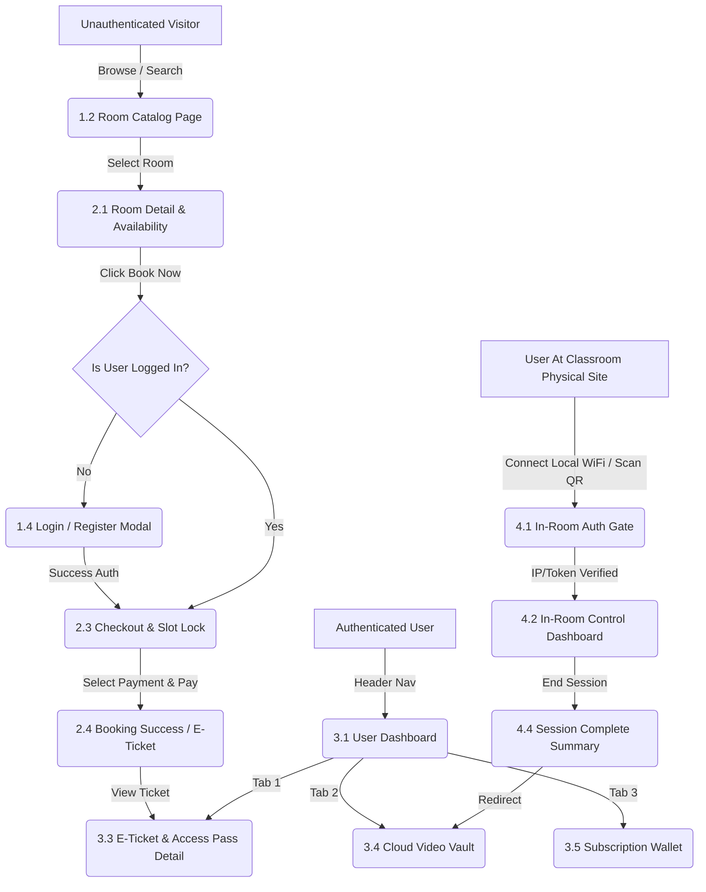

# Information Architecture (IA) Document: Platform Sewa Smart Classroom
**Versi:** 1.0  
**Tanggal:** 8 Agustus 2026  
**Penulis:** Senior Product Manager  
**Target Audiens:** UI/UX Designer, Frontend Engineer, Lead Software Engineer, Product Manager, System Architect  
**Dokumen Terkait:** 
* `01_ProductDiscovery.md` (Strategi Bisnis, Visi & Persona)
* `02_ProductRequirementDocument.md` (Spesifikasi Produk, Scope & User Stories)
* `03_FunctionalRequirementDocument.md` (Fitur Teknis, Workflow, RBAC, API & Error Handling)

---

## 1. Executive Summary & Anti-Redundancy Strategy

Dokumen **Information Architecture (IA)** ini bertindak sebagai jembatan struktural antara kebutuhan fungsional teknis (`03_FunctionalRequirementDocument.md`) dan perancangan antarmuka visual (UI/UX Design). IA mendefinisikan **bagaimana informasi diatur, dikelompokkan, dan dinavigasi** oleh pengguna pada platform web sewanya.

### Batasan Tanggung Jawab & Mencegah Redundansi Lintas Dokumen:
* **Product Discovery (`01_ProductDiscovery.md`):** Menjelaskan *WHY* (Visi, Persona, Business Model, Pricing, SWOT).
* **PRD (`02_ProductRequirementDocument.md`):** Menjelaskan *WHAT* (Scope, Product Goals, High-Level Features, User Stories & AC).
* **FRD (`03_FunctionalRequirementDocument.md`):** Menjelaskan *HOW (System & Logic)* (Modul Fitur, API Contract, MQTT, RBAC, Business Rules, Error Code).
* **IA (`04_InformationArchitecture.md` - Dokumen Ini):** Menjelaskan *HOW (Navigation & Structure)* (Sitemap, Navigation Flow, Screen Hierarchy, User Flow Visual, & Task Flow Detail).

> **Prinsip Bebas Redundansi:** Dokumen ini **tidak mengulang** aturan bisnis refund/overtime, spesifikasi API REST/MQTT, maupun matriks SWOT. Dokumen ini murni berfokus pada **struktur navigasi, hierarki layar, hirarki informasi visual, dan taksonomi langkah interaksi pengguna**.

---

## 2. Global Sitemap

Berikut adalah struktur peta situs (*Sitemap*) terorganisir untuk platform web responsive *Smart Classroom*:

```
┌────────────────────────────────────────────────────────────────────────────────────────────────────────┐
│                                           GLOBAL SITEMAP                                               │
└────────────────────────────────────────────────────────────────────────────────────────────────────────┘
                                                   │
     ┌───────────────────────┬─────────────────────┼──────────────────────┬──────────────────────┐
     ▼                       ▼                     ▼                      ▼                      ▼
[1.0 Public/Guest]   [2.0 Booking Engine]  [3.0 User Dashboard]   [4.0 In-Room Controller] [5.0 Admin Portal]
     │                       │                     │                      │                      │
     ├─ 1.1 Landing Page     ├─ 2.1 Room Detail    ├─ 3.1 Overview/Home   ├─ 4.1 Room Auth Gate  ├─ 5.1 Ops Dashboard
     ├─ 1.2 Catalog Search   ├─ 2.2 Schedule Pick  ├─ 3.2 Active Bookings  ├─ 4.2 Control Panel   ├─ 5.2 Room Management
     ├─ 1.3 Pricing/Subscription 2.3 Checkout Page ├─ 3.3 Access Ticket   ├─ 4.3 Studio Live Feed ├─ 5.3 Hardware Status
     ├─ 1.4 Auth (Login/Reg) └─ 2.4 Success Page   ├─ 3.4 Video Vault     └─ 4.4 Session Complete├─ 5.4 Manual Unlock
     └─ 1.5 Help/FAQ                               ├─ 3.5 Subscriptions                          └─ 5.5 Audit Logs
                                                   └─ 3.6 Account Profile
```

---

## 3. Navigation Flow

Navigation Flow menggambarkan bagaimana pengguna berpindah antar area/modul utama berdasarkan status autentikasi dan konteks penggunaan (misal: sebelum sewa vs saat berada di dalam ruangan).



---

## 4. Screen Hierarchy & Content Layout

Berikut adalah hierarki konten (*Wireframe/Content Structure*) pada halaman-halaman kunci untuk memandu tim UI/UX Designer:

### 4.1 Screen H-01: Room Catalog & Discovery Page (`/rooms`)
1. **Header Navigation Bar:** Logo, Location Selector, Search Bar, Global Nav (Pricing, Help), User Profile Avatar / Login Button.
2. **Filter & Refinement Sidebar (Left):**
   * Tanggal & Rentang Jam Kebutuhan.
   * Kapasitas Ruangan (Slider: 1-10, 11-30, 31-50 orang).
   * Fasilitas Hardware (Checkbox: Smart Board, Multi-Cam AI, Studio Podcasting, Audio Array).
   * Range Harga Sewa (Per Jam).
3. **Main Content Area (Right Grid):**
   * **Sort Bar:** Urutkan berdasarkan (Rekomendasi, Termurah, Rating, Terdekat).
   * **Room Cards (Repeater):**
     * Thumbnail Foto Ruangan (Carousel).
     * Tag Status: `Tersedia`, `Terkunci Sementara`, `Terisi`.
     * Judul Ruangan & Badge Lokasi.
     * Chip Fasilitas Utama (misal: "AI Track Cam", "Smart Board").
     * Label Harga / Jam (misal: "Rp 150.000/jam").
     * CTA Primary: `Pilih Jadwal`.

### 4.2 Screen H-02: In-Room Web Controller (`/in-room/control`)
*Screen ini diakses saat pengguna berada di dalam kelas via jaringan WiFi lokal / QR controller.*
1. **Top Status Bar (Sticky Alert):**
   * Status Koneksi IoT: `Connected (Green Dot)`.
   * Timer Sesi Kelas: `Sisa Waktu: 00:42:15` (Warna berubah kuning jika <10 menit).
   * Indicator Live Studio: Badge `[REC]` Merah Berkedip saat merekam.
2. **Main Studio Action Control (Primary Area - Touch Friendly Large Buttons):**
   * **Recording Master Switch:** Tombol besar `[ START RECORDING ]` / `[ STOP RECORDING ]`.
   * **Live Stream Toggle:** Toggle Switch `[ Stream to YouTube/Zoom ]`.
3. **Hardware Preset Quick Controls:**
   * **Camera Angle Presets:** Button Group (`Whiteboard Focus`, `Instructor Tracking`, `Wide Classroom`).
   * **Audio Switch:** Mute/Unmute Instructor Mic, Room Mic.
   * **Smart Board Display:** Source Input Selector (`HDMI-1`, `Wireless Cast`, `Built-in Whiteboard`).
4. **Bottom Bar:**
   * CTA Secondary: `Minta Bantuan / Panggil Ops` (Trigger HTTP Alert ke Ops).
   * CTA Exit: `Selesaikan Sesi Lebih Awal`.

---

## 5. End-to-End User Flows

### 5.1 User Flow 1: Discovery, Slot Reservation & Checkout

User Flow ini menggambarkan jalur logis pengguna mulai dari mencari ruangan hingga mendapatkan tiket digital:


---

## 6. Task Flow Detail

Task Flow menjabarkan setiap langkah interaksi mikro (*action-by-action*) pada dua tugas paling krusial: **Akses Pintu Fisik** dan **Merekam Sesi Pengajaran**.

### 6.1 Task Flow A: Membuka Pintu Kelas Fisik (Smart Lock Access)

* **Goal:** Pengguna berhasil membuka pintu Smart Classroom secara *self-service*.
* **Pre-condition:** Pengguna memiliki E-Ticket aktif untuk slot jam berjalan.

| Step # | Aksi Pengguna (*User Action*) | Respon System / Hardware Interface | Lokasi Layar / Hardware |
| :---: | :--- | :--- | :--- |
| **1** | Pengguna tiba di depan pintu kelas. | - | Fisik Lokasi Studio |
| **2** | Buka smartphone, buka web app → Masuk ke `Dashboard > E-Ticket Active`. | Menampilkan QR Code dinamis dan PIN 6-Digit (Teks Besar). | Screen `3.3 E-Ticket Detail` |
| **3** | Mengarahkan layar QR Code ke kamera scanner *Smart Lock* (atau ketik PIN). | Hardware Smart Lock membaca payload terenkripsi HMAC & publish ke MQTT broker. | Pemindai Smart Lock Pintu |
| **4** | System mengecek validitas token & buffer waktu sewa (15m sebelum). | Server membalas MQTT `/door/unlock`: STATUS_OK. Smart Lock berbunyi "Beep-Beep" & indikator LED hijau. | Smart Lock Hardware |
| **5** | Pengguna mendorong pintu & masuk kelas. | Status booking di database berubah dari `CONFIRMED` menjadi `IN_ROOM`. | Fisik Pintu Kelas |

---

### 6.2 Task Flow B: Kontrol Perekaman Sesi Pengajaran (In-Room Recording)

* **Goal:** Pengajar memulai dan menghentikan rekaman otomatis tanpa bantuan kru teknis.
* **Pre-condition:** Pengguna telah berada di dalam kelas & smartphone/laptop terhubung ke WiFi lokal kelas.

| Step # | Aksi Pengguna (*User Action*) | Respon System / Hardware Interface | Lokasi Layar / Hardware |
| :---: | :--- | :--- | :--- |
| **1** | Pengguna menghubungkan laptop/HP ke WiFi Kelas `SmartClass-Room01`. | Web App mendeteksi IP/Subnet lokal & menampilkan banner notification: *"Anda terhubung di Room 01. Buka Controller?"* | Global Web App Header |
| **2** | Klik banner / Akses URL `/in-room/control`. | Sistem memverifikasi sesi booking aktif & menampilkan *In-Room Web Controller Dashboard*. | Screen `4.2 In-Room Controller` |
| **3** | Tekan tombol utama `[ START RECORDING ]`. | Web App mengirim `POST /api/v1/studio/record/action` dengan action `START`. Sinyal dikirim ke kamera AI-tracking & audio array. | Screen `4.2 In-Room Controller` |
| **4** | Pengajar mulai mengajar. | Tampilan layar controller berubah: Tombol berubah jadi merah berkedip `[ RECORDING 00:01:23 ]` & preset kamera aktif otomatis. | Screen `4.2 In-Room Controller` |
| **5** | Sesi mengajar selesai, tekan tombol `[ STOP RECORDING ]`. | Sistem menghentikan stream RTSP, memotong file video, dan memicu *Auto-Ingestion Pipeline* ke Cloud Storage S3. | Screen `4.2 In-Room Controller` |
| **6** | Pengguna melihat modal konfirmasi. | Sistem menampilkan modal: *"Rekaman selesai dan sedang diunggah. Video akan tersedia di Video Vault Anda dalam < 15 menit."* | Screen `4.4 Session Complete` |

---
