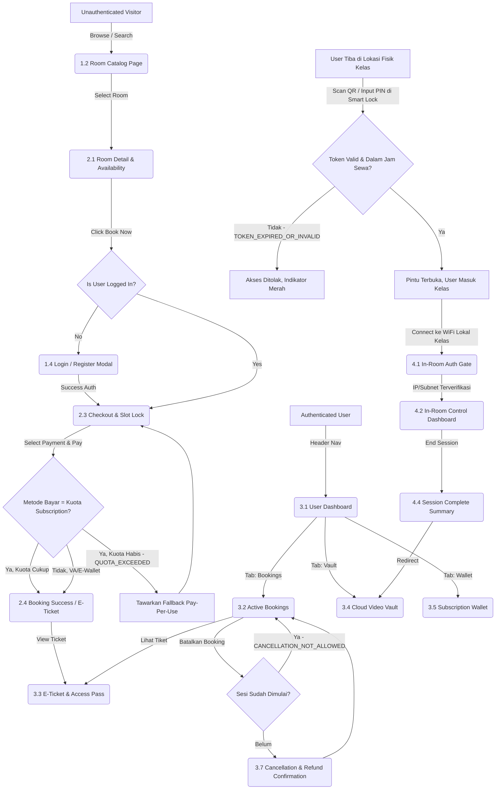
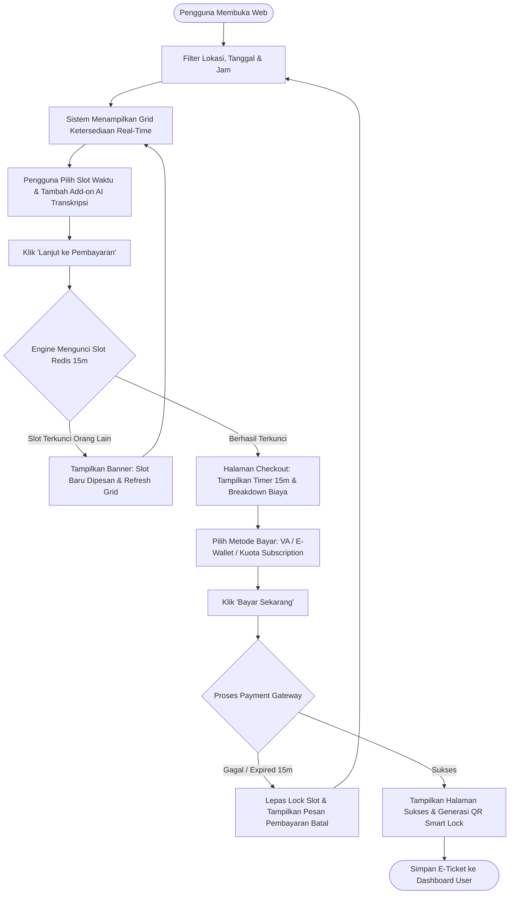
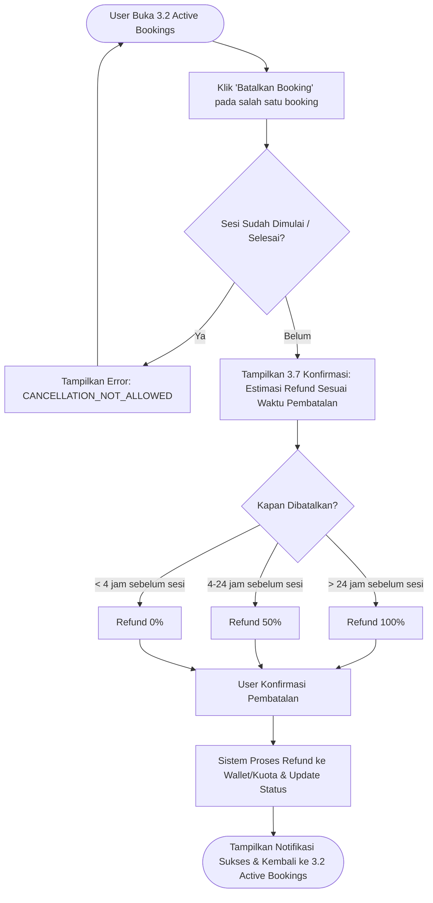

# Information Architecture (IA) Document: Platform Sewa Smart Classroom
**Versi:** 1.2  
**Tanggal:** 8 Agustus 2026  
**Penulis:** Senior Product Manager  
**Target Audiens:** UI/UX Designer, Frontend Engineer, Lead Software Engineer, Product Manager, System Architect  
**Dokumen Terkait:** 
* `01_ProductDiscovery.md` (Strategi Bisnis, Visi & Persona)
* `02_ProductRequirementDocument.md` (Spesifikasi Produk, Scope & User Stories)
* `03_FunctionalRequirementDocument.md` (Fitur Teknis, Workflow, RBAC, API & Error Handling)

### Riwayat Revisi

| Versi | Bagian | Sebelum | Sesudah |
| :--- | :--- | :--- | :--- |
| 1.0 | Dokumen (keseluruhan) | — | Draf awal Information Architecture. |
| 1.2 | Global Sitemap (2) | Belum ada screen untuk halaman Kebijakan & Ketentuan meski PD §8.2 mulai mereferensikannya. | Ditambahkan **1.6 Kebijakan & Ketentuan (Terms & Policy)** sebagai placeholder — konten detail menyusul saat kebijakan refund subscription difinalisasi. |
| 1.2 | Screen Hierarchy (4) | Status kelengkapan *content hierarchy* per screen tidak ditrack secara eksplisit — hanya disebut naratif ("4 dari ~20 screen"), sehingga gap serupa (Temuan #6 di `docs/A_AnalysisSummary.md`) berisiko lolos lagi tanpa disadari di revisi berikutnya. | Ditambahkan **tabel Cakupan Screen Hierarchy** di awal Bagian 4 yang melacak status Done/Pending untuk seluruh 28 screen di sitemap, plus aturan: screen baru wajib ditambahkan ke tabel ini sebelum dianggap *ready for design* (P1-5). |
| 1.1 | Global Sitemap (2) | Diagram ASCII box-tree memiliki baris rusak/tidak sejajar (kolom "2.3 Checkout Page" & "5.4 Manual Unlock" kehilangan garis pohon); tidak ada screen untuk Pembatalan Booking (FEAT-BKG-03) maupun User/Role Management (FEAT-USR-02) meski keduanya sudah didefinisikan di FRD. | Diagram ASCII diganti daftar bertingkat yang lebih tahan-rusak; ditambahkan 3.7 (Cancellation & Refund Confirmation), 5.6 (Booking & Refund Management), dan 5.7 (User & Role Management). |
| 1.1 | Navigation Flow (3) | Panah "Connect Local WiFi / Scan QR" menyamakan proses *scan QR di Smart Lock pintu fisik* (FRD Workflow 3.2, kanal MQTT) dengan *deteksi WiFi lokal untuk In-Room Dashboard* (FEAT-CTL-01, kanal HTTP) — padahal keduanya mekanisme & kanal yang berbeda. Tidak ada jalur untuk Pembatalan Booking maupun fallback saat kuota subscription habis. | Dipisah menjadi dua tahap eksplisit: unlock pintu fisik via QR/PIN → baru connect WiFi kelas untuk in-room dashboard. Ditambahkan jalur Pembatalan Booking dan fallback `QUOTA_EXCEEDED` ke pay-per-use (selaras FRD §8). |
| 1.1 | Penamaan Screen 3.3 | Disebut dengan 3 nama berbeda di 3 tempat: "3.3 Access Ticket" (sitemap), "3.3 E-Ticket & Access Pass Detail" (navigation flow), "Screen 3.3 E-Ticket Detail" (task flow). | Distandardisasi menjadi **"3.3 E-Ticket & Access Pass"** di seluruh dokumen. |
| 1.1 | Screen Hierarchy (4) | Hanya 2 dari ~20 screen pada sitemap yang didetailkan (Catalog, In-Room Controller) — Checkout (konversi transaksi utama) dan Cloud Video Vault (deliverable utama produk) tidak punya breakdown konten. | Ditambahkan H-03 (Checkout & Payment) dan H-04 (Cloud Video Vault), termasuk catatan kondisi akses AI Transkripsi (Pay Add-on vs Included) sesuai RBAC FRD §4. |
| 1.1 | End-to-End User Flow (5) | Tidak ada alur untuk Pembatalan & Refund meski FRD §3.4/§7.2 sudah mendefinisikan business rule dan workflow-nya. | Ditambahkan Flow 5.2: Cancellation & Refund. |
| 1.1 | Task Flow Detail (6) | Hanya mencakup Akses Pintu & Kontrol Rekaman; tidak ada task flow mikro untuk Pembatalan Booking self-service (FEAT-BKG-03). | Ditambahkan Task Flow C: Pembatalan Booking Mandiri. |
| 1.1 | Catatan Permission & Akses (7 - baru) | Tidak ada panduan bagi UI/UX Designer tentang elemen mana yang perlu disembunyikan/dinonaktifkan berdasarkan role (RBAC sudah ada di FRD §4, tapi implikasinya ke layar tidak diterjemahkan). | Ditambahkan bagian baru yang memetakan setiap screen kunci ke role yang berhak mengaksesnya dan implikasi UI-nya (show/hide/disable), tanpa mengulang tabel RBAC penuh dari FRD. |

---

## 1. Executive Summary & Anti-Redundancy Strategy

Dokumen **Information Architecture (IA)** ini bertindak sebagai jembatan struktural antara kebutuhan fungsional teknis (`03_FunctionalRequirementDocument.md`) dan perancangan antarmuka visual (UI/UX Design). IA mendefinisikan **bagaimana informasi diatur, dikelompokkan, dan dinavigasi** oleh pengguna pada platform web sewanya.

### Batasan Tanggung Jawab & Mencegah Redundansi Lintas Dokumen:
* **Product Discovery (`01_ProductDiscovery.md`):** Menjelaskan *WHY* (Visi, Persona, Business Model, Pricing, SWOT).
* **PRD (`02_ProductRequirementDocument.md`):** Menjelaskan *WHAT* (Scope, Product Goals, High-Level Features, User Stories & AC).
* **FRD (`03_FunctionalRequirementDocument.md`):** Menjelaskan *HOW (System & Logic)* (Modul Fitur, API Contract, MQTT, RBAC, Business Rules, Error Code).
* **IA (`04_InformationArchitecture.md` - Dokumen Ini):** Menjelaskan *HOW (Navigation & Structure)* (Sitemap, Navigation Flow, Screen Hierarchy, User Flow Visual, & Task Flow Detail).

> **Prinsip Bebas Redundansi:** Dokumen ini **tidak mengulang** aturan bisnis refund/overtime, spesifikasi API REST/MQTT, maupun matriks SWOT. Dokumen ini murni berfokus pada **struktur navigasi, hierarki layar, hirarki informasi visual, dan taksonomi langkah interaksi pengguna**.

---

## 2. Global Sitemap

Berikut adalah struktur peta situs (*Sitemap*) terorganisir untuk platform web responsive *Smart Classroom*, dikelompokkan dalam 5 area utama:

**1.0 Public / Guest**
* 1.1 Landing Page
* 1.2 Catalog Search
* 1.3 Pricing / Subscription
* 1.4 Auth (Login / Register)
* 1.5 Help / FAQ
* 1.6 Kebijakan & Ketentuan (Terms & Policy) — ***(baru, placeholder — mendukung PD §8.2 Kebijakan Refund Subscription)***

**2.0 Booking Engine**
* 2.1 Room Detail
* 2.2 Schedule Picker
* 2.3 Checkout Page
* 2.4 Success Page

**3.0 User Dashboard**
* 3.1 Overview / Home
* 3.2 Active Bookings
* 3.3 E-Ticket & Access Pass
* 3.4 Cloud Video Vault
* 3.5 Subscriptions
* 3.6 Account Profile
* 3.7 Cancellation & Refund Confirmation — ***(baru, mendukung FEAT-BKG-03 / FRD §3.4 & §5.4)***

**4.0 In-Room Controller**
* 4.1 Room Auth Gate
* 4.2 Control Panel
* 4.3 Studio Live Feed
* 4.4 Session Complete

**5.0 Admin Portal**
* 5.1 Ops Dashboard
* 5.2 Room Management
* 5.3 Hardware Status
* 5.4 Manual Unlock
* 5.5 Audit Logs
* 5.6 Booking & Refund Management — ***(baru, mendukung permission "Cancel Booking — All/Override" pada FRD §4 RBAC)***
* 5.7 User & Role Management — ***(baru, mendukung FEAT-USR-02 / FRD §2.7)***

---

## 3. Navigation Flow

Navigation Flow menggambarkan bagaimana pengguna berpindah antar area/modul utama berdasarkan status autentikasi dan konteks penggunaan (misal: sebelum sewa vs saat berada di dalam ruangan).

---

## 4. Screen Hierarchy & Content Layout

Berikut adalah hierarki konten (*Wireframe/Content Structure*) pada halaman-halaman kunci untuk memandu tim UI/UX Designer.

### 4.0 Cakupan Screen Hierarchy (Tracking — Anti-Berulangnya Temuan #6)

> **Aturan wajib mulai v1.2:** setiap screen baru yang ditambahkan ke Global Sitemap (Bagian 2) **wajib** ditambahkan sebagai baris ke tabel ini dengan status ⏳ *Pending* pada saat yang sama. Tabel ini adalah satu-satunya sumber kebenaran untuk melihat screen mana yang sudah/belum punya breakdown konten — sehingga gap seperti Temuan #6 (`docs/A_AnalysisSummary.md`) langsung terlihat, bukan baru diketahui belakangan.

| Area | Screen | Status | Ref. Detail |
| :--- | :--- | :---: | :--- |
| 1.0 Public/Guest | 1.1 Landing Page | ⏳ Pending | — |
| 1.0 Public/Guest | 1.2 Catalog Search | ✅ Done | H-01 (§4.1) |
| 1.0 Public/Guest | 1.3 Pricing / Subscription | ⏳ Pending | — |
| 1.0 Public/Guest | 1.4 Auth (Login/Register) | ⏳ Pending | — |
| 1.0 Public/Guest | 1.5 Help / FAQ | ⏳ Pending | — |
| 1.0 Public/Guest | 1.6 Kebijakan & Ketentuan | ⏳ Pending | Placeholder — lihat PD §8.2 |
| 2.0 Booking Engine | 2.1 Room Detail | ⏳ Pending | — |
| 2.0 Booking Engine | 2.2 Schedule Picker | ⏳ Pending | — |
| 2.0 Booking Engine | 2.3 Checkout Page | ✅ Done | H-03 (§4.3) |
| 2.0 Booking Engine | 2.4 Success Page | ⏳ Pending | — |
| 3.0 User Dashboard | 3.1 Overview / Home | ⏳ Pending | — |
| 3.0 User Dashboard | 3.2 Active Bookings | ⏳ Pending | — |
| 3.0 User Dashboard | 3.3 E-Ticket & Access Pass | ⏳ Pending | — |
| 3.0 User Dashboard | 3.4 Cloud Video Vault | ✅ Done | H-04 (§4.4) |
| 3.0 User Dashboard | 3.5 Subscriptions | ⏳ Pending | — |
| 3.0 User Dashboard | 3.6 Account Profile | ⏳ Pending | — |
| 3.0 User Dashboard | 3.7 Cancellation & Refund Confirmation | ⏳ Pending | — |
| 4.0 In-Room Controller | 4.1 Room Auth Gate | ⏳ Pending | — |
| 4.0 In-Room Controller | 4.2 Control Panel | ✅ Done | H-02 (§4.2) |
| 4.0 In-Room Controller | 4.3 Studio Live Feed | ⏳ Pending | — |
| 4.0 In-Room Controller | 4.4 Session Complete | ⏳ Pending | — |
| 5.0 Admin Portal | 5.1 Ops Dashboard | ⏳ Pending | — |
| 5.0 Admin Portal | 5.2 Room Management | ⏳ Pending | — |
| 5.0 Admin Portal | 5.3 Hardware Status | ⏳ Pending | — |
| 5.0 Admin Portal | 5.4 Manual Unlock | ⏳ Pending | — |
| 5.0 Admin Portal | 5.5 Audit Logs | ⏳ Pending | — |
| 5.0 Admin Portal | 5.6 Booking & Refund Management | ⏳ Pending | — |
| 5.0 Admin Portal | 5.7 User & Role Management | ⏳ Pending | — |

**Ringkasan:** 4 dari 28 screen (14%) sudah punya content hierarchy formal. Sisanya adalah pekerjaan lanjutan tim UI/UX (P1-5 di `docs/A_AnalysisSummary.md`) — bukan lagi risiko "terlewat tanpa disadari" karena sudah tercatat eksplisit di tabel ini.

### 4.1 Screen H-01: Room Catalog & Discovery Page (`/rooms`)
1. **Header Navigation Bar:** Logo, Location Selector, Search Bar, Global Nav (Pricing, Help), User Profile Avatar / Login Button.
2. **Filter & Refinement Sidebar (Left):**
   * Tanggal & Rentang Jam Kebutuhan.
   * Kapasitas Ruangan (Slider: 1-10, 11-30, 31-50 orang).
   * Fasilitas Hardware (Checkbox: Smart Board, Multi-Cam AI, Studio Podcasting, Audio Array).
   * Range Harga Sewa (Per Jam).
3. **Main Content Area (Right Grid):**
   * **Sort Bar:** Urutkan berdasarkan (Rekomendasi, Termurah, Rating, Terdekat).
   * **Room Cards (Repeater):**
     * Thumbnail Foto Ruangan (Carousel).
     * Tag Status: `Tersedia`, `Terkunci Sementara`, `Terisi`.
     * Judul Ruangan & Badge Lokasi.
     * Chip Fasilitas Utama (misal: "AI Track Cam", "Smart Board").
     * Label Harga / Jam (misal: "Rp 150.000/jam").
     * CTA Primary: `Pilih Jadwal`.

### 4.2 Screen H-02: In-Room Web Controller (`/in-room/control`)
*Screen ini diakses saat pengguna berada di dalam kelas via jaringan WiFi lokal / QR controller.*
1. **Top Status Bar (Sticky Alert):**
   * Status Koneksi IoT: `Connected (Green Dot)`.
   * Timer Sesi Kelas: `Sisa Waktu: 00:42:15` (Warna berubah kuning jika <10 menit).
   * Indicator Live Studio: Badge `[REC]` Merah Berkedip saat merekam.
2. **Main Studio Action Control (Primary Area - Touch Friendly Large Buttons):**
   * **Recording Master Switch:** Tombol besar `[ START RECORDING ]` / `[ STOP RECORDING ]`.
   * **Live Stream Toggle:** Toggle Switch `[ Stream to YouTube/Zoom ]`.
3. **Hardware Preset Quick Controls:**
   * **Camera Angle Presets:** Button Group (`Whiteboard Focus`, `Instructor Tracking`, `Wide Classroom`).
   * **Audio Switch:** Mute/Unmute Instructor Mic, Room Mic.
   * **Smart Board Display:** Source Input Selector (`HDMI-1`, `Wireless Cast`, `Built-in Whiteboard`).
4. **Bottom Bar:**
   * CTA Secondary: `Minta Bantuan / Panggil Ops` (Trigger HTTP Alert ke Ops).
   * CTA Exit: `Selesaikan Sesi Lebih Awal`.

### 4.3 Screen H-03: Checkout & Payment (`/checkout`)

> *Screen ini sebelumnya hanya disebut di Navigation Flow & User Flow tanpa breakdown konten, padahal merupakan titik konversi transaksi utama (lihat FRD AC-1.1/1.2 & FEAT-PAY-01/02).*

1. **Booking Summary Card (Sticky):** Nama ruangan, tanggal, `start_time`-`end_time`, add-on terpilih (mis. AI Transkripsi), dan **countdown timer slot lock 15 menit** (warna berubah merah di 2 menit terakhir — lihat `SLOT_ALREADY_LOCKED`/`PAYMENT_TIMEOUT` pada FRD §8).
2. **Price Breakdown:** Tarif per jam × durasi, biaya add-on, pajak, total akhir (transparan sesuai AC-1.1).
3. **Payment Method Selector:**
   * Virtual Account (BCA/Mandiri/BNI), E-Wallet (GoPay/OVO/ShopeePay).
   * **Kuota Subscription** (khusus Premium Member) — tampilkan sisa kuota jam; jika tidak cukup, tampilkan pesan `QUOTA_EXCEEDED` dan arahkan ke opsi pay-per-use (lihat Navigation Flow §3).
4. **CTA Primary:** `Bayar Sekarang`.
5. **Error/Empty States:** Banner "Slot baru saja diambil" (SLOT_ALREADY_LOCKED) dan "Waktu pembayaran habis" (PAYMENT_TIMEOUT), masing-masing mengarahkan kembali ke Room Detail.

### 4.4 Screen H-04: Cloud Video Vault (`/dashboard/vault`)

> *Screen deliverable utama produk (FR-06/FR-07) sebelumnya tidak punya breakdown konten meski disebut di Workflow FRD §3.3.*

1. **Filter & Search Bar:** Filter berdasarkan tanggal sesi, nama ruangan, status pemrosesan.
2. **Video Card (Repeater):**
   * Thumbnail preview + durasi video.
   * Status Badge: `Processing` (< 15 menit), `Ready`, `Upload Gagal — Retry Otomatis` (ref. `CLOUD_UPLOAD_FAILED`).
   * CTA: `Unduh Video`.
3. **Transcript Panel:**
   * Jika status `Ready`: tampilkan CTA `Unduh Transkrip (.srt/.pdf)`.
   * Jika `TRANSCRIPTION_FAILED`: tampilkan pesan "Transkripsi gagal, video tetap tersedia" (video tetap bisa diunduh, transkrip tidak).
   * **Kondisi akses berbeda per role (lihat FRD §4 RBAC):** untuk role `Member`, transkrip berstatus *Pay Add-on* — tampilkan CTA upsell `Aktifkan AI Transcription` jika belum dibeli saat booking; untuk `Premium Member`, transkrip *Included* — langsung tersedia tanpa upsell.

---

## 5. End-to-End User Flows

### 5.1 User Flow 1: Discovery, Slot Reservation & Checkout

User Flow ini menggambarkan jalur logis pengguna mulai dari mencari ruangan hingga mendapatkan tiket digital:

### 5.2 User Flow 2: Pembatalan & Refund Booking

> *Flow ini sebelumnya belum ada meski FRD §3.4 (Workflow) dan §7.2 (Business Rule Cancellation Policy) sudah mendefinisikannya.*

---

## 6. Task Flow Detail

Task Flow menjabarkan setiap langkah interaksi mikro (*action-by-action*) pada tiga tugas paling krusial: **Akses Pintu Fisik**, **Merekam Sesi Pengajaran**, dan **Pembatalan Booking Mandiri**.

### 6.1 Task Flow A: Membuka Pintu Kelas Fisik (Smart Lock Access)

* **Goal:** Pengguna berhasil membuka pintu Smart Classroom secara *self-service*.
* **Pre-condition:** Pengguna memiliki E-Ticket aktif untuk slot jam berjalan.

| Step # | Aksi Pengguna (*User Action*) | Respon System / Hardware Interface | Lokasi Layar / Hardware |
| :---: | :--- | :--- | :--- |
| **1** | Pengguna tiba di depan pintu kelas. | - | Fisik Lokasi Studio |
| **2** | Buka smartphone, buka web app → Masuk ke `Dashboard > E-Ticket Active`. | Menampilkan QR Code dinamis dan PIN 6-Digit (Teks Besar). | Screen `3.3 E-Ticket & Access Pass` |
| **3** | Mengarahkan layar QR Code ke kamera scanner *Smart Lock* (atau ketik PIN). | Hardware Smart Lock membaca payload terenkripsi HMAC & publish ke MQTT broker. | Pemindai Smart Lock Pintu |
| **4** | System mengecek validitas token & buffer waktu sewa (15m sebelum). | Server membalas MQTT `/door/unlock`: STATUS_OK. Smart Lock berbunyi "Beep-Beep" & indikator LED hijau. | Smart Lock Hardware |
| **5** | Pengguna mendorong pintu & masuk kelas. | Status booking di database berubah dari `CONFIRMED` menjadi `IN_ROOM`. | Fisik Pintu Kelas |

---

### 6.2 Task Flow B: Kontrol Perekaman Sesi Pengajaran (In-Room Recording)

* **Goal:** Pengajar memulai dan menghentikan rekaman otomatis tanpa bantuan kru teknis.
* **Pre-condition:** Pengguna telah berada di dalam kelas & smartphone/laptop terhubung ke WiFi lokal kelas.

| Step # | Aksi Pengguna (*User Action*) | Respon System / Hardware Interface | Lokasi Layar / Hardware |
| :---: | :--- | :--- | :--- |
| **1** | Pengguna menghubungkan laptop/HP ke WiFi Kelas `SmartClass-Room01`. | Web App mendeteksi IP/Subnet lokal & menampilkan banner notification: *"Anda terhubung di Room 01. Buka Controller?"* | Global Web App Header |
| **2** | Klik banner / Akses URL `/in-room/control`. | Sistem memverifikasi sesi booking aktif & menampilkan *In-Room Web Controller Dashboard*. | Screen `4.2 In-Room Controller` |
| **3** | Tekan tombol utama `[ START RECORDING ]`. | Web App mengirim `POST /api/v1/studio/record/action` dengan action `START`. Sinyal dikirim ke kamera AI-tracking & audio array. | Screen `4.2 In-Room Controller` |
| **4** | Pengajar mulai mengajar. | Tampilan layar controller berubah: Tombol berubah jadi merah berkedip `[ RECORDING 00:01:23 ]` & preset kamera aktif otomatis. | Screen `4.2 In-Room Controller` |
| **5** | Sesi mengajar selesai, tekan tombol `[ STOP RECORDING ]`. | Sistem menghentikan stream RTSP, memotong file video, dan memicu *Auto-Ingestion Pipeline* ke Cloud Storage S3. | Screen `4.2 In-Room Controller` |
| **6** | Pengguna melihat modal konfirmasi. | Sistem menampilkan modal: *"Rekaman selesai dan sedang diunggah. Video akan tersedia di Video Vault Anda dalam < 15 menit."* | Screen `4.4 Session Complete` |

---

### 6.3 Task Flow C: Pembatalan Booking Mandiri (Self-Service Cancellation)

> *Task flow ini sebelumnya tidak ada meski FEAT-BKG-03 (FRD §2.2) adalah fitur self-service yang eksplisit didefinisikan sebagai dalam-lingkup, berbeda dari "Pembatalan Manual via Admin" yang out-of-scope.*

* **Goal:** Pengguna membatalkan booking miliknya sendiri sebelum sesi dimulai dan memahami nominal refund yang akan diterima.
* **Pre-condition:** Pengguna memiliki booking berstatus `CONFIRMED` yang belum dimulai.

| Step # | Aksi Pengguna (*User Action*) | Respon System / Hardware Interface | Lokasi Layar / Hardware |
| :---: | :--- | :--- | :--- |
| **1** | Buka `Dashboard > 3.2 Active Bookings`, pilih booking, klik `Batalkan Booking`. | Sistem cek `current_time` vs `start_time` booking. | Screen `3.2 Active Bookings` |
| **2** | — | Jika sesi sudah dimulai/selesai: tampilkan error `CANCELLATION_NOT_ALLOWED` dan CTA dinonaktifkan. Jika belum: lanjut ke Step 3. | Screen `3.2 Active Bookings` |
| **3** | Pengguna melihat estimasi refund. | Sistem hitung & tampilkan persentase refund sesuai Cancellation Policy (FRD §7.2): 100% (>24 jam), 50% (4-24 jam), atau 0% (<4 jam). | Screen `3.7 Cancellation & Refund Confirmation` |
| **4** | Pengguna menekan `Konfirmasi Pembatalan`. | Sistem memanggil `POST /api/v1/bookings/{id}/cancel`, update status jadi `CANCELLED`, proses refund ke wallet/kuota. | Screen `3.7 Cancellation & Refund Confirmation` |
| **5** | Pengguna melihat notifikasi hasil. | Tampilkan toast/notifikasi: *"Booking dibatalkan. Refund Rp X (Y%) telah dikreditkan ke [Wallet/Kuota]."* | Screen `3.2 Active Bookings` |

---

## 7. Catatan Permission & Akses untuk UI/UX

Matriks RBAC lengkap adalah milik `03_FunctionalRequirementDocument.md` §4 dan **tidak diulang di sini**. Bagian ini hanya menerjemahkan implikasinya menjadi keputusan *show/hide/disable* per screen, agar UI/UX Designer tidak perlu membolak-balik FRD saat membuat wireframe.

| Screen | Role Minimum | Implikasi UI |
| :--- | :--- | :--- |
| 1.1 - 1.5 (Public/Guest) | Tidak ada (Guest) | Semua elemen *Create Booking* tampil namun mengarah ke 1.4 Login/Register jika diklik tanpa sesi aktif (lihat Navigation Flow §3, node `D`). |
| 2.1 - 2.4 (Booking Engine) | Member | CTA `Bayar Sekarang` disabled untuk Guest; opsi metode bayar "Kuota Subscription" pada H-03 hanya tampil untuk role `Premium Member`. |
| 3.2 Active Bookings / 3.7 Cancellation | Member (data milik sendiri) | Tombol `Batalkan Booking` hanya aktif pada booking milik user yang login (`Read/Execute — Own`); tidak ada akses ke booking user lain. |
| 3.4 Cloud Video Vault (H-04) | Member (Read Own) / Premium Member | Panel Transcript menampilkan CTA upsell untuk `Member` (Pay Add-on) vs akses langsung untuk `Premium Member` (Included) — lihat detail H-04. |
| 4.1 - 4.4 (In-Room Controller) | Member/Premium Member (hanya slot miliknya) | Dashboard hanya bisa dibuka jika IP/subnet sesuai kelas **dan** booking aktif milik user yang login; selain itu tampilkan halaman "Akses Ditolak". |
| 5.1 - 5.7 (Admin Portal) | Studio Admin / Super Admin | Seluruh area 5.0 disembunyikan total dari navigasi utama untuk role Guest/Member/Premium Member — bukan sekadar disabled, agar tidak membocorkan keberadaan fitur admin. |
| 5.6 Booking & Refund Management | Studio Admin (Execute) / Super Admin (Full) | Menampilkan kemampuan *override* pembatalan/refund lintas pengguna — berbeda dari 3.7 yang hanya untuk booking milik sendiri. |
| 5.7 User & Role Management | Super Admin (Full Access) | Studio Admin **tidak** memiliki akses ke penetapan role (hanya Super Admin, sesuai FRD §4). |

---
